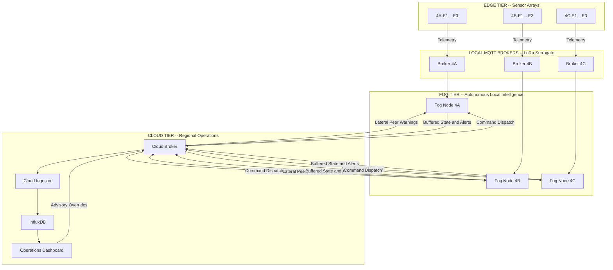

# IGNIS

**Intelligent Geo-distributed Network for Wildfire Intervention and Surveillance**

---

## What is IGNIS

IGNIS is a distributed wildfire early warning and autonomous pre-suppression platform built on a hierarchical **Edge-Fog-Cloud (EFC) computing architecture**. It pushes decision intelligence to local fog nodes stationed inside forest zones, enabling sub-second autonomous threat assessment and pre-suppression action triggering without dependence on centralized cloud connectivity.

The IGNIS Version 1 platform consists of two integrated components:

- **The Decision Architecture (Software Core):** A fully implemented, tested, and benchmarked distributed decision pipeline -- from raw sensor ingestion through multi-factor risk scoring, multi-sensor confirmation, deterministic state machine evaluation, lateral peer coordination, and autonomous action triggering. This is the primary deliverable.

- **The Simulation Environment (Pre-Hardware Validation):** A containerized software testbed where every physical component (sensors, LoRa radios, fog servers, actuators) is replaced with a Docker microservice surrogate that reproduces identical data flows, decision logic, and failure modes. This validates the architecture's correctness, latency, resilience, and safety guarantees before any hardware capital expenditure. The simulation is explicitly designed for a 1:1 data-source swap into physical hardware without redesigning core logic.

---

## The Problem

Conventional wildfire detection suffers from three structural failure modes:

| Failure Mode | Root Cause | Consequence |
| :--- | :--- | :--- |
| **Detection Latency** | Satellite revisit cycles (6-12 hours), cloud processing queues | Incipient ignitions escalate into uncontrollable fires before alerts reach responders |
| **Centralized Dependency** | All sensor data routed to remote cloud for processing | WAN outage severs the entire detection pipeline; field stations lose all capability |
| **False Positive Vulnerability** | Single-sensor threshold triggers | Faulty sensors, heated rocks, and transient spikes exhaust field staff through alert fatigue |

---

## How IGNIS Solves It

IGNIS resolves these failures through localized autonomous intelligence at the fog tier, multi-sensor confirmation logic, and peer-to-peer lateral coordination:



### Validated Performance

| Target | Specification | Measured Result | Status |
| :--- | :--- | :--- | :---: |
| Fog Decision Latency | Sensor breach to logged action | 88.4 ms +/- 4.2 ms (target: under 150 ms) | PASS |
| Lateral Alert Propagation | Peer fog node pre-emptive escalation | 3.24 s +/- 0.18 s (target: under 5.0 s) | PASS |
| False Positive Rate | Invalid ORANGE/RED under sensor fault (S4) | 0.0% across 30 trials | PASS |
| Offline Continuity | Buffered event recovery post-WAN reconnect (S5) | 100.0% across 30 trials | PASS |
| Crosstalk Isolation | Cross-zone message leakage (S7) | 0 messages across 30 trials | PASS |

---

## Project Documentation

| Document | Purpose |
| :--- | :--- |
| [Project Definition](docs/project_definition.md) | Master document: problem domain, proposed solution, core capabilities, scope, and hardware migration path |
| [System Architecture](docs/architecture.md) | Three-tier container architecture, MQTT topics, zone hierarchy, fog pipeline, state machine, data models, tech stack |
| [Mathematical Framework](docs/mathematical_framework.md) | Scoring formulas, normalization functions, confirmation logic, wind vector math, complete parameter inventory |
| [Scenario Reference](docs/scenario_reference.md) | Validation scenario suite S1-S7: descriptions, sensor trajectories, expected outcomes, benchmark targets |
| [Dashboard Guide](docs/dashboard_guide.md) | Cloud Dashboard: 9-page UI reference, REST API endpoints, architectural design principles |
| [Repository Structure](docs/repository_structure.md) | Complete codebase map with file-level descriptions |
| [Testing Plan](docs/v1_consolidated_testing_plan.md) | Master test strategy across all subsystems (Phases A-G) |
| [UI Testing Protocol](docs/ui_and_simulation_testing_plan.md) | Dashboard UI verification and live multi-zone simulation testing procedures |

Phase-by-phase development history is preserved in `docs/phase-a/` through `docs/phase-g/`.

---

## Quick Start

### Prerequisites

- Docker Desktop with Docker Compose v2

### Build and Run

```bash
docker compose up --build
```

### Access Points

| Service | URL |
| :--- | :--- |
| Operations Dashboard (Docker) | `http://localhost:9000` |
| Operations Dashboard (Local Dev) | `http://localhost:8000` |
| OpenAPI / Swagger Docs | `http://localhost:8000/docs` |
| InfluxDB Console | `http://localhost:8086` |

### Run Experiment Suite

```bash
python -m src.run_experiment --trials 10 --clean
```

### Run Test Suite

```bash
python -m unittest discover tests
```

---

## Ecological Case Study

IGNIS V1 is calibrated against the environmental conditions of the **Simlipal Tiger Reserve / Biosphere Reserve** (Mayurbhanj, Odisha, India). Sensor normalization parameters, confirmation thresholds, and zone topology are derived from the real-world fuel bed characteristics, diurnal thermal patterns, and topographical wind corridors of this ecosystem. See [Project Definition -- Simlipal Case Study](docs/project_definition.md) for detailed justification.

---

## License

This repository is intended for academic research, experimentation, and educational purposes.
