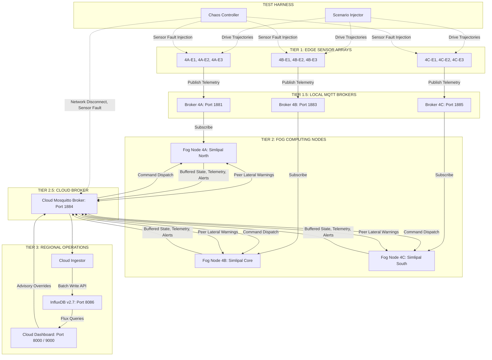
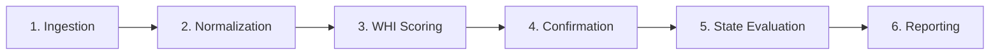
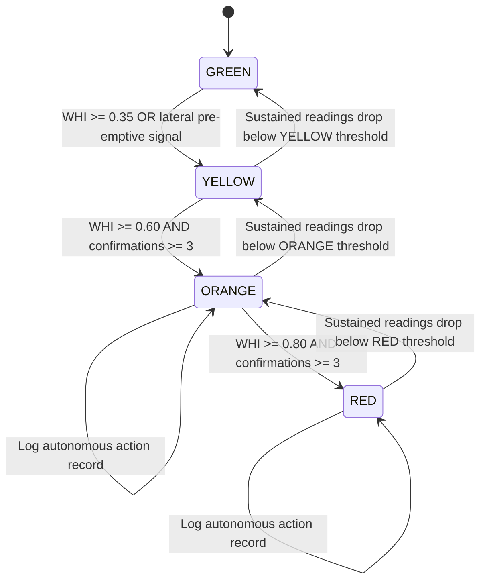
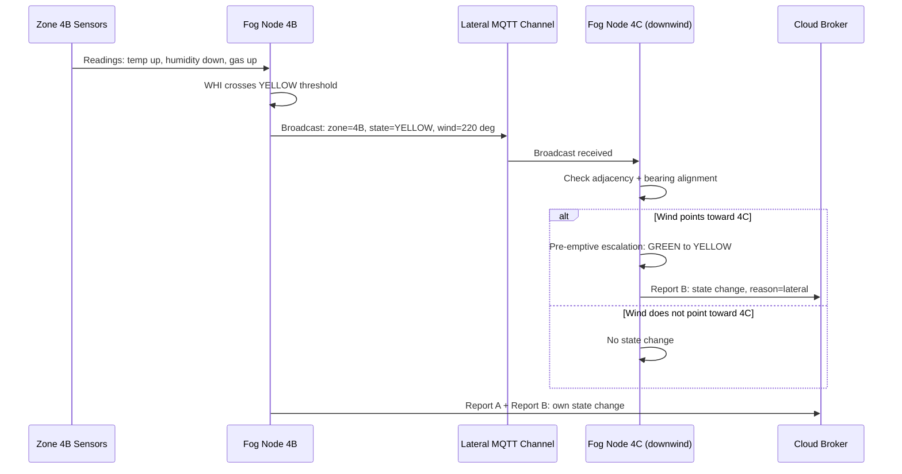
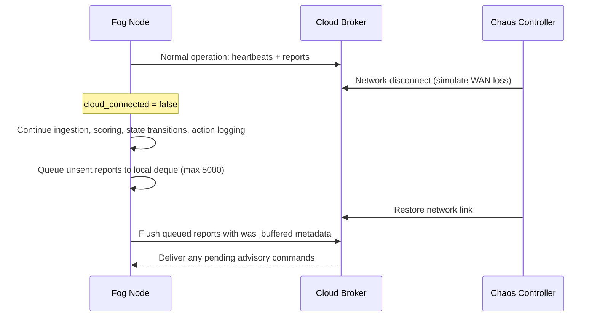

# IGNIS -- System Architecture

---

## 1. Three-Tier Container Architecture

IGNIS deploys as a set of isolated Docker microservices organized into three tiers, orchestrated by a single `docker-compose.yml`. Per-zone services are parameterized through Compose environment variables -- adding a new zone is a configuration change, not a code change.



---

## 2. Container Inventory

| Container | Image Basis | Role | Scale |
| :--- | :--- | :--- | :--- |
| `edge-sim` | `python:slim` | Synthetic sensor generator with pluggable telemetry providers | N per zone (3 in V1) |
| `mqtt-broker-local` | `eclipse-mosquitto:2` | Edge-to-Fog message bus (LoRa surrogate), isolated per zone | 1 per zone |
| `fog-node` | `python:slim` | Risk scoring, state machine, lateral coordination, buffered cloud sync | 1 per zone |
| `cloud-broker` | `eclipse-mosquitto:2` | Fog-to-Cloud and lateral peer message bus | 1 shared |
| `influxdb` | `influxdb:2.7` | Time-series telemetry and decision state persistence | 1 shared |
| `cloud-ingestor` | `python:slim` | Asynchronous MQTT-to-InfluxDB ingestion worker | 1 shared |
| `cloud-dashboard` | `python:slim` + FastAPI | Unified web operations and research portal (9 pages) | 1 shared |
| `control-center` | `python:slim` + FastAPI | Local zone operator control panel | 1 (Zone 4B) |
| `scenario-injector` | `python:slim` | Drives predefined sensor data trajectories into edge nodes | On demand |
| `chaos-controller` | `python:slim` | Network/sensor fault injection via Docker SDK | On demand |

Total: **16 containers** in the full multi-zone deployment (9 edge + 3 brokers + 3 fog + 1 cloud broker + 1 InfluxDB + 1 ingestor + 1 dashboard + 1 control center = 20; some share base images).

---

## 3. MQTT Topic Taxonomy

All topics are namespaced under the versioned root prefix `ignis/v1/`:

| Topic Path | Direction | Trigger | Payload |
| :--- | :--- | :--- | :--- |
| `ignis/v1/telemetry/zone/{zone_id}/edge/{node_id}` | Edge to Fog to Cloud | Every 3.0s | Raw sensor readings, GPS, sequence, battery |
| `ignis/v1/system/zone/{zone_id}/edge/{node_id}/control` | Cloud/Service to Edge | On demand | Mode switch (baseline, scenario, fault), random seed |
| `ignis/v1/fog/zone/{zone_id}/state` | Fog to Local and Cloud | Periodic and on state change | Zone state, WHI, active node list, clamping flags |
| `ignis/v1/fog/zone/{zone_id}/alert` | Fog to Local and Cloud | State transition event | Escalation alert, source node, confirming sensors |
| `ignis/v1/fog/zone/{zone_id}/action_log` | Fog to Local and Cloud | On ORANGE or RED | Autonomous pre-suppression action records |
| `ignis/v1/fog/zone/{zone_id}/lateral` | Fog to Cloud/Peer Fogs | On YELLOW, ORANGE, RED | Peer broadcast: state, WHI, wind vector heading |
| `ignis/v1/system/fog/zone/{zone_id}/heartbeat` | Fog to Cloud | Every 5.0s | Fog daemon health, policy thresholds |
| `ignis/v1/advisory/zone/{zone_id}/command` | Dashboard to Fog | Operator triggered | Replay-protected advisory commands |
| `ignis/v1/advisory/zone/{zone_id}/response` | Fog to Dashboard | Command execution | Status (SUCCESS / FAILED) and audit details |

---

## 4. Zone and Region Naming Hierarchy

### 4.1. Spatial Partitioning

IGNIS V1 models a single simulated forest region assigned the identifier Region 4, partitioned into three neighboring ecological zones:

| Zone | Description | Ecological Profile |
| :--- | :--- | :--- |
| `4A` | Northern Zone | Simlipal North: peer fog node for lateral warning propagation |
| `4B` | Core Zone | Simlipal Core: primary high-risk biosphere sector under active test scenarios |
| `4C` | Southern Zone | Simlipal South: peer fog node for multi-zone crosstalk isolation testing |

### 4.2. Node Hierarchy

```
Region 4
    Zone 4A (Northern Zone)
        Edge E1 (4A-E1)
        Edge E2 (4A-E2)
        Edge E3 (4A-E3)
    Zone 4B (Core Zone)
        Edge E1 (4B-E1)
        Edge E2 (4B-E2)
        Edge E3 (4B-E3)
    Zone 4C (Southern Zone)
        Edge E1 (4C-E1)
        Edge E2 (4C-E2)
        Edge E3 (4C-E3)
```

The identifier `4B-E2` resolves to: Region 4 / Zone B (Core) / Edge Node 2.

### 4.3. MQTT Namespace Mapping

The structural hierarchy maps directly into the MQTT namespace:
- `ignis/v1/telemetry/zone/4B/edge/4B-E1` -- Telemetry from Edge Node 1, Zone 4B, Region 4
- `ignis/v1/fog/zone/4B/state` -- Decision state for the Fog Node responsible for Zone 4B

### 4.4. Scalability

The naming convention scales naturally for multi-region deployments: Region 1 (1A, 1B, 1C), Region 2 (2A, 2B, 2C), etc. Adding regions or zones is a configuration change in `config/zones_config.json`.

> Region 4 is an internal simulation identifier. It is not an official administrative designation of the Simlipal Biosphere Reserve or any real forest management jurisdiction.

---

## 5. Fog Node Decision Pipeline

The fog node is the core intelligence under test. Its six-step pipeline processes each incoming edge telemetry reading:



**Step 1 -- Ingestion:** Subscribe to all edge topics for the assigned zone. Maintain a rolling buffer per sensor node with timeout-based stale node detection (15s timeout = 5 missed ticks at 3s interval).

**Step 2 -- Normalization:** Convert raw sensor readings into dimensionless 0.0-1.0 risk coefficients using parameter-specific min-max clamping and inversion. See [Mathematical Framework](mathematical_framework.md) for formulas.

**Step 3 -- WHI Scoring:** Compute the weighted composite Wildfire Hazard Index from normalized coefficients. WHI is bounded to [0.0, 1.0].

**Step 4 -- Confirmation:** Count how many independent sensor modalities exceed their individual confirmation thresholds. This count gates access to ORANGE and RED states.

**Step 5 -- State Evaluation:** Apply the deterministic state machine rules using the WHI value and confirmation count. If WHI exceeds the ORANGE/RED threshold but fewer than 3 sensors confirm, clamp to YELLOW (single fault guard).

**Step 6 -- Reporting:** Dual reporting path:
- **Report A** (local): High-priority alert published to local MQTT for the control center
- **Report B** (cloud): Full data packet (raw readings + scores + decisions) published via BufferedPublisher to the cloud broker

Additionally: evaluate received lateral warnings from peer fog nodes, process cloud advisory commands through security verification gates, and log autonomous pre-suppression actions.

---

## 6. State Machine

Each fog node maintains a deterministic 4-state machine:



**Clamping Rule:** If WHI >= 0.60 but confirmation count < 3, the state is clamped to YELLOW regardless of WHI magnitude. This is the primary false positive suppression mechanism.

**Zone Aggregation:** The zone-level state is the maximum state across all active edge nodes: `ZoneState = max(NodeStates)`. This ensures localized threats are never diluted by benign readings from distant sensors.

---

## 7. Lateral Fog-to-Fog Coordination



Lateral warnings expire after a configurable timeout (default: 30 seconds). When all active lateral warnings expire, the zone state decays back to its sensor-evaluated baseline.

---

## 8. Offline Resilience



The BufferedPublisher uses a thread-safe deque with a capacity of 5,000 items (approximately 4 hours of offline telemetry per node). On reconnection, each buffered payload is enriched with `was_buffered: true` and `buffer_flush_timestamp` metadata before publication, enabling the cloud ingestor to track buffering latency.

---

## 9. Cloud Advisory Command Pipeline

Operator advisory commands are validated through a 5-gate security pipeline before execution:

```
Incoming Command Payload
    |
    v
Gate 1: Structural Schema Validation        --> Missing fields?    --> REJECT
    |
    v
Gate 2: Duplicate UUID Deduplication         --> Command ID seen?   --> REJECT
    |
    v
Gate 3: Monotonic Sequence Counter           --> Seq <= LastSeq?    --> REJECT
    |
    v
Gate 4: Replay Protection (TTL Check)       --> Age > 300s?        --> REJECT
    |
    v
Gate 5: Zone ID Routing Match               --> Target != Zone?    --> REJECT
    |
    v
Execute Command and Apply State Lock
    |
    v
Publish Execution Response (SUCCESS)
```

### Supported Advisory Commands

| Command | Effect |
| :--- | :--- |
| `SET_SAFETY_MODE` / `set_override_state` | Clamp zone state to a specified level (GREEN, YELLOW, ORANGE, RED) |
| `FORCE_CLAMP_WHI` | Forcibly cap the effective hazard score to a specified ceiling |
| `RESET_OVERRIDE` / `release_override` | Clear all active overrides, restore autonomous decisioning |
| `ADJUST_THRESHOLD` | Modify sensor confirmation limits in memory |

---

## 10. Data Models

### 10.1. Edge Reading

```json
{
    "node_id": "4B-E2",
    "zone_id": "4B",
    "timestamp": "2026-08-06T14:30:00Z",
    "temperature_c": 34.2,
    "humidity_pct": 21.5,
    "wind_speed_kmh": 14.0,
    "wind_dir_deg": 220,
    "soil_moisture_pct": 9.1,
    "gas_ppm": 12,
    "thermal_anomaly_c": 2.1,
    "light_lux": 41000,
    "rain_mm": 0.0,
    "gps": [21.94, 86.32]
}
```

### 10.2. Fog Decision Record

```json
{
    "zone_id": "4B",
    "timestamp": "2026-08-06T14:30:01Z",
    "risk_score": 0.78,
    "state": "ORANGE",
    "confirming_sensors": ["gas_ppm", "thermal_anomaly_c", "soil_moisture_pct"],
    "actions_logged": ["activate_mist_perimeter", "notify_control_center"],
    "cloud_connected": false
}
```

### 10.3. Lateral Broadcast

```json
{
    "message_type": "lateral_broadcast",
    "version": "1",
    "zone_id": "4B",
    "state": "ORANGE",
    "whi": 0.742,
    "wind_dir_deg": 180.0,
    "wind_speed_kmh": 22.0,
    "timestamp": "2026-08-06T14:30:00Z"
}
```

---

## 11. Technology Stack

| Layer | Technology | Responsibility |
| :--- | :--- | :--- |
| Core Runtime | Python 3.10+ | Asynchronous execution, typing, dataclasses, concurrent task management |
| Web Framework | FastAPI (v0.100+) | REST API routes, Jinja2 templating, SSE streaming |
| ASGI Server | Uvicorn | Production-grade async HTTP and SSE connections |
| Messaging | Eclipse Mosquitto v2 (MQTT) | Pub/sub routing for Edge-Fog, Fog-Fog lateral, and Fog-Cloud |
| MQTT Client | Paho-MQTT | Connection management, subscriptions, QoS delivery, buffering |
| Time-Series DB | InfluxDB v2.7 | Persistent high-throughput telemetry and decision state storage |
| DB Client | InfluxDB-Client Python | Flux query builder, write API with retry and batch processing |
| Containerization | Docker + Docker Compose v2 | Multi-container microservice orchestration |
| Data Validation | Pydantic v2 | Schema definition, request validation, OpenAPI generation |
| Configuration | PyYAML + JSON | Zone topologies, scenarios (S1-S7), regression rules |
| Statistics | NumPy + SciPy | Descriptive stats, Student-t 95% confidence intervals |
| Interactive Charts | Plotly.js v2.27.0 (vendored) | Client-side charting in standalone HTML reports and dashboards |
| Static Charts | Matplotlib | Headless server-side PNG chart generation |
| Document Export | WeasyPrint + python-docx | PDF and Word DOCX export |
| Front-End | Vanilla CSS3 + HTML5 | Dark glassmorphism theme, responsive layouts |
| Test Automation | Pytest + Unittest | Unit tests, mock network tests, API integration tests |

---

## 12. Network Architecture

### 12.1. Docker Networks

| Network | Purpose | Connected Services |
| :--- | :--- | :--- |
| `default` | Local zone communication (edge nodes, fog nodes, local brokers) | All edge-sim, fog-node, mqtt-broker, control-center containers |
| `cloud-net` | Cloud tier communication (fog-to-cloud sync, dashboard, InfluxDB) | Cloud broker, InfluxDB, cloud ingestor, cloud dashboard, all fog nodes, all local brokers |

### 12.2. Port Mappings

| Port | Service |
| :--- | :--- |
| 1881 | Zone 4A Local MQTT Broker |
| 1883 | Zone 4B Local MQTT Broker |
| 1885 | Zone 4C Local MQTT Broker |
| 1884 | Cloud MQTT Broker |
| 8086 | InfluxDB v2 |
| 8000 | Control Center (local dev) / Dashboard (local dev) |
| 9000 | Cloud Dashboard (Docker) |
