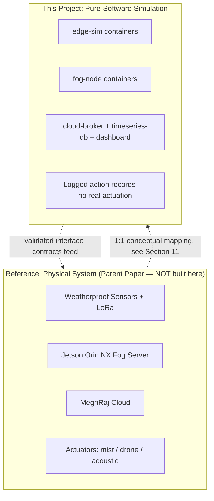
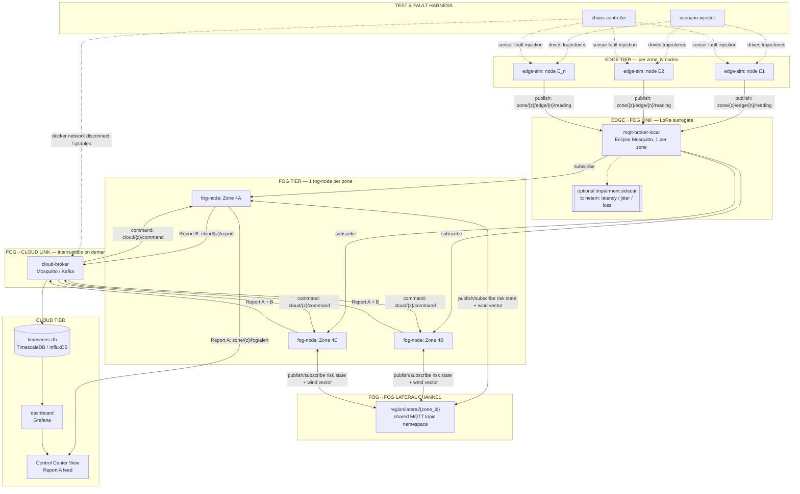
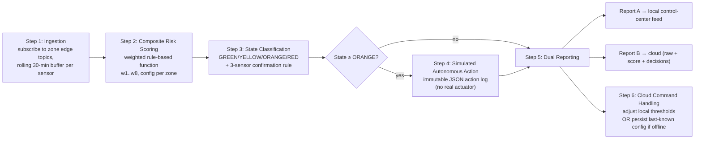
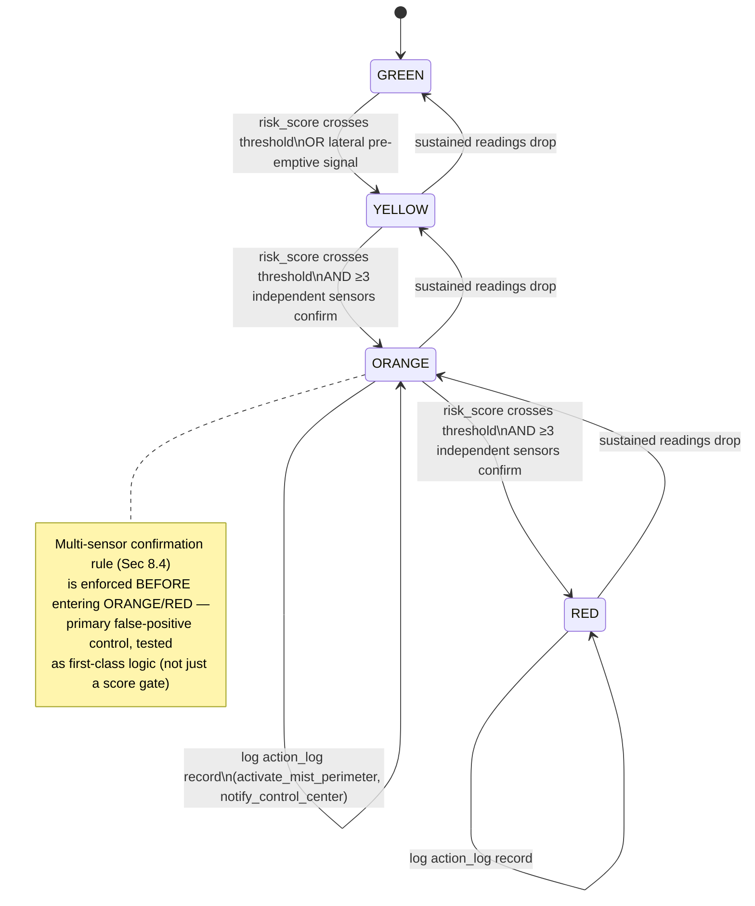
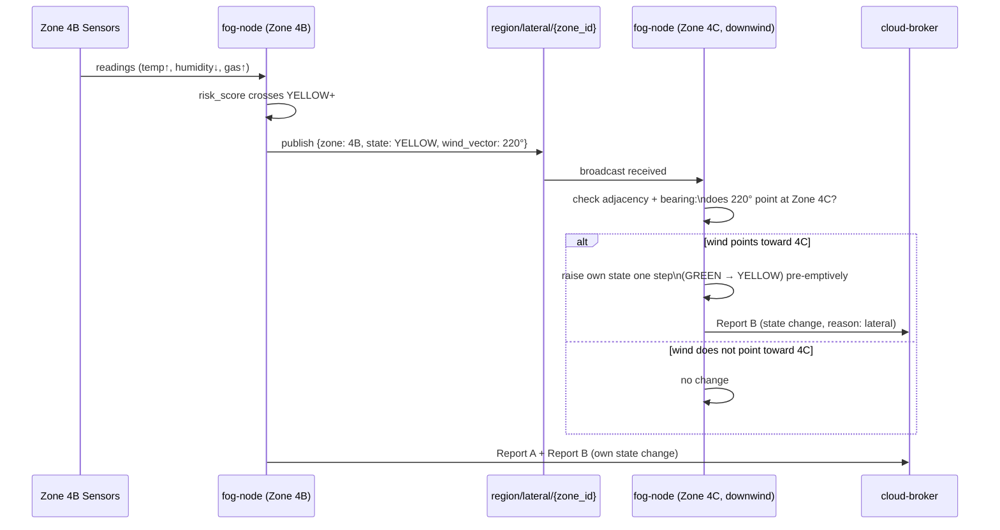
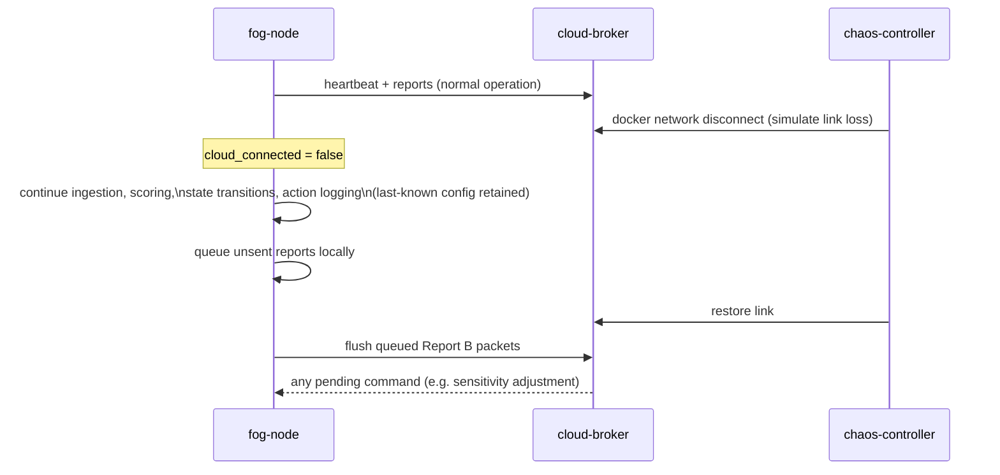
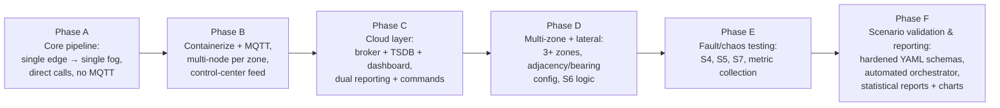

# IGNIS — Simulation Architecture

**Edge-Fog-Cloud (EFC) Software Simulation — Detailed Architecture Document (v1)**
**Parent concept:** Autonomous Wildfire Early Warning and Pre-Suppression Using Edge-Fog-Cloud Architecture in Indian Forest Ecosystems

---

## 1. Purpose

This document translates the Simulation Ideation (v1) into a concrete, buildable software architecture. It is a **decision-architecture validation testbed** — every physical component (sensors, LoRa radios, solar fog servers, actuators) is replaced with a containerized software surrogate that reproduces the same data flow, decision logic, and failure modes. Nothing here drives real hardware; the goal is to produce measurable evidence for the risk-scoring, state-machine, lateral-coordination, and offline-resilience claims of the parent design before any capital is spent.

---

## 2. System Context



---

## 3. Three-Tier Container Architecture



---

### 3.1. Simulated Forest Region & Zone Naming Hierarchy (Region 4)

IGNIS V1 models a **single simulated forest region** assigned the internal identifier **Region 4**.

> [!IMPORTANT]
> **Explicit Clarification:** Region 4 is an internal simulation identifier and should not be interpreted as an official administrative designation of the Simlipal Biosphere Reserve or any real forest management jurisdiction.

#### Spatial Partitioning & Naming Hierarchy

```
Region (Simulated Study Area)
   Zone (Ecological Sector)
         Edge Node (Microclimate Sensor Array)
```

The simulated study region is partitioned into three neighboring ecological zones:

| Zone | Description | Spatial / Ecological Profile |
| :--- | :--- | :--- |
| **`4A`** | **Northern Zone** | Simlipal North — Peer fog node for lateral warning propagation. |
| **`4B`** | **Core Zone** | Simlipal Core — Primary high-risk biosphere sector under active test scenarios (S1–S5). |
| **`4C`** | **Southern Zone** | Simlipal South — Peer fog node for multi-zone cross-talk isolation testing (S7). |

```
Region 4
 Zone 4A (Northern Zone)
       Edge E1 (4A-E1)
       Edge E2 (4A-E2)
       Edge E3 (4A-E3)
 Zone 4B (Core Zone)
       Edge E1 (4B-E1)
       Edge E2 (4B-E2)
       Edge E3 (4B-E3)
 Zone 4C (Southern Zone)
        Edge E1 (4C-E1)
        Edge E2 (4C-E2)
        Edge E3 (4C-E3)
```

An identifier such as **`4B-E2`** resolves hierarchically to:
- **Region 4**: Simulated study region
- **Zone B**: Core ecological zone
- **Edge Node 2**: Sensor node instance #2

#### MQTT Topic Namespace Mapping
The structural hierarchy is reflected directly in the versioned MQTT namespace:
- `ignis/v1/telemetry/zone/4B/edge/4B-E1` $\rightarrow$ Telemetry from Edge Node 1, Zone B, Region 4.
- `ignis/v1/fog/zone/4B/state` $\rightarrow$ Decision state for Fog Node responsible for Zone 4B in Region 4.

#### Rationale & Scalability
- The numeric prefix (**`4`**) groups related zones belonging to the same simulated forest region.
- The alphabetic suffix (**`A`**, **`B`**, **`C`**) distinguishes neighboring ecological zones within that region.
- This design scales naturally if additional simulated regions are added in future versions (e.g., Region 1: `1A,1B,1C`; Region 2: `2A,2B,2C`; Region 3: `3A,3B,3C`; Region 4: `4A,4B,4C`).

---

## 4. Container Inventory

| Container | Image Basis | Role | Scale |
|---|---|---|---|
| `edge-sim` | `python:slim` | Synthetic sensor generator | N per zone (5–10) |
| `mqtt-broker-local` | `eclipse-mosquitto` | Edge↔fog bus (LoRa surrogate) | 1 per zone |
| `fog-node` | `python:slim` / `node:slim` | Risk scoring, state machine, lateral coordination | 1 per zone |
| `cloud-broker` | `eclipse-mosquitto` or `bitnami/kafka` | Fog↔cloud bus | 1 shared |
| `timeseries-db` | `timescale/timescaledb` or `influxdb` | Historical + live store | 1 shared |
| `dashboard` | `grafana/grafana` | Visualization | 1 shared |
| `scenario-injector` | `python:slim` | Drives test scenarios | on demand |
| `chaos-controller` | `python:slim` + `iproute2` | Network/sensor fault injection | on demand |

All orchestrated via a single `docker-compose.yml`; per-zone services parameterized through Compose's `deploy`/environment-variable pattern so adding a zone is a config change, not a code change.

---

## 5. Fog-Node Internal Pipeline

The fog node is the core logic under test. Its six-step pipeline:



**Composite risk score:**
```
risk_score = w1·f(temperature) + w2·f(humidity) + w3·f(wind_speed)
           + w4·f(soil_moisture) + w5·f(gas_level) + w6·f(thermal_anomaly)
           + w7·f(time_of_day) + w8·f(seasonal_baseline)
```
Weights and normalization functions are configurable per zone (YAML/JSON), enabling dry-deciduous vs. moist-Himalayan profiles without code changes. Phase 1 is fully rule-based/auditable; a stub interface allows a later ML classifier swap without touching the surrounding architecture.

---

## 6. State Machine (per Fog Node)



---

## 7. Lateral Fog-to-Fog Coordination (Sequence)

The most novel, and highest-priority-to-validate, logic path:



---

## 8. Offline-Resilience Behavior



---

## 9. Data Model

**Edge reading**
```json
{
  "node_id": "E12", "zone_id": "4B", "timestamp": "...",
  "temperature_c": 34.2, "humidity_pct": 21.5,
  "wind_speed_kmh": 14.0, "wind_dir_deg": 220,
  "soil_moisture_pct": 9.1, "gas_ppm": 12,
  "thermal_anomaly_c": 2.1, "light_lux": 41000,
  "rain_mm": 0.0, "gps": [21.94, 86.32]
}
```

**Fog decision record**
```json
{
  "zone_id": "4B", "timestamp": "...",
  "risk_score": 0.78, "state": "ORANGE",
  "confirming_sensors": ["gas_ppm", "thermal_anomaly_c", "soil_moisture_pct"],
  "actions_logged": ["activate_mist_perimeter", "notify_control_center"],
  "cloud_connected": false
}
```

---

## 10. Topic / Message Naming Convention

| Topic | Purpose |
|---|---|
| `zone/{zone_id}/edge/{node_id}/reading` | edge sensor readings |
| `zone/{zone_id}/fog/state` | fog risk state heartbeat |
| `zone/{zone_id}/fog/alert` | control-center alert (Report A) |
| `zone/{zone_id}/fog/action_log` | simulated autonomous action record |
| `region/lateral/{zone_id}` | lateral coordination broadcast |
| `cloud/{zone_id}/report` | full data packet to cloud (Report B) |
| `cloud/{zone_id}/command` | advisory command from cloud to fog |

---

## 11. Test Scenario Matrix

| ID | Scenario | Exercises | Expected Result |
|---|---|---|---|
| S1 | Normal day | Baseline operation | State stays GREEN; periodic telemetry only |
| S2 | Slow-building risk | Gradual multi-parameter drift | GREEN→YELLOW transition; sampling rate increases |
| S3 | Sudden ignition | Rapid multi-sensor spike | ORANGE/RED within seconds; action log populated |
| S4 | Single sensor fault | Fault-mode edge node | No escalation from one faulty sensor (validates 3-sensor rule) |
| S5 | Cloud outage during event | Chaos-controller cuts fog↔cloud mid-scenario | Fog continues locally; reports flush on reconnect |
| S6 | Lateral spread prediction | S3 + wind vector toward neighbor | Neighbor pre-emptively raises state before its own sensors trigger |
| S7 | Concurrent multi-zone escalation | S3 in 2+ zones simultaneously | No dropped messages, no cross-talk, dashboard reflects both |

---

## 12. Validation Metrics

| Metric | Measurement | Validates |
|---|---|---|
| Fog decision latency | last confirming reading → state-change timestamp delta | Section 7.1 latency claim (fog-level) |
| Lateral alert propagation time | source escalation → neighbor pre-emptive change | Section 6.3 predictive capability |
| False-positive rate under fault injection | unwarranted ORANGE/RED count across S4 trials | Section 8.4 multi-sensor design |
| Offline continuity | uninterrupted decisioning/logging during S5 | Sections 2.3, 8.2 offline resilience |
| Concurrent-zone integrity | message loss / cross-talk count during S7 | Message-bus scalability |

---

## 13. Development Phases



Phase F serves as the **experimental validation and reporting layer**. By formalizing test cases as versioned, tamper-evident YAML configurations, the orchestrator computes 95% Student-t confidence intervals across multi-trial sweeps and asserts exact pass/fail metrics. The output report maps these statistical aggregates directly to architecture validation claims, confirming the real-time latencies and resilient continuity targets.

---

## 14. Technology Stack

- **Languages:** Python (edge sims, fog logic, scenario/chaos scripts); optional Node.js for fog service
- **Messaging:** Eclipse Mosquitto (MQTT); optional Kafka for higher-throughput cloud ingestion
- **Storage:** TimescaleDB or InfluxDB
- **Visualization:** Grafana; static page fallback for control-center view
- **Orchestration:** Docker Compose (no Kubernetes needed at this scale)
- **Fault injection:** `tc netem`, `iptables`/`docker network disconnect`, scripted via Python
- **Testing:** Versioned YAML scenarios + a test runner asserting on Section 12 metrics

---

## 15. Explicit Scope Boundary

| Aspect | In scope | Out of scope (hardware phase) |
|---|---|---|
| Sensor readings | Synthetic generation, realistic ranges + faults | Real calibration, drift, physical fault behavior |
| Edge↔fog comms | MQTT + optional artificial latency/loss | Real LoRa RF propagation, antenna design |
| Fog decision logic | Fully implemented and tested | — (main deliverable) |
| Autonomous actions | Logged structured records only | Real mist/drone/acoustic actuation |
| Power system | Not modeled | Solar sizing, battery chemistry |
| Fog↔fog / fog↔cloud links | MQTT + simulated outages | Real 4G/VSAT/sub-GHz RF behavior |
| Governance/logging | Immutable action-log format | Legal/regulatory sign-off, DGCA compliance |
| Hardware durability | N/A | IP67 enclosures, temperature range, tamper detection |
| Institutional integration | N/A | RFO workflows, FSI/NRSC data-sharing agreements |

---

## 16. Path Back to Hardware

Once metrics in Section 12 are stable against Section 7 targets, the natural next step (outside this project) is the Phase 1 field pilot: 5–10 real edge nodes + 1 real fog node in a single forest division, advisory-only mode, reusing the simulation's message schemas and risk-scoring config as-is — a data-source swap, not a redesign.

---

## 17. Known Limitations

- Cannot validate RF propagation, power sizing, or hardware durability — field testing is still required regardless of simulation quality.
- Synthetic sensor data won't capture the full statistical texture of real forest conditions; the measured false-positive rate is a **lower bound**, not a real-world prediction.
- "Autonomous action" outputs are logged intentions only — real actuator control is unverified until hardware integration.
- Human-factors questions (would an RFO trust and act on this alert format) cannot be tested in simulation.
