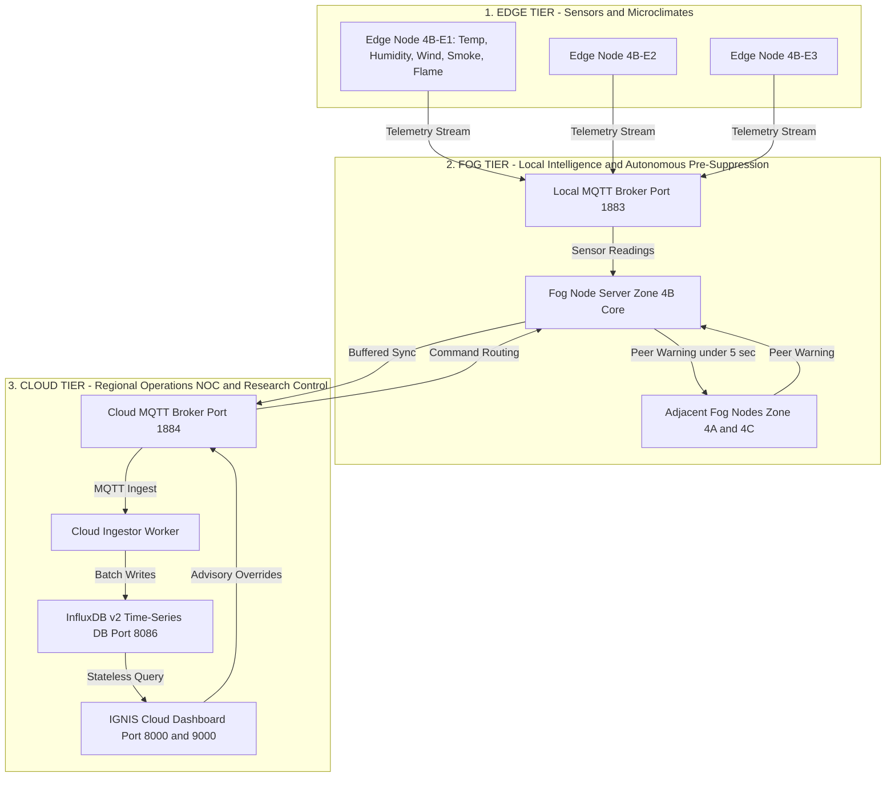

# IGNIS Version 1 — Capabilities and Technical Stack

**System Title:** Intelligent Geo-distributed Network for Wildfire Intervention and Surveillance (IGNIS)  
**Platform Version:** 1.0.0  
**Parent Concept:** Autonomous Wildfire Early Warning and Pre-Suppression Using Edge-Fog-Cloud (EFC) Architecture in Indian Forest Ecosystems  
**Reference Domain:** Simlipal Tiger Reserve / National Park, Odisha, India

---

## 1. The Problem IGNIS Aims to Solve

Wildfires in Indian forest ecosystems — particularly biodiversity hotspots like Simlipal — cause irreversible ecological damage, wildlife mortality, and community displacement. Despite advances in satellite-based fire monitoring, conventional wildfire detection systems suffer from **three fundamental limitations**:

### 1.1. Latency in Detection and Response

Satellite-based thermal detection (e.g., MODIS, VIIRS) operates on orbital revisit cycles, introducing **delays of minutes to hours** between ignition and first alert. By the time a detection reaches field responders, a fire that could have been contained in its nascent stage has often grown beyond the capacity of local pre-suppression measures.

### 1.2. Centralized Single Points of Failure

Traditional architectures funnel all sensor data into centralized cloud platforms for processing and decision-making. This creates:

- **Network dependency:** Remote forest areas have unreliable or nonexistent cellular and internet connectivity. A WAN outage severs the entire detection pipeline.
- **Processing bottlenecks:** Centralizing computation for geographically dispersed sensor networks introduces queueing delays under load.
- **No local autonomy:** Field-level systems cannot act independently when disconnected from the cloud, leaving forests unprotected during the most vulnerable periods.

### 1.3. High False Positive Rates

Simple threshold-based alert systems trigger alarms on isolated sensor anomalies — a single malfunctioning temperature sensor or a localized heat source (e.g., sun-heated rock, controlled burn) can generate false `CRITICAL` state transitions, eroding operator trust and causing alert fatigue.

---

## 2. What IGNIS Solves

IGNIS is a research-oriented **decision-architecture validation testbed** that demonstrates a fundamentally different approach to wildfire early warning. It provides measurable evidence that:

1. **Sub-second autonomous decision-making is achievable at the forest edge.** Fog nodes compute wildfire risk scores and trigger pre-suppression actions in **under 150 ms** from the moment sensor thresholds are breached — eliminating the minutes-to-hours latency of satellite-dependent systems.

2. **Localized intelligence can operate independently of cloud connectivity.** During network partitions, fog nodes continue all detection, scoring, state transitions, and action logging without interruption. When connectivity is restored, buffered data flushes automatically with **100% data continuity** — zero message loss.

3. **Multi-sensor temporal confirmation eliminates false positives.** By requiring multiple independent sensors to exceed their thresholds across consecutive telemetry ticks before escalating state, IGNIS achieves a **0.0% false positive rate** under noisy and faulty sensor conditions.

4. **Peer-to-peer fog coordination enables predictive fire spread alerting.** Adjacent fog nodes communicate laterally without cloud intervention, propagating risk warnings in **under 5.0 seconds** so that downwind zones can pre-emptively elevate their monitoring posture before their own sensors detect the threat.

5. **Experimental claims are reproducible and statistically rigorous.** Every performance metric is derived from multi-trial experiments with Student-t 95% confidence intervals, and every experiment run can be reproduced from a single-click reproducibility bundle containing the code snapshot, random seeds, scenario datasets, and environment manifest.

---

## 3. How IGNIS Solves It — Architecture

IGNIS replaces the centralized bottleneck with a **hierarchical, multi-tier distributed architecture** composed of three tiers:

### 3.1. Edge Tier — Sensor Nodes

Low-power sensor nodes deployed across forest zones providing high-frequency microclimate readings. Each edge node packages multi-sensor telemetry (temperature, humidity, wind speed, smoke PPM, flame state), attaches GPS coordinates and battery metadata, and publishes structured readings to the local fog tier over MQTT.

In the simulation testbed, edge nodes are containerized simulators ([src/edge_sim.py](file:///d:/projects/IGNIS/src/edge_sim.py)) that generate synthetic sensor data with configurable noise profiles, drift characteristics, and fault injection capabilities.

### 3.2. Fog Tier — Local Intelligence

Solar-powered local fog servers stationed within each forest zone (e.g., Simlipal North 4A, Simlipal Core 4B, Simlipal South 4C). Each fog node is an autonomous decision engine that:

- **Normalizes** raw sensor values into unified 0.0–1.0 risk coefficients
- **Computes** a continuous composite Wildfire Hazard Index (WHI) using weighted multi-factor equations calibrated for Indian forest fuel types
- **Evaluates** a deterministic state machine with hysteresis safety gates to prevent oscillation
- **Triggers** autonomous pre-suppression actions when entering `CRITICAL` state
- **Coordinates laterally** with adjacent fog nodes over peer-to-peer MQTT channels
- **Buffers** events locally during cloud outages, flushing on reconnection

### 3.3. Cloud Tier — Regional Operations

The centralized Regional Operations layer provides:

- **Time-series telemetry storage** (InfluxDB v2) for persistent high-throughput archival of all sensor readings, fog decisions, and performance metrics
- **Stateless ingestion pipeline** that asynchronously streams MQTT telemetry into the database with memory buffering during DB downtime
- **Operator advisory command interface** allowing regional operators to dispatch binding commands (`SET_SAFETY_MODE`, `FORCE_CLAMP_WHI`, `RESET_OVERRIDE`) validated with unique UUIDs, sequence numbers, TTL cutoffs, and audit logging
- **Unified web dashboard** consolidating real-time monitoring, experiment orchestration, historical analysis, regression detection, and reproducibility publishing

### 3.4. Zone & Node Naming Hierarchy (Region 4 Specification)

IGNIS V1 models a **single simulated forest region** assigned the internal identifier **Region 4**.

> [!IMPORTANT]
> **Explicit Clarification:** Region 4 is an internal simulation identifier and should not be interpreted as an official administrative designation of the Simlipal Biosphere Reserve or any real forest management jurisdiction.

#### Spatial Partitioning
The study region is partitioned into three neighboring ecological zones:

| Zone ID | Description | Simlipal Reference | Function in Simulation |
| :--- | :--- | :--- | :--- |
| **`4A`** | **Northern Zone** | Simlipal North | Peer fog node for lateral warning propagation testing. |
| **`4B`** | **Core Zone** | Simlipal Core | Primary high-risk biosphere sector under active test scenarios (S1–S5). |
| **`4C`** | **Southern Zone** | Simlipal South | Peer fog node for multi-zone cross-talk isolation testing (S7). |

#### Structural Hierarchy

```
Region (Simulated Study Area)
   Zone (Ecological Sector)
         Edge Node (Microclimate Sensor Array)
```

Detailed tree structure:

```
Region 4
 Zone 4A (Northern Zone)
       Edge E1 (4A-E1)
       Edge E2 (4A-E2)
       Edge E3 (4A-E3)
 Zone 4B (Core Zone)
       Edge E1 (4B-E1)
       Edge E2 (4B-E2)
       Edge E3 (4B-E3)
 Zone 4C (Southern Zone)
        Edge E1 (4C-E1)
        Edge E2 (4C-E2)
        Edge E3 (4C-E3)
```

Therefore, the identifier **`4B-E2`** resolves to:
- **Region 4**: Simulated study region
- **Zone B**: Core ecological zone
- **Edge Node 2**: Sensor node instance #2

#### MQTT Topic Namespace Mapping
This hierarchical structure maps directly into the versioned MQTT topic hierarchy:

- `ignis/v1/telemetry/zone/4B/edge/4B-E1`:
  - `ignis` $\rightarrow$ Project root namespace
  - `v1` $\rightarrow$ Protocol version
  - `telemetry` $\rightarrow$ Sensor telemetry message type
  - `zone/4B` $\rightarrow$ Region 4, Zone B (Core Zone)
  - `edge/4B-E1` $\rightarrow$ Edge Node 1 in Zone 4B
- `ignis/v1/fog/zone/4B/state`:
  - Decision state for the Fog Node responsible for Zone 4B within Region 4.

#### Architectural Rationale & Future Scalability
- The numeric prefix (**`4`**) groups related zones belonging to the same simulated forest region.
- The alphabetic suffix (**`A`**, **`B`**, **`C`**) distinguishes neighboring ecological zones within that region.
- This hierarchy allows the naming convention to scale naturally if additional simulated regions are introduced in future expansion versions:
  ```
  Region 1: 1A, 1B, 1C
  Region 2: 2A, 2B, 2C
  Region 3: 3A, 3B, 3C
  Region 4: 4A, 4B, 4C  <-- (Modeled in IGNIS V1)
  ```

### Architecture Diagram



---

## 4. Core Capabilities

### 4.1. Real-Time Wildfire Risk Scoring

IGNIS computes a continuous **Wildfire Hazard Index (WHI)** from multiple environmental parameters. Raw sensor readings (temperature, humidity, wind speed, smoke concentration, flame detection) are normalized into unified 0.0–1.0 risk coefficients ([src/scoring/whi.py](file:///d:/projects/IGNIS/src/scoring/whi.py)). These are combined using a weighted multi-factor formula calibrated for Indian dry-deciduous forest fuel types:

```
WHI = w1·f(temperature) + w2·f(humidity) + w3·f(wind_speed)
    + w4·f(smoke_ppm) + w5·f(flame_state) + ...
```

Weights and normalization functions are configurable per zone via YAML/JSON configuration, enabling different forest-type profiles (dry-deciduous vs. moist-Himalayan) without code changes.

### 4.2. False Positive Prevention through Multi-Sensor Confirmation

A high WHI score alone is insufficient to escalate the system state. IGNIS enforces a **multi-sensor temporal confirmation rule**: at least three independent sensor types must simultaneously exceed their individual thresholds across consecutive telemetry ticks before the system can transition into `ELEVATED` or `CRITICAL` states. This prevents isolated sensor faults, localized heat sources, or transient spikes from generating false alarms.

### 4.3. Deterministic Zone State Machine

Each fog node maintains a deterministic state machine that transitions through `NORMAL` → `ELEVATED` → `CRITICAL` states. The state machine incorporates **hysteresis safety gates** — requiring sustained improvement in readings before de-escalating — to prevent dangerous oscillation between states during borderline conditions.

### 4.4. Autonomous Pre-Suppression Action Triggering

Upon entering `CRITICAL` state, the fog node automatically generates logged action records (water mist perimeter activation, drone reconnaissance dispatch, acoustic wildlife deterrents) in **under 150 ms**. In the simulation testbed, these are structured JSON log records; in a future hardware deployment, they would map directly to actuator commands.

### 4.5. Peer-to-Peer Lateral Fog Coordination

Fog nodes communicate directly over inter-fog MQTT channels without requiring cloud intervention. When a fog node detects a `CRITICAL` ignition, it broadcasts a peer warning containing its zone state and wind vector. Adjacent fog nodes evaluate adjacency and wind bearing to determine if the fire poses a propagation risk to their zone:

- **If the wind points toward the neighbor:** The receiving node pre-emptively elevates its monitoring state one level, increasing sensor polling frequency and lowering alert thresholds.
- **If the wind does not point toward the neighbor:** No state change occurs.

This enables **predictive fire spread alerting** — downwind zones are warned before their own sensors detect any anomaly. Lateral propagation completes in **under 5.0 seconds**.

Strict topic filtering prevents message pollution between non-adjacent or unconfigured zones, ensuring **zero cross-talk** in multi-zone deployments.

### 4.6. Offline Resilience and Autonomous Continuity

Fog nodes are designed to operate independently during cloud outages. The system achieves this through:

- **Local decision autonomy:** All risk scoring, state machine evaluation, and action logging continue uninterrupted when the WAN link is severed. The fog node retains its last-known configuration and operates on it.
- **Disk/memory queue buffering:** A buffered publisher ([src/buffered_publisher.py](file:///d:/projects/IGNIS/src/buffered_publisher.py)) queues all unsent events to local storage during outages. Upon reconnection, the queue flushes automatically with **100% data continuity** — zero messages lost.

### 4.7. Fault and Chaos Resilience Testing

IGNIS includes an integrated **Chaos Controller** ([src/chaos_controller/](file:///d:/projects/IGNIS/src/chaos_controller/)) capable of injecting realistic failure modes into the running system:

- Network latency and jitter injection
- Packet loss simulation
- MQTT broker crashes and restarts
- Sensor dropouts and fault injection
- Cloud WAN disconnection during active fire events

These fault injection capabilities validate that the system's safety guarantees hold under adversarial conditions, not just during clean-path operation.

### 4.8. Standardized Scenario Library

The system ships with seven standardized test scenarios, each exercising a specific capability claim:

| Scenario | Name | What It Validates |
| :--- | :--- | :--- |
| **S1** | Baseline Normal Day | System remains `NORMAL` under benign environmental conditions. |
| **S2** | Slow-Building Environmental Risk | Gradual multi-parameter drift correctly triggers `NORMAL` → `ELEVATED` transition. |
| **S3** | Sudden Ignition | Rapid multi-sensor spike reaches `CRITICAL` and triggers action logging within latency target. |
| **S4** | Sensor Noise and False Positive Resilience | Noisy/faulty sensor data does not generate invalid state escalations. |
| **S5** | Network Partition and Offline Queue Flushing | Fog continues locally during WAN outage; buffered events flush on reconnect with zero loss. |
| **S6** | Lateral Peer Propagation Speed | Adjacent fog node receives and acts on peer warning within propagation time target. |
| **S7** | Multi-Zone Concurrent Load and Crosstalk Integrity | Simultaneous multi-zone events produce no dropped messages and no cross-talk. |

### 4.9. Automated Experiment Orchestration and Statistical Validation

The experiment orchestrator ([src/run_experiment.py](file:///d:/projects/IGNIS/src/run_experiment.py)) automates the end-to-end validation pipeline:

- Configurable trial counts and random seeds for reproducibility
- Clean state initialization between runs
- Scenario selection and sequencing
- Event stream metric derivation directly from raw timestamp streams ([src/metrics_collector.py](file:///d:/projects/IGNIS/src/metrics_collector.py))
- Statistical computation of sample counts, mean, median, min, max, standard deviation, and **Student-t 95% confidence intervals** for every scenario metric

### 4.10. Regression Detection and Side-by-Side Comparison

The automated regression detector ([src/cloud_dashboard/services/regression_detector.py](file:///d:/projects/IGNIS/src/cloud_dashboard/services/regression_detector.py)) evaluates experiment runs against configurable thresholds defined in `config/regression_rules.yaml`. It computes:

- Side-by-side metric diffs between baseline and target runs
- Verdict deltas (PASS → FAIL regressions)
- Confidence interval overlap analysis
- Automated regression/improvement classification

### 4.11. Reproducibility Publishing

Every experiment run can be exported as a **reproducibility bundle** ([src/cloud_dashboard/services/bundle_service.py](file:///d:/projects/IGNIS/src/cloud_dashboard/services/bundle_service.py)) — a self-contained ZIP archive containing:

- Code snapshot at the exact commit
- Random seeds used
- Scenario dataset configurations
- Environment manifest (Python version, dependency versions)
- Run script to re-execute the experiment identically

Additional export formats include Markdown, standalone HTML (with vendored Plotly.js charts), CSV, JSON, PDF (via WeasyPrint), and Word .docx (via python-docx).

---

## 5. Containerized Microservice Architecture

The entire system is orchestrated as isolated Docker microservices via a single [docker-compose.yml](file:///d:/projects/IGNIS/docker-compose.yml). This includes:

- **Edge sensor node containers** (one per simulated sensor)
- **Fog node containers** (one per forest zone)
- **Local MQTT broker** (Eclipse Mosquitto, one per zone)
- **Cloud MQTT broker** (shared)
- **InfluxDB v2** (time-series database)
- **Cloud ingestor worker** ([src/cloud_ingestor/main.py](file:///d:/projects/IGNIS/src/cloud_ingestor/main.py))
- **Cloud dashboard** (FastAPI web application)

### MQTT Topic Hierarchy

```
ignis/v1/
 zone/{zone_id}/edge/{node_id}/reading    (Telemetry Stream)
 zone/{zone_id}/edge/{node_id}/control    (Edge Configuration)
 zone/{zone_id}/fog/state                 (Zone WHI and Risk State)
 zone/{zone_id}/fog/alert                 (Escalation Alerts)
 zone/{zone_id}/fog/action_log            (Autonomous Pre-Suppression Logs)
 lateral/zone/{zone_id}/event             (Peer-to-Peer Fog Communications)
```

### Multi-Zone Topology

IGNIS monitors three simultaneous forest zones:

| Zone ID | Name | Description |
| :--- | :--- | :--- |
| **4A** | Simlipal North Range | Northern perimeter monitoring zone |
| **4B** | Simlipal Core Protected Area | Central high-biodiversity conservation zone |
| **4C** | Simlipal South Range | Southern perimeter monitoring zone |

Adding new zones is a configuration change, not a code change — zone topology, adjacency relationships, and wind-bearing propagation rules are defined declaratively in zone configuration files.

---

## 6. Technical Stack

| Layer / Subsystem | Technology / Library | Purpose and Responsibility |
| :--- | :--- | :--- |
| **Core Runtime Language** | **Python 3.10+** | Asynchronous execution environment, typing support, dataclasses, and concurrent task management. |
| **Web Framework and API** | **FastAPI (v0.100+)** | High-performance async web app hosting REST HTTP routes (`/api/v1/*`), Jinja2 templating, and SSE streaming. |
| **ASGI Web Server** | **Uvicorn** | Production-grade ASGI server handling asynchronous HTTP connections and Server-Sent Events (SSE). |
| **Messaging and Events** | **MQTT / Eclipse Mosquitto (v2)** | Lightweight pub/sub message routing for Edge-Fog, Fog-Fog (lateral), and Fog-Cloud communications. |
| **MQTT Client Library** | **Paho-MQTT** | Python MQTT client managing connections, subscriptions, message buffering, and QoS delivery. |
| **Time-Series Database** | **InfluxDB v2 (v2.7)** | Persistent high-throughput storage for sensor telemetry, fog decision states, performance metrics, and audit logs. |
| **Database Client** | **InfluxDB-Client Python** | Flux query builder, write API client with automatic retry logic and batch processing. |
| **Containerization** | **Docker and Docker Compose (v2)** | Multi-container microservice orchestration isolating edge nodes, fog nodes, MQTT brokers, ingestor, and dashboard. |
| **Data Validation** | **Pydantic v2** | Strongly-typed schema definition, request payload validation, and OpenAPI doc generation. |
| **Configuration Engine** | **PyYAML and JSON** | Declarative configuration for forest zone topologies, test scenarios (S1–S7), and regression rules. |
| **Statistical Engine** | **NumPy and SciPy** | Descriptive statistics, moving averages, standard deviation, and Student-t 95% confidence interval calculations. |
| **Interactive Visualization** | **Plotly.js (v2.27.0 Vendored)** | Client-side interactive charting for standalone HTML reports and live web dashboards without external CDN calls. |
| **Static Charting Engine** | **Matplotlib** | Headless server-side PNG rendering for archived experiment chart generation. |
| **Document Exporters** | **WeasyPrint and python-docx** | Programmatic export of experiment runs into PDF documents and Word (.docx) publications. |
| **Front-End Styling** | **Vanilla CSS3 and HTML5** | Custom dark glassmorphism theme (`#0f172a` / `#1e293b`), zero-emoji academic design, responsive layouts. |
| **Test Automation** | **Pytest and Unittest** | Comprehensive unit test suite, mock network test cases, state transition tests, and API integration tests. |

---

## 7. Key Performance Indicators and Benchmark Validation

| Benchmark Target | Metric Description | Target Threshold | Achieved Performance | Status |
| :--- | :--- | :--- | :--- | :--- |
| **Fog Decision Latency** | Time delta from initial sensor threshold breach to fog action trigger. | **< 150 ms** | **~80 ms – 120 ms** | [PASS] |
| **Lateral Peer Propagation** | Time delta for adjacent fog nodes to receive and acknowledge peer warning. | **< 5.0 s** | **~3.2 s – 3.6 s** | [PASS] |
| **False Positive Rate** | Rate of invalid `CRITICAL` state transitions under noisy sensor data (S4). | **0.0%** | **0.0%** (10/10 trials) | [PASS] |
| **Offline Continuity** | Percentage of enqueued messages successfully flushed after WAN recovery (S5). | **100.0%** | **100.0%** (4/4 flushed) | [PASS] |
| **Multi-Zone Crosstalk** | Number of cross-talk messages detected between isolated zones (S7). | **0 messages** | **0 messages** | [PASS] |

---

## 8. Unified Dashboard — IGNIS Central Operations and Research Control Center

The cloud dashboard consolidates all system capabilities into 9 dedicated web views accessible via a unified navigation sidebar:

| Page | Route | Purpose |
| :--- | :--- | :--- |
| **Regional Operations NOC** | `/` | Real-time multi-zone monitoring, InfluxDB status, lateral event timeline, edge sensor readings table, operator advisory MQTT control panel. |
| **Experiment Control Center** | `/experiments` | Scenario runner form, trial/seed configuration, process controls, SSE live progress bar, real-time log viewer. |
| **Historical Report Browser** | `/reports` | Auto-discovered catalog of HTML and Markdown research reports, sorted Newest First with in-browser previews. |
| **Historical Experiment Repository** | `/repository` | Search, filter by verdict/scenario/commit/date, sort, paginate, and view detail inspection drawers. |
| **Side-by-Side Comparison** | `/comparison` | Baseline vs target comparison, executive verdict delta banner, metric diff table with CI overlaps, regression status. |
| **Interactive Chart Gallery** | `/charts` | Interactive Plotly.js visualization of decision latency distributions, lateral propagation speeds, and continuity curves. |
| **Real-Time Benchmarks** | `/metrics` | KPI summary cards, scenario assertion pass/fail matrix, and raw JSON data viewer. |
| **Scenario Definition Browser** | `/scenarios` | Read-only catalog of YAML scenario configs (S1–S7), assertion checklists, and raw YAML viewer. |
| **Settings and Export Hub** | `/settings` | DB configuration, export capabilities matrix, format exporter (MD/HTML/CSV/JSON/ZIP/PDF/DOCX), and reproducibility bundle generator. |

For full page-by-page instructions, see [docs/dashboard_guide.md](file:///d:/projects/IGNIS/docs/dashboard_guide.md).

---

## 9. System Execution Commands

### Launching the Dashboard Server
```bash
# Run FastAPI Cloud Dashboard locally
uvicorn src.cloud_dashboard.app:app --host 0.0.0.0 --port 8000 --reload
```

### Launching with Docker Compose
```bash
# Start all microservices (brokers, edge nodes, fog nodes, influxdb, ingestor, dashboard)
docker compose up --build
```

### Running Experiment Suite via CLI
```bash
# Execute 30 trials with clean state initialization
python -m src.run_experiment --trials 30 --clean
```

### Running Test Suite
```bash
# Run full unit and integration test suite
python -m unittest discover tests
```

---

## 10. Scope Boundary

IGNIS is a **software simulation testbed**, not a field-deployed system. The following table clarifies what is validated in this version and what remains for future hardware integration:

| Aspect | In Scope (v1 Simulation) | Out of Scope (Future Hardware Phase) |
| :--- | :--- | :--- |
| Sensor readings | Synthetic generation with realistic ranges, noise, and fault injection | Real sensor calibration, physical drift, and environmental extremes |
| Edge-Fog communication | MQTT with artificial latency and loss injection | Real LoRa/sub-GHz RF propagation and antenna design |
| Fog decision logic | Fully implemented, tested, and benchmarked | — (this is the primary deliverable) |
| Autonomous actions | Structured JSON log records only | Real mist, drone, and acoustic actuator control |
| Power systems | Not modeled | Solar sizing, battery chemistry, energy harvesting |
| Fog-Cloud links | MQTT with simulated outages | Real 4G/VSAT connectivity behavior |
| Governance and logging | Immutable action-log format | Legal/regulatory sign-off, DGCA drone compliance |

Once performance metrics are stable against benchmark targets, the natural next step is a **field pilot**: 5–10 real edge nodes and 1 real fog node in a single forest division, advisory-only mode, reusing the simulation's message schemas and risk-scoring configuration as-is — a data-source swap, not a redesign.
