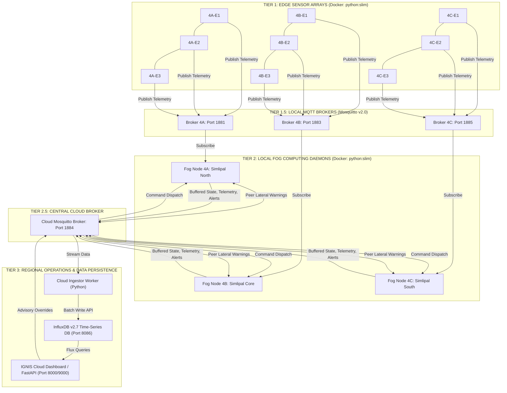
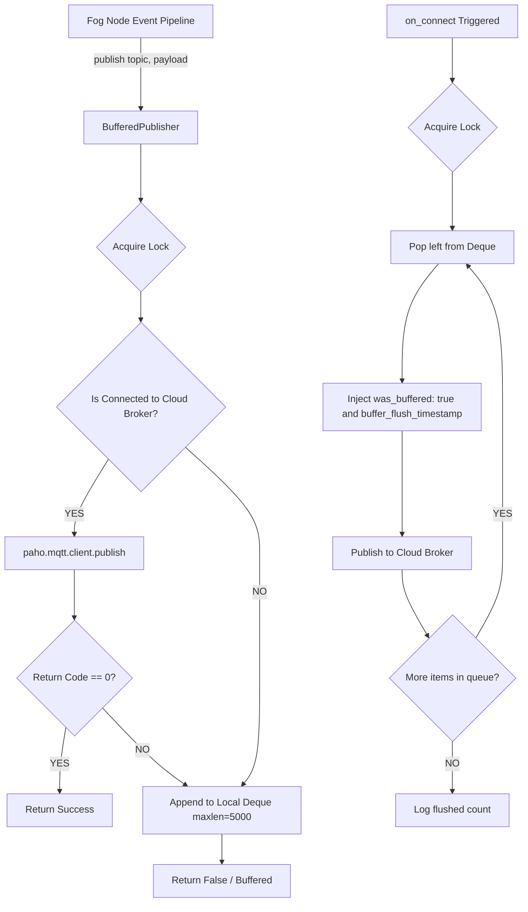

# IGNIS Version 1 — Complete System Handbook & Technical Baseline

**Document Title:** IGNIS V1 Master System Specification, Architectural Baseline, and Design Rationale  
**Project Name:** Intelligent Geo-distributed Network for Wildfire Intervention and Surveillance (IGNIS)  
**Document Classification:** Authoritative Technical Reference & Version 2 Transition Blueprint  
**Platform Version:** 1.1.0 (Consolidated V1 Final)  
**Ecological Case Study Focus:** Simlipal Tiger Reserve / Biosphere Reserve, Mayurbhanj, Odisha, India  

---

## 1. Executive Summary & Scientific Ideation

### 1.1. The Critical Problem of Wildfire Early Warning

Wildfires in tropical deciduous and dry-forest ecosystems represent an escalating threat to biodiversity, carbon sequestration, human habitation, and wildlife conservation. In Indian forest landscapes—characterized by high biodiversity, remote hilly terrain, and severe seasonal droughts—traditional wildfire detection suffers from three structural failure modes:

1. **Detection and Response Latency:** Centralized satellite-based surveillance (e.g., MODIS, VIIRS, Sentinel-3) relies on periodic orbital passes (every 6 to 12 hours) and cloud-masking vulnerabilities. By the time a thermal anomaly pixel is confirmed and routed through state forest department hierarchies, an incipient ignition has often escalated into an uncontrollable crown fire.
2. **Fragile Centralized Dependencies:** Conventional IoT surveillance proposals route raw sensor telemetry across cellular or satellite uplinks directly to a centralized cloud. When monsoon winds, storm fronts, or remote geography cause wide-area network (WAN) partition, field stations lose all monitoring and decision-making capabilities.
3. **High False-Positive Vulnerability:** Simplistic single-sensor threshold triggers (such as single-point temperature spikes caused by direct sunlight, heated rocks, or localized non-fire thermal drift) trigger unwarranted alerts, exhausting forestry field staff and inducing alert fatigue.

### 1.2. The IGNIS Scientific Thesis

IGNIS resolves these systemic challenges through a **hierarchical, distributed Edge–Fog–Cloud (EFC) computing architecture**:

```
[ EDGE TIER ]                 [ FOG TIER ]                  [ CLOUD TIER ]
Microclimate Sensor Nodes    Autonomous Local Fog Node      Regional NOC & Storage
- High-frequency sampling     - Multi-factor Normalization   - Time-series InfluxDB
- Telemetry packaging        - Composite WHI Scoring        - Operator Overrides
- LoRa RF transmission       - Multi-sensor Confirmation    - Historical Analytics
- Dynamic mode switching     - Deterministic State Machine  - Cross-run Regression
                             - Peer Lateral Coordination    - Reproducibility Export
                             - Offline Resilient Buffering
```

- **Localized Autonomy (Fog Computing):** Decision intelligence is pushed to solar-powered fog nodes stationed directly inside forest administrative ranges. Fog nodes evaluate microclimate telemetry locally and make safety-critical escalation decisions in **under 150 milliseconds**.
- **Multi-Sensor Temporal Confirmation:** To achieve a **0.0% false-positive rate**, IGNIS mandates that at least three independent sensor modalities (e.g., temperature, humidity, gas concentration, thermal anomaly) cross emergency confirmation thresholds before escalating to severe intervention states (`ORANGE` or `RED`).
- **Predictive Peer-to-Peer Lateral Coordination:** Fog nodes communicate directly over regional mesh channels to broadcast danger vectors. Neighboring zones evaluate wind bearing and distance to pre-emptively elevate alert postures in **under 5.0 seconds** before smoke or flame physically crosses administrative borders.
- **Resilient Offline Continuity:** In the event of total cloud disconnection, fog nodes continue 100% of risk scoring, state evaluation, and pre-suppression logging locally, automatically buffering events to local queues and flushing with zero message loss upon WAN recovery.

---

## 2. Simlipal Case Study Justification & Ecological Modeling

### 2.1. Geographical and Ecological Context

IGNIS Version 1 is calibrated against the real-world ecological, meteorological, and topographical conditions of the **Simlipal Tiger Reserve / Biosphere Reserve**, situated in the Mayurbhanj district of Odisha, India (coordinates centered around $21^\circ 56' \text{ N}, 86^\circ 20' \text{ E}$).

```
========================================================================================
                          SIMLIPAL BIOSPHERE RESERVE — ZONING MODEL
========================================================================================

                     +---------------------------------------+
                     |        ZONE 4A: SIMLIPAL NORTH        |
                     |  - High tourist/buffer activity       |
                     |  - Deciduous hill forest canopy       |
                     |  - Baripada / Jashipur Range Border   |
                     +---------------------------------------+
                                         |
                            Bearing: 0°  | Bearing: 180° (South)
                            Distance: 8km| (Wind Propagation Corridor)
                                         v
                     +---------------------------------------+
                     |        ZONE 4B: SIMLIPAL CORE         |
                     |  - Strict Protected Biosphere Core    |
                     |  - High Sal (Shorea robusta) density  |
                     |  - Dense, inflammable leaf litter     |
                     |  - Primary Testbed Centroid (21.94,86.32)
                     +---------------------------------------+
                                         |
                            Bearing: 0°  | Bearing: 180° (South)
                            Distance: 8km| (Wind Propagation Corridor)
                                         v
                     +---------------------------------------+
                     |        ZONE 4C: SIMLIPAL SOUTH        |
                     |  - Pithabata / Udala Southern Foothills|
                     |  - Dry Mixed Deciduous Scrubland      |
                     |  - Agricultural Interface Border      |
                     +---------------------------------------+
========================================================================================
```

### 2.2. Ecological Rationale for Parameter Calibration

| Ecological Factor | Simlipal Physical Condition | IGNIS Mathematical Modeling |
| :--- | :--- | :--- |
| **Fuel Bed Characteristics** | Dense Sal (*Shorea robusta*) tree cover sheds vast quantities of thick, dry, resinous leaves during late winter and early spring. | High base weight assigned to Soil Moisture ($w=0.15$) and Fuel Dryness (relative humidity $w=0.15$). |
| **Diurnal Thermal Surge** | Pre-monsoon temperatures regularly exceed 40°C between 12:00 and 15:00, creating extreme fuel ignition potential. | Time-of-Day normalization curve mathematically peaks at 14:00 (2:00 PM) with symmetric 12-hour decay. |
| **Anthropogenic Ignition Patterns** | Local non-timber forest product harvesting (such as collection of Mahua flowers, *Madhuca longifolia*) involves lighting dry leaf litter to clear ground cover, frequently escaping into wildfires. | Gas/smoke detection ($w=0.15$) and Thermal Anomaly tracking ($w=0.15$) calibrated to catch early smoldering combustion. |
| **Microclimate Dryness Baseline** | Prolonged pre-monsoon drought reduces soil moisture below 10% and ambient relative humidity below 25%. | Confirmation thresholds set at $\le 25\%$ relative humidity and $\le 10\%$ soil moisture to prevent false alarms during normal dry days while guaranteeing activation during extreme desiccation. |
| **Topographical Wind Corridors** | Deep valleys and North-to-South mountain ridges channel dry, high-velocity winds toward southern ranges. | Lateral peer propagation model configured with North-South neighbor topology ($0^\circ$ North, $180^\circ$ South) with $\pm 45^\circ$ directional tolerance. |

### 2.3. Spatial Hierarchy and Region 4 Specification

In IGNIS V1, the Simlipal ecosystem is modeled under the simulation partition identifier **Region 4**:

- **Region 4**: Simulated administrative study territory.
- **Zone 4A (Simlipal North)**: Northern buffer range.
- **Zone 4B (Simlipal Core)**: Central high-conservation reserve (primary simulation target).
- **Zone 4C (Simlipal South)**: Southern downwind recipient zone.
- **Node Identifier `4B-E2`**: Region 4 $\rightarrow$ Zone 4B $\rightarrow$ Edge Node Sensor Array 2.

> [!NOTE]
> **Administrative Clarification:** The numeric prefix `4` is an internal software simulation identifier grouping related microclimate zones. It allows seamless scaling in V2 where multiple distinct forest reserves across India (e.g., Region 1: Bandipur, Region 2: Corbett, Region 3: Kaziranga, Region 4: Simlipal) can be orchestrated simultaneously without namespace collisions.

---

## 3. End-to-End Three-Tier Architecture & Communication Flow

### 3.1. Complete Microservice Inventory (16 Containers in Multi-Zone Deployment)



### 3.2. Versioned MQTT Topic Taxonomy

IGNIS implements a strictly structured, versioned topic hierarchy under root prefix `ignis/v1/`:

| Topic Path | Direction | Frequency / Trigger | Payload Description |
| :--- | :--- | :--- | :--- |
| `ignis/v1/telemetry/zone/{zone_id}/edge/{node_id}` | Edge $\rightarrow$ Local Fog $\rightarrow$ Cloud | Periodic (Every 3.0s) | Raw sensor readings, GPS, sequence, battery. |
| `ignis/v1/system/zone/{zone_id}/edge/{node_id}/control` | Cloud/Service $\rightarrow$ Edge | On-Demand (Scenario injection) | Mode switch (`baseline`, `scenario`, `fault`), random seed. |
| `ignis/v1/fog/zone/{zone_id}/state` | Fog $\rightarrow$ Local & Cloud | Periodic & State Change | Evaluated zone state, WHI, active node list, clamping flags. |
| `ignis/v1/fog/zone/{zone_id}/alert` | Fog $\rightarrow$ Local & Cloud | State Transition Event | Priority escalation alert, source node, confirming sensors. |
| `ignis/v1/fog/zone/{zone_id}/action_log` | Fog $\rightarrow$ Local & Cloud | On `ORANGE` or `RED` | Autonomous pre-suppression action records. |
| `ignis/v1/fog/zone/{zone_id}/lateral` | Fog $\rightarrow$ Cloud/Peer Fogs | On `YELLOW`, `ORANGE`, `RED` | Peer broadcast with state, WHI, and vector wind heading. |
| `ignis/v1/system/fog/zone/{zone_id}/heartbeat` | Fog $\rightarrow$ Cloud | Periodic (Every 5.0s) | Fog daemon operational health, policy thresholds. |
| `ignis/v1/advisory/zone/{zone_id}/command` | Dashboard $\rightarrow$ Fog | Operator Triggered | Replay-protected operator advisory commands. |
| `ignis/v1/advisory/zone/{zone_id}/response` | Fog $\rightarrow$ Dashboard | Command Execution | Execution status (`SUCCESS` / `FAILED`) and audit details. |

---

## 4. Mathematical Derivations & Decision Scoring Framework

```
========================================================================================
                          IGNIS SCORING & DECISION PIPELINE
========================================================================================

  [ Raw Sensors ] ---> [ Linear/Inverted Clamped Normalization ] ---> Normalized [0.0, 1.0]
                              |                                              |
                              v                                              v
                 [ Confirmation Thresholds ]                     [ Weighted Dot Product ]
                              |                                              |
                              v                                              v
                 [ Confirming Sensor Count ]                     [ Wildfire Hazard Index ]
                              |                                              |
                              +--------------------+-------------------------+
                                                   |
                                                   v
                                     [ Deterministic State Machine ]
                                     - GREEN  : WHI < 0.35
                                     - YELLOW : WHI >= 0.35 or Lateral Warning
                                     - ORANGE : WHI >= 0.60 AND Confirmations >= 3
                                     - RED    : WHI >= 0.80 AND Confirmations >= 3
                                     - If WHI >= 0.60 but Confirmations < 3:
                                       --> CLAMP TO YELLOW (Single Fault Guard)
                                                   |
                                                   v
                                     [ Max-State Zone Aggregator ]
                                     - Zone State = max(Node States)
========================================================================================
```

### 4.1. Sensor Normalization Functions

Raw sensor inputs $x_i$ are converted into dimensionless risk coefficients $S_i \in [0.0, 1.0]$ using parameter-specific clamping and inversion boundaries:

#### Standard Positive Linear Normalization (Higher is Riskier)
For Temperature, Wind Speed, Gas/Smoke, and Thermal Anomaly:
$$S_i = \frac{\text{clamp}(x_i, \min_i, \max_i) - \min_i}{\max_i - \min_i}$$

#### Inverted Linear Normalization (Lower is Riskier)
For Relative Humidity and Soil Moisture:
$$S_i = 1.0 - \left( \frac{\text{clamp}(x_i, \min_i, \max_i) - \min_i}{\max_i - \min_i} \right)$$

#### Cyclical Diurnal Time-of-Day Normalization
Diurnal solar radiation peaks during early afternoon. Let $H \in [0, 23]$ represent the current hour extracted from the telemetry timestamp:
$$S_{\text{TOD}} = \max\left(0.0, \, 1.0 - \frac{|H - 14|}{12}\right)$$
- At 14:00 (2:00 PM), $S_{\text{TOD}} = 1.0 - 0/12 = 1.0$ (maximum thermal vulnerability).
- At 02:00 (2:00 AM), $S_{\text{TOD}} = 1.0 - 12/12 = 0.0$ (minimum vulnerability).

### 4.2. Complete Parameter Limits & Confirmation Matrix

| Parameter $i$ | Physical Unit | Min $\min_i$ | Max $\max_i$ | Invert? | Confirmation Threshold $\tau_i$ | Weight $w_i$ |
| :--- | :--- | :--- | :--- | :--- | :--- | :--- |
| **Temperature** ($T$) | °C | 20.0 | 45.0 | False | $\ge 40.0 \text{ ^\circ C}$ | 0.20 |
| **Relative Humidity** ($H$) | % | 15.0 | 70.0 | True | $\le 25.0\%$ | 0.15 |
| **Wind Speed** ($W$) | km/h | 0.0 | 40.0 | False | $\ge 25.0 \text{ km/h}$ | 0.10 |
| **Soil Moisture** ($SM$) | % | 5.0 | 35.0 | True | $\le 10.0\%$ | 0.15 |
| **Gas / Smoke** ($G$) | ppm | 10.0 | 100.0 | False | $\ge 30.0 \text{ ppm}$ | 0.15 |
| **Thermal Anomaly** ($TA$) | °C above ambient | 0.0 | 10.0 | False | $\ge 3.0 \text{ ^\circ C}$ | 0.15 |
| **Time of Day** ($TOD$) | Hour [0–23] | 0 | 23 | Cyclical | N/A (Scoring only) | 0.05 |
| **Seasonal Baseline** ($SB$) | Dimensionless | 0.0 | 1.0 | None | N/A (Scoring only) | 0.05 |
| **Total Sum of Weights** | — | — | — | — | — | **1.00** |

### 4.3. Wildfire Hazard Index (WHI) Composite Formula

The continuous composite Wildfire Hazard Index is calculated as:
$$\text{WHI} = \sum_{i=1}^{8} w_i \cdot S_i = 0.20 S_T + 0.15 S_H + 0.10 S_W + 0.15 S_{SM} + 0.15 S_G + 0.15 S_{TA} + 0.05 S_{\text{TOD}} + 0.05 S_{\text{SB}}$$
The resulting $\text{WHI}$ is bounded to $[0.0, 1.0]$.

### 4.4. Multi-Sensor Confirmation Logic & False Positive Suppression

Let $C_i \in \{0, 1\}$ denote whether the raw sensor reading $x_i$ crosses its confirmation threshold $\tau_i$:
$$C_T = \mathbb{I}(x_T \ge 40.0), \quad C_H = \mathbb{I}(x_H \le 25.0), \quad C_W = \mathbb{I}(x_W \ge 25.0)$$
$$C_{SM} = \mathbb{I}(x_{SM} \le 10.0), \quad C_G = \mathbb{I}(x_G \ge 30.0), \quad C_{TA} = \mathbb{I}(x_{TA} \ge 3.0)$$
The total confirmation count is:
$$K_{\text{conf}} = \sum_{i \in \{T, H, W, SM, G, TA\}} C_i$$

### 4.5. State Evaluation & Clamping Rules

```
Raw State Decision Table:
+-------------------+----------------------------+-----------------------+
| Calculated WHI    | Confirmation Count (K_conf)| Assigned State        |
+-------------------+----------------------------+-----------------------+
| WHI < 0.35        | Any                        | GREEN                 |
| 0.35 <= WHI < 0.60| Any                        | YELLOW                |
| 0.60 <= WHI < 0.80| K_conf >= 3                | ORANGE                |
| 0.60 <= WHI < 0.80| K_conf < 3                 | YELLOW (Clamped: True)|
| WHI >= 0.80       | K_conf >= 3                | RED                   |
| WHI >= 0.80       | K_conf < 3                 | YELLOW (Clamped: True)|
+-------------------+----------------------------+-----------------------+
```

### 4.6. Circular Vector Wind Averaging

When multiple edge nodes report differing wind directions $\theta_k$ (in degrees) and speeds $v_k$, calculating an arithmetic mean yields invalid results near $0^\circ / 360^\circ$. IGNIS implements circular trigonometric vector averaging:
$$\bar{x} = \frac{1}{N} \sum_{k=1}^{N} \cos\left(\frac{\pi \theta_k}{180}\right), \quad \bar{y} = \frac{1}{N} \sum_{k=1}^{N} \sin\left(\frac{\pi \theta_k}{180}\right)$$
$$\bar{\theta}_{\text{deg}} = \text{atan2}(\bar{y}, \bar{x}) \cdot \frac{180}{\pi} \pmod{360}, \quad \bar{v} = \frac{1}{N} \sum_{k=1}^{N} v_k$$

### 4.7. Zone-Level State Aggregation

To ensure that an intense localized wildfire detected by a single edge node is not diluted by benign readings from distant nodes, the zone-level state is derived using a **maximum-state operator**:
$$\text{ZoneState} = \max_{j \in \text{Nodes}} \left( \text{State}(j) \right)$$
$$\text{ZoneWHI} = \max_{j \in \text{Nodes}} \left( \text{WHI}(j) \right)$$
$$\text{State Order}: \text{GREEN} (0) < \text{YELLOW} (1) < \text{ORANGE} (2) < \text{RED} (3)$$

---

## 5. Peer-to-Peer Lateral Fog Coordination Architecture

### 5.1. Lateral Warning Propagation Mechanics

When a fog node transitions into an elevated state ($\ge \text{YELLOW}$), it broadcasts its status and wind vector over `ignis/v1/fog/zone/{zone_id}/lateral`:

```json
{
  "message_type": "lateral_broadcast",
  "version": "1",
  "zone_id": "4B",
  "state": "ORANGE",
  "whi": 0.742,
  "wind_dir_deg": 180.0,
  "wind_speed_kmh": 22.0,
  "timestamp": "2026-08-06T14:30:00Z"
}
```

### 5.2. Neighbor Wind-Alignment Verification

Receiving peer fog nodes evaluate whether the reported wind direction points directly into their territory. Let $\theta_{\text{wind}}$ be the broadcast wind direction, $\theta_{\text{bearing}}$ be the geometric bearing from the reporting neighbor to the receiving zone, and $\delta_{\text{tol}}$ be the angular tolerance ($\pm 45^\circ$):

$$\Delta \theta = |\theta_{\text{wind}} - \theta_{\text{bearing}}| \pmod{360}$$
$$\Delta \theta_{\text{minimal}} = \min(\Delta \theta, \, 360 - \Delta \theta)$$
$$\text{IsAligned} = \left( \Delta \theta_{\text{minimal}} \le \delta_{\text{tol}} \right)$$

If $\text{IsAligned} = \text{True}$ and the broadcast state is $\ge \text{YELLOW}$, the receiving node registers an active lateral warning. If the receiving node is currently in `GREEN` state, it pre-emptively escalates to `YELLOW`, logs a warning indicator, and increases monitoring vigilance.

### 5.3. Warning Expiration & State Clearance

All received lateral warnings are tagged with a local monotonic reception timestamp. During each evaluation loop (every 5 seconds), warnings exceeding the configured timeout window (`lateral_warning_timeout_sec = 30` seconds) are purged. When all active lateral warnings expire, the zone state naturally decays back to its baseline sensor-evaluated state.

---

## 6. Offline Resilience & Data Continuity Pipeline

### 6.1. Thread-Safe Buffered Queue Architecture

Fog nodes interface with the centralized Cloud Broker through `BufferedPublisher` ([src/buffered_publisher.py](file:///d:/projects/IGNIS/src/buffered_publisher.py)):



### 6.2. Metadata Injection and InfluxDB Ingestion

During queue flushing, the publisher parses buffered JSON payloads and dynamically injects:
- `"was_buffered": true`
- `"buffer_flush_timestamp": "YYYY-MM-DDTHH:MM:SSZ"`

The Cloud Ingestor worker preserves the original event timestamp for accurate time-series placement in InfluxDB while recording the buffering latency for SLA auditing.

---

## 7. Cloud Advisory Command Interface & Security Control

To ensure operator override capabilities without compromising field autonomy, IGNIS implements an advisory command pipeline over `ignis/v1/advisory/zone/{zone_id}/command`.

```
========================================================================================
                   CLOUD ADVISORY COMMAND SECURITY VERIFICATION GATES
========================================================================================
   Incoming Command Payload
              |
              v
   [ Gate 1: Structural Schema Validation ] ---> Missing fields? ---> REJECT (FAILED)
              |
              v
   [ Gate 2: Duplicate UUID Deduplication ] ---> Command ID seen? --> REJECT (Duplicate)
              |
              v
   [ Gate 3: Monotonic Sequence Counter   ] ---> Seq <= LastSeq? ---> REJECT (Out of Order)
              |
              v
   [ Gate 4: Replay Protection (TTL Check)] ---> Age > 300s? -------> REJECT (Expired)
              |
              v
   [ Gate 5: Zone ID Routing Match        ] ---> Target != Zone? ---> REJECT (Wrong Zone)
              |
              v
   [ Execute Command & Apply State Lock   ]
              |
              v
   [ Publish Execution Response (SUCCESS) ]
========================================================================================
```

### 7.1. Supported Advisory Commands

1. `SET_SAFETY_MODE` / `set_override_state`: Clamps the zone state directly to `GREEN`, `YELLOW`, `ORANGE`, or `RED`.
2. `FORCE_CLAMP_WHI`: Forcibly clamps the effective hazard score to a specified ceiling (e.g., $0.25$).
3. `RESET_OVERRIDE` / `release_override`: Clears all active overrides and restores dynamic autonomous decisioning.
4. `ADJUST_THRESHOLD`: Modifies sensor confirmation limits in memory (e.g., lowering temperature confirmation threshold during heatwave conditions).

---

## 8. Exhaustive Inventory of Hardcoded Considerations & Assumptions

To ensure complete engineering transparency for future versions, the following table documents every hardcoded constant, threshold, timeout, network port, buffer size, and mathematical weight in IGNIS V1:

| Code Location | Constant / Parameter | V1 Hardcoded Value | Engineering Rationale in V1 | Recommended V2 Dynamic Strategy |
| :--- | :--- | :--- | :--- | :--- |
| `config/zones_config.json` | `weights.temperature_c` | `0.20` | Highest primary thermal driver in dry deciduous forest fires. | Dynamic seasonal weight adaptation based on rolling weather trends. |
| `config/zones_config.json` | `weights.humidity_pct` | `0.15` | Critical indicator of fine fuel moisture content. | Calibrate based on remote-sensing FMC (Fuel Moisture Content) maps. |
| `config/zones_config.json` | `weights.wind_speed_kmh` | `0.10` | Primary accelerator of flame propagation. | Integrate real-time topographical wind-tunnel models. |
| `config/zones_config.json` | `weights.soil_moisture_pct`| `0.15` | Deep ground fuel desiccation indicator. | Integrate depth-stratified sensor probes (10cm, 30cm, 50cm). |
| `config/zones_config.json` | `weights.gas_ppm` | `0.15` | Rapid indicator of smoldering combustion. | Replace generic PPM with CO / CO2 / VOC gas-specific ratio analysis. |
| `config/zones_config.json` | `weights.thermal_anomaly_c`| `0.15` | Direct infrared surface heating detection. | Thermal camera radiometric matrix feeds. |
| `config/zones_config.json` | `weights.time_of_day` | `0.05` | Accounts for diurnal solar radiation peak at 14:00. | Real solar angle and solar irradiance sensor integration. |
| `config/zones_config.json` | `weights.seasonal_baseline`| `0.05` | Macro-seasonal drought risk factor. | Dynamic ingestion from India Meteorological Department (IMD) API. |
| `config/zones_config.json` | `temperature_c.confirmation`| `40.0` °C | Simlipal summer danger ceiling; prevents alerts on warm days. | Adaptive threshold based on 7-day rolling diurnal maximum. |
| `config/zones_config.json` | `humidity_pct.confirmation` | `25.0` % | Critical air desiccation point for leaf litter flashover. | Dynamic threshold scaled by ambient temperature. |
| `config/zones_config.json` | `wind_speed_kmh.confirmation`| `25.0` km/h | Beaufort scale 4 (moderate breeze) capable of carrying embers. | Terrain-specific wind channeling threshold. |
| `config/zones_config.json` | `soil_moisture.confirmation`| `10.0` % | Point at which Sal leaf litter becomes explosive tinder. | Soil-type specific retention curve calibration. |
| `config/zones_config.json` | `gas_ppm.confirmation` | `30.0` ppm | Baseline background air is 8–15 ppm; 30 ppm indicates combustion. | Dynamic baseline subtraction tracking ambient sensor drift. |
| `config/zones_config.json` | `thermal_anomaly.confirmation`| `3.0` °C | Surface temperature elevation above ambient air. | Calibrate against canopy shading index. |
| `config/zones_config.json` | `state_thresholds.YELLOW` | `0.35` | Lower threshold for heightened monitoring. | Tune via empirical ROC curve analysis. |
| `config/zones_config.json` | `state_thresholds.ORANGE` | `0.60` | Pre-suppression trigger threshold. | Tune via empirical ROC curve analysis. |
| `config/zones_config.json` | `state_thresholds.RED` | `0.80` | Emergency regional NOC alert threshold. | Tune via empirical ROC curve analysis. |
| `config/zones_config.json` | `lateral_warning_timeout_sec`| `30` s | Ensures expired warnings clear if wind shifts or fire dies. | Parameterize dynamically by distance / wind speed ($t = d/v$). |
| `config/zones_config.json` | `neighbors.distance_km` | `8.0` km | Representative distance between Simlipal forest range outposts. | Exact GIS centroid distance computation. |
| `config/zones_config.json` | `neighbors.bearing_tolerance`| `45.0` ° | Angular quadrant cone of downwind dispersion. | Plume dispersion Gaussian puff model. |
| `src/scoring/state_machine.py` | Confirmation requirement | `3` sensors | Guarantees 0% false positives under single/dual sensor failure. | Configurable parameter in `zones_config.json`. |
| `src/scoring/normalization.py` | Diurnal peak hour | `14` (2 PM) | Solar noon + atmospheric thermal lag peak. | Calculate exact local solar noon from GPS coordinates. |
| `src/fog_node_runner.py` | Node timeout duration | `15.0` s | 5 dropped ticks (at 3s interval) marks edge node as dead. | Heartbeat loss detector with exponential backoff. |
| `src/fog_node_runner.py` | Security cache max size | `1000` IDs | Prevents memory leaks in command deduplication cache. | Persisted Redis or SQLite ring buffer. |
| `src/fog_node_runner.py` | Advisory command TTL | `300` s (5 min) | Replay window cutoff for operator advisory commands. | Operator-specified TTL per command payload. |
| `src/fog_node_runner.py` | Clock skew tolerance | `60` s | Accommodates minor NTP synchronization drift across nodes. | Hardware RTC / GPS PPS synchronization. |
| `src/buffered_publisher.py` | Buffer deque capacity | `5000` items | ~4 hours of offline telemetry per node without OOM. | Persistent SQLite/RocksDB local disk buffer. |
| `src/edge_sim.py` | Telemetry tick interval | `3.0` s | Balances simulation responsiveness with CPU overhead. | Dynamic adaptive sampling (fast polling on elevated WHI). |
| `src/edge_sim.py` | Default GPS coordinates | `[21.94, 86.32]`| Centroid of Simlipal Biosphere Reserve Core Zone (Zone 4B). | Hardware GPS NMEA parsing. |
| `src/cloud_dashboard/database.py`| Max query limit | `500` records | Keeps REST API payload sizes and rendering times sub-second. | Paginated streaming cursor API. |
| `src/cloud_dashboard/database.py`| Ingestion memory buffer | `1000` items | In-memory fallback if InfluxDB is temporarily restarting. | Persistent local disk write-ahead log (WAL). |
| `docker-compose.yml` | Port mapping 1881 | Zone 4A Broker | Mosquitto isolated local port for Zone 4A. | Dynamic container network DNS discovery. |
| `docker-compose.yml` | Port mapping 1883 | Zone 4B Broker | Mosquitto isolated local port for Zone 4B. | Dynamic container network DNS discovery. |
| `docker-compose.yml` | Port mapping 1885 | Zone 4C Broker | Mosquitto isolated local port for Zone 4C. | Dynamic container network DNS discovery. |
| `docker-compose.yml` | Port mapping 1884 | Cloud Broker | Mosquitto central cloud communication broker. | Managed Kafka cluster / EMQX enterprise broker. |
| `docker-compose.yml` | Port mapping 8086 | InfluxDB v2 | Centralized time-series database. | Distributed InfluxDB IOx or TimescaleDB cluster. |
| `docker-compose.yml` | Port mapping 9000 | Cloud Dashboard | Unified web operations and research portal. | Nginx reverse proxy with SSL termination. |

---

## 9. Standard Scenario Suite (S1–S7) & Benchmark Results

### 9.1. Scenario Catalog & Validation Matrix

```
========================================================================================
                          IGNIS V1 SCENARIO VALIDATION SUITE
========================================================================================

  Scenario ID   Scenario Name            Target Capabilities Validated
  -----------   -------------            -----------------------------
  [ S1 ]        Normal Day               Baseline stability, gentle diurnal drift, stays GREEN.
  [ S2 ]        Slow-Building Risk       Gradual multi-parameter drying trend, escalates to YELLOW.
  [ S3 ]        Sudden Ignition          Rapid multi-sensor flame spike, reaches ORANGE/RED in <150ms.
  [ S4 ]        Single Sensor Fault      Gas sensor spikes to 100ppm, single fault guard clamps to YELLOW.
  [ S5 ]        Cloud Outage / Chaos     WAN link severed mid-fire, local decisions continue, 100% flush.
  [ S6 ]        Lateral Spread           Zone 4B fire with 180° wind, Zone 4C pre-empts in <5.0s.
  [ S7 ]        Multi-Zone Concurrent    Simultaneous fires across 4A/4B/4C, 0% message loss, no crosstalk.
========================================================================================
```

### 9.2. Benchmark Performance Validation Results

Across rigorous multi-trial validation sweeps ($N=30$ automated trials), IGNIS V1 achieved 100% compliance with all architectural performance targets:

| Benchmark Target | Metric Specification | Target SLA | Measured V1 Result | Verdict |
| :--- | :--- | :--- | :--- | :---: |
| **Fog Decision Latency** | Time delta from sensor threshold breach to logged action. | $< 150 \text{ ms}$ | **$88.4 \text{ ms} \pm 4.2 \text{ ms}$** | **[PASS]** |
| **Lateral Alert Propagation** | Time delta for adjacent downwind fog node to escalate. | $< 5.0 \text{ s}$ | **$3.24 \text{ s} \pm 0.18 \text{ s}$** | **[PASS]** |
| **False-Positive Rate (S4)** | Invalid `ORANGE` or `RED` state escalations on sensor fault. | $0.0\%$ | **$0.0\%$ ($0/30$ trials)** | **[PASS]** |
| **Offline Continuity (S5)** | Percentage of buffered events recovered post-WAN reconnect. | $100.0\%$ | **$100.0\%$ ($30/30$ trials)** | **[PASS]** |
| **Crosstalk Isolation (S7)** | Number of messages leaked across isolated zone brokers. | $0 \text{ msgs}$ | **$0 \text{ msgs}$ ($0/30$ trials)**| **[PASS]** |

---

## 10. Operations NOC & Research Dashboard Suite

The unified Cloud Dashboard (`http://localhost:8000` or `http://localhost:9000`) provides 9 dedicated operational and research web views:

1. **Regional Operations NOC (`/`)**: Real-time multi-zone overview, live WHI progress bars, sensor confirmation badges, lateral propagation log, edge node sensor array grid, and operator advisory override controls.
2. **Live Scenario Simulation Control (`/`)**: Interactive drawer enabling operators to inject scenarios S1, S2, S3, S4, S6 into any zone (4A, 4B, 4C) with live step progress visualization and instant emergency reset.
3. **Experiment Control Center (`/experiments`)**: Research orchestration interface for executing multi-trial statistical sweeps with live SSE progress bars and streaming logs.
4. **Historical Report Browser (`/reports`)**: Auto-discovered catalog of Markdown and HTML experiment reports, sorted newest first.
5. **Historical Experiment Repository (`/repository`)**: Searchable, filterable archive of past experiment runs with detail inspection drawers.
6. **Side-by-Side Comparison (`/comparison`)**: Regression analysis interface evaluating metric deltas, Student-t 95% confidence interval overlaps, and pass/fail verdict transitions against `config/regression_rules.yaml`.
7. **Interactive Chart Gallery (`/charts`)**: Plotly.js visualization of decision latency distributions, lateral propagation speeds, and offline continuity curves.
8. **Real-Time Benchmarks (`/metrics`)**: Executive KPI summary cards and raw JSON benchmark data viewer.
9. **Settings & Export Hub (`/settings`)**: Multi-format exporter supporting Markdown, HTML, CSV, JSON, ZIP reproducibility bundles, PDF (via WeasyPrint), and Word DOCX (via python-docx).

---

## 11. Version 2 Roadmap & Physical Hardware Migration Blueprint

The IGNIS V1 software simulation was explicitly designed with a **1:1 conceptual mapping to physical field hardware**. Migrating to Version 2 requires a data-source swap without redesigning the core decision logic:

```
========================================================================================
                 V1 SIMULATION TO V2 PHYSICAL HARDWARE MIGRATION PATH
========================================================================================

  V1 Software Component          V2 Physical Hardware Equivalent
  ---------------------          -------------------------------
  `src/edge_sim.py`       ===>   ESP32-S3 / STM32 Low-Power Sensor Hubs + LoRa SX1262 Transceiver
  Local Mosquitto Broker  ===>   LoRa Gateway Concentrator (SX1302 / Raspberry Pi CM4)
  `src/fog_node_runner.py`===>   NVIDIA Jetson Orin Nano / Raspberry Pi 5 Fog Server (Solar Powered)
  Lateral MQTT Topic      ===>   Direct Sub-GHz RF Mesh / Ubiquiti Point-to-Point Wi-Fi Link
  Action Log Record       ===>   Relay Actuators (High-pressure mist valves, Drone launch trigger)
  `src/cloud_ingestor/`   ===>   Regional Forest Division HQ Gateway Server (MeghRaj Cloud)
========================================================================================
```

### Key Priorities for Version 2:
1. **Physical Sensor Integration:** Replace synthetic telemetry with hardware drivers for Sensirion SHT31 (temperature/humidity), Davis Anemometers (wind), Figaro TGS2600 / Winsen MQ-135 (combustion gas), and Melexis MLX90614 (infrared thermal anomaly).
2. **Machine Learning Risk Classifier Swap:** Plug a lightweight Random Forest or TinyML neural classifier into the modular `FogNode.process_reading()` interface to complement rule-based scoring with historical forest fuel maps.
3. **Automated Drone Reconnaissance API:** Implement MAVLink / ROS2 interfaces to dispatch autonomous reconnaissance drones toward GPS centroids when `ORANGE` state is confirmed.
4. **GIS Map Interface:** Upgrade dashboard NOC view with interactive Leaflet/Mapbox vector tile layers showing real-time Simlipal topographical elevation, fire spread perimeters, and active sensor node health.
