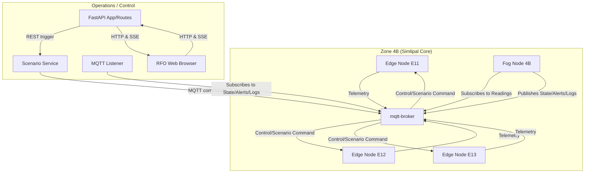
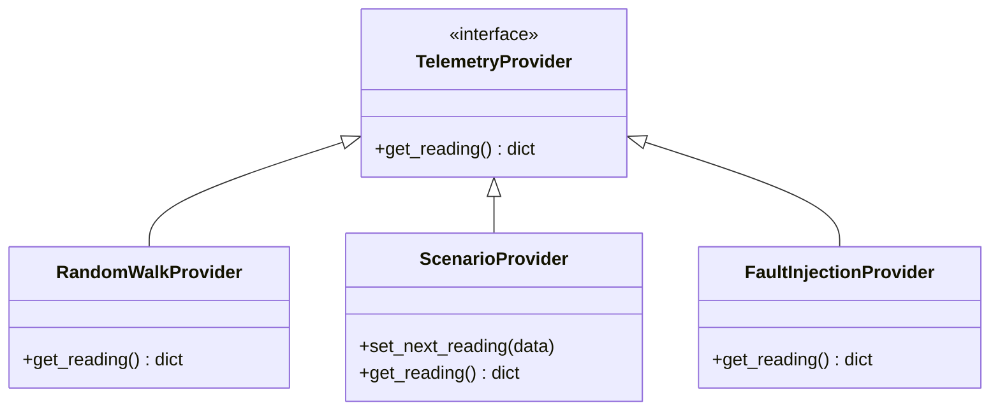

# Implementation Plan — Phase B: Containerize and Message-Bus

Phase B transitions the core IGNIS wildfire early warning pipeline from synchronous Python function calls to an asynchronous, message-driven, containerized architecture. 

It wraps all components in Docker containers, replaces direct method calls with MQTT pub/sub using a versioned topic hierarchy (`ignis/v1/...`), supports multiple edge nodes per zone, and introduces a modular local control-center web feed with a decoupled scenario orchestration service.

---

## User Review Required

> [!IMPORTANT]
> **Host Requirements**: The entire system runs in Docker. The host environment only needs **Docker Desktop** (with Docker Compose v2) installed.
> 
> **Interactive Dashboards**: To meet premium UX expectations, the **Local Control Center** will be built as a FastAPI-backed web application using modular components. It displays a glassmorphic dashboard with live Server-Sent Events (SSE) updates and a clickable control panel that communicates with a backend `ScenarioService` to run tests.

---

## Proposed Changes

We will create a multi-container Docker application structured as follows:



---

### 1. Versioned MQTT Message Schemas & Topics

To support clean decoupling and future protocol growth, all MQTT topics are versioned under `ignis/v1/`.

#### Topic Hierarchy:
- **Telemetry**: `ignis/v1/zone/{zone_id}/edge/{node_id}/reading`
- **Control**: `ignis/v1/zone/{zone_id}/edge/{node_id}/control`
- **Fog Zone State**: `ignis/v1/zone/{zone_id}/fog/state`
- **Fog Alert**: `ignis/v1/zone/{zone_id}/fog/alert`
- **Fog Action Log**: `ignis/v1/zone/{zone_id}/fog/action_log`

#### Payload Schemas (JSON):

##### Telemetry Reading Message
```json
{
  "message_type": "reading",
  "version": "1",
  "node_id": "E11",
  "zone_id": "4B",
  "timestamp": "2026-07-08T09:40:00Z",
  "sequence": 42,
  "temperature_c": 38.2,
  "humidity_pct": 21.0,
  "wind_speed_kmh": 14.0,
  "wind_dir_deg": 220.0,
  "soil_moisture_pct": 9.1,
  "gas_ppm": 12.0,
  "thermal_anomaly_c": 2.1,
  "light_lux": 41000.0,
  "rain_mm": 0.0,
  "gps": [21.94, 86.32],
  "seasonal_baseline": 0.8
}
```

##### Zone State Message
```json
{
  "message_type": "zone_state",
  "version": "1",
  "zone_id": "4B",
  "timestamp": "2026-07-08T09:40:02Z",
  "whi": 0.83,
  "state": "ORANGE",
  "is_state_clamped": true,
  "confirming_sensors": ["gas_ppm"],
  "active_nodes": ["E11", "E12", "E13"]
}
```

##### Alert Message
```json
{
  "message_type": "alert",
  "version": "1",
  "zone_id": "4B",
  "timestamp": "2026-07-08T09:40:02Z",
  "severity": "RED",
  "source_node": "E12",
  "whi": 0.85,
  "confirming_sensors": ["temperature_c", "humidity_pct", "gas_ppm", "thermal_anomaly_c"]
}
```

##### Action Log Message
```json
{
  "message_type": "action_log",
  "version": "1",
  "zone_id": "4B",
  "timestamp": "2026-07-08T09:40:02Z",
  "actions": ["activate_mist_perimeter", "notify_control_center"],
  "reason": "Risk state escalated to ORANGE"
}
```

##### Control/Scenario Message
```json
{
  "message_type": "control",
  "version": "1",
  "command": "set_mode",
  "mode": "scenario",
  "sensor_data": {
    "temperature_c": 41.0,
    "humidity_pct": 22.0,
    "wind_speed_kmh": 15.0,
    "wind_dir_deg": 230.0,
    "soil_moisture_pct": 12.0,
    "gas_ppm": 45.0,
    "thermal_anomaly_c": 3.8,
    "light_lux": 42000.0,
    "rain_mm": 0.0
  },
  "seasonal_baseline": 0.85
}
```

---

### 2. Orchestration & Configuration

#### [NEW] [docker-compose.yml](file:///d:/projects/IGNIS/docker-compose.yml)
- Sets up `mqtt-broker-local` (Eclipse Mosquitto).
- Spins up three edge nodes: `edge-sim-e11`, `edge-sim-e12`, `edge-sim-e13` inside Zone `4B`.
- Spins up `fog-node` (running Simlipal Core Zone fog listener).
- Spins up the `control-center` web application (port `8000`).

#### [NEW] [Dockerfile](file:///d:/projects/IGNIS/Dockerfile)
- Standard slim Python builder installing: `paho-mqtt`, `fastapi`, `uvicorn`, `jinja2`.

#### [NEW] [config/mosquitto.conf](file:///d:/projects/IGNIS/config/mosquitto.conf)
- Enables listening on `1883` and allows anonymous connections.

---

### 3. Abstract Telemetry Provider & Edge Node Simulation

To support future real-world sensor integrations, the edge simulation logic decouples the source of data from the message delivery.



#### [NEW] [src/edge_sim.py](file:///d:/projects/IGNIS/src/edge_sim.py)
- Connects to MQTT, subscribes to `ignis/v1/zone/{zone_id}/edge/{node_id}/control`.
- Periodically queries its current active `TelemetryProvider` (default `RandomWalkProvider`).
- If a control signal triggers `"set_mode"`, dynamically swaps the active provider (e.g. to `ScenarioProvider` with injected values, or `FaultInjectionProvider`).
- Publishes the compiled telemetry to `ignis/v1/zone/{zone_id}/edge/{node_id}/reading`.

---

### 4. Fog Node Decision Logic

#### [NEW] [src/fog_node_runner.py](file:///d:/projects/IGNIS/src/fog_node_runner.py)
- Subscribes to `ignis/v1/zone/{zone_id}/edge/+/reading`.
- Tracks incoming telemetry and maintains states separately for each node ID.
- Computes overall zone risk indices, state, confirming sensors, and actions by aggregating individual node evaluations:
  - **Zone Risk Score (WHI)**: Max of all active node WHIs.
  - **Zone Risk State**: Max of all active node states (GREEN < YELLOW < ORANGE < RED).
- Publishes results back to the appropriate topics (`.../fog/state`, `.../fog/alert`, `.../fog/action_log`).

---

### 5. Modular Control Center & Scenario Service

Instead of a monolithic script, the presentation and scenario orchestration layers are separated into a modular package:

```
src/control_center/
├── __init__.py
├── app.py                   # FastAPI application startup and lifespan handlers
├── routes.py                # HTTP UI endpoints and SSE streams
├── mqtt_listener.py         # Background MQTT subscriber pushing updates to SSE queues
├── scenario_service.py      # Independent orchestration engine executing scenarios (S1-S4)
└── templates/
    └── index.html           # Beautiful glassmorphic control dashboard
```

#### [NEW] [src/control_center/scenario_service.py](file:///d:/projects/IGNIS/src/control_center/scenario_service.py)
- Acts as the decoupled orchestration coordinator.
- Exposes functions like `run_scenario(scenario_name: str)`.
- Steps through predefined scenarios, publishing control payloads to `ignis/v1/zone/{zone_id}/edge/{node_id}/control` over MQTT with configurable step delays.

---

## Verification Plan

### Automated Tests
- Update `tests/test_scoring.py` to cover multi-node aggregation edge-cases.
- Run tests in-container:
  ```bash
  docker compose run --rm fog-node python -m unittest discover tests
  ```

### Manual Verification
1. Start the simulation stack:
   ```bash
   docker compose up --build
   ```
2. Open `http://localhost:8000` in a web browser.
3. Observe baseline drift. All nodes and zones should start as **GREEN**.
4. Click **Trigger Scenario S3 (Sudden Ignition)**:
   - Verify that the backend coordinates the telemetry overrides.
   - Verify that the Fog Node scales to RED and logs action logs dynamically.
5. Click **Trigger Scenario S4 (Single Sensor Fault)**:
   - Verify that the state remains clamped to **YELLOW** due to the 3-sensor validation check.
6. **Distributed Resiliency Test**:
   - Run the command to stop one edge node container:
     ```bash
     docker compose stop edge-sim-e11
     ```
   - Verify that the dashboard shows `E11` as disconnected/inactive.
   - Verify that the remaining edge nodes (`E12`, `E13`) continue publishing.
   - Verify that the Fog Node continues computing correct overall Zone status.
