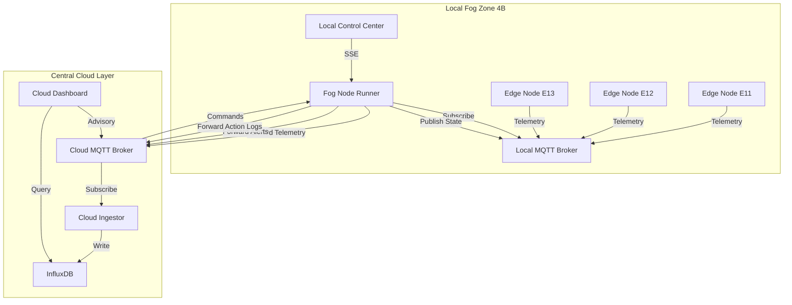
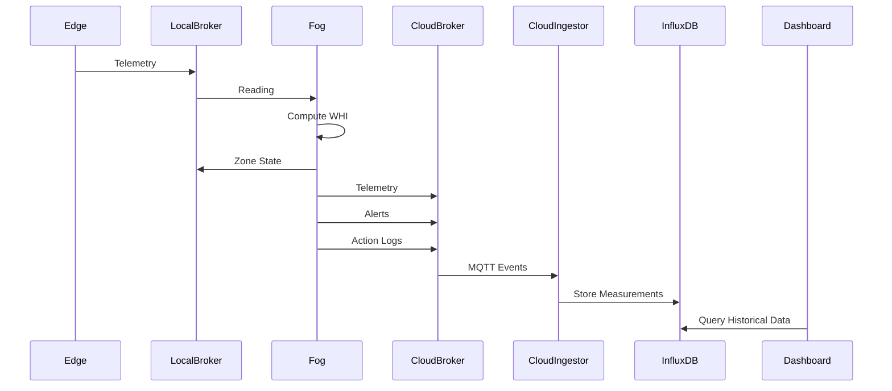
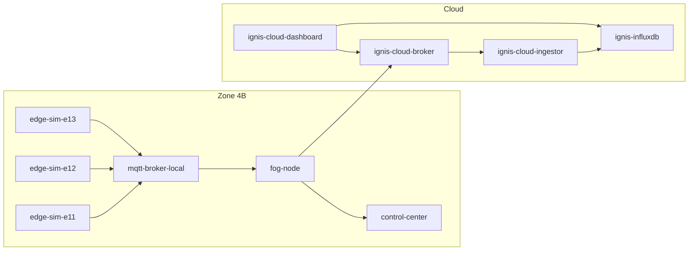
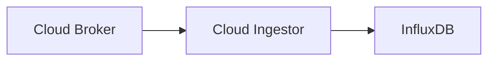
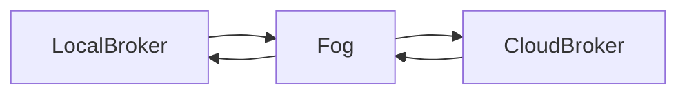
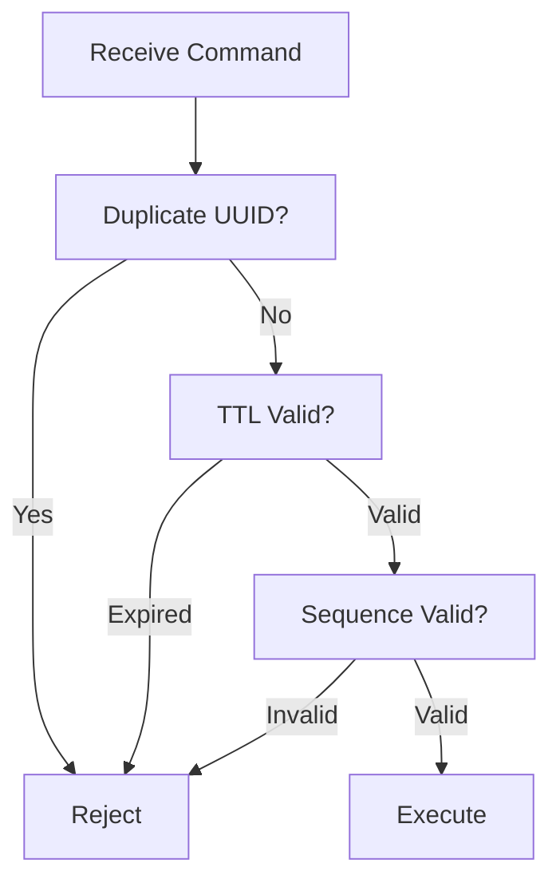
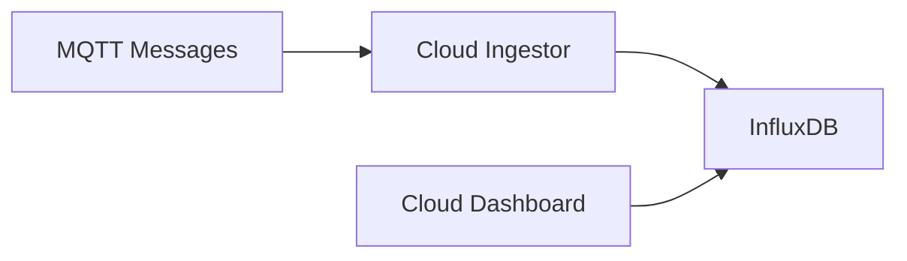
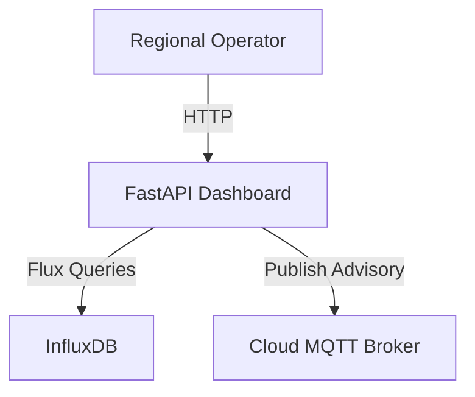
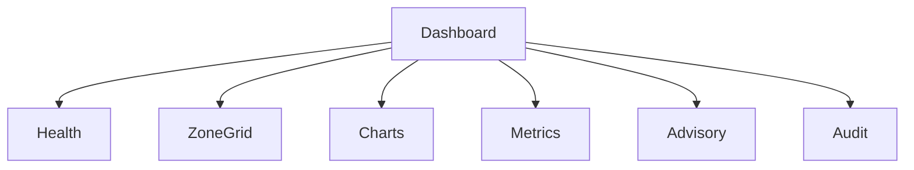
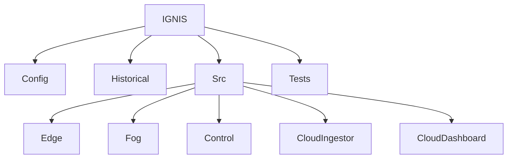

# Implementation Plan — Phase C: Centralized Cloud Layer

Phase C extends the IGNIS wildfire early warning simulation from a localized Edge–Fog architecture into a complete **Edge–Fog–Cloud** system.

While the Fog Node continues to perform autonomous wildfire detection and decision making, the newly introduced Cloud Layer provides centralized telemetry archival, historical analytics, regional monitoring, performance evaluation, and administrative advisory capabilities.

Unlike traditional cloud-centric IoT architectures, the IGNIS cloud is **non-authoritative**. It supervises and coordinates regional operations but never replaces local fog intelligence. Even if the cloud becomes unavailable, every Fog Node continues to function independently using its last known configuration.

---

# User Review Required

> [!IMPORTANT]
> **New Cloud Infrastructure**
>
> The following containers will be added to the Docker Compose stack:
>
> 1. **ignis-cloud-broker**
>    - Eclipse Mosquitto MQTT Broker
>    - Host Port: `1884`
>    - Central communication backbone for Fog → Cloud messaging
>
> 2. **ignis-cloud-ingestor**
>    - Dedicated Python service
>    - Subscribes to all cloud MQTT topics
>    - Calculates performance metrics
>    - Archives data into InfluxDB
>    - Operates independently of the dashboard
>
> 3. **ignis-influxdb**
>    - InfluxDB v2
>    - Host Port: `8086`
>    - Stores telemetry, alerts, state changes, audit logs and performance metrics
>
> 4. **ignis-cloud-dashboard**
>    - FastAPI + Jinja2 web application
>    - Host Port: `9000`
>    - Queries InfluxDB for historical visualization
>    - Publishes advisory commands on demand
>
> **Cloud Design Philosophy**
>
> The Cloud Dashboard **does not continuously subscribe to MQTT**.
>
> Instead:
>
> - Cloud Ingestor performs all MQTT subscriptions.
> - Dashboard performs InfluxDB queries.
> - Dashboard only establishes short-lived MQTT connections when an operator submits an advisory command.
>
> This separation ensures that UI failures never interrupt telemetry archival.

---

# Proposed Architecture



---

# Proposed Changes

## 1. Cloud Communication Architecture

Phase B introduced asynchronous communication between Edge Nodes and the Fog Node through a local MQTT broker.

Phase C extends this communication model by introducing a dedicated cloud messaging layer.

Instead of replacing the local broker, the Fog Node now maintains **two independent MQTT client connections**:

- Local Broker
- Cloud Broker

The local broker continues serving all low-latency communication inside the forest zone.

The cloud broker receives copies of telemetry and decision events for centralized processing.

This preserves local autonomy while enabling regional visibility.

---

### Cloud Communication Flow



---

## 2. MQTT Topic Hierarchy

To maintain consistency with Phase B, every cloud topic follows the versioned namespace.

### Telemetry Topics

```
ignis/v1/telemetry/zone/{zone_id}/edge/{node_id}
```

Publisher

- Fog Node

Subscriber

- Cloud Ingestor

---

### Zone State

```
ignis/v1/fog/zone/{zone_id}/state
```

Publisher

- Fog Node

Subscriber

- Cloud Ingestor

---

### Alerts

```
ignis/v1/fog/zone/{zone_id}/alert
```

Publisher

- Fog Node

Subscriber

- Cloud Ingestor

---

### Action Logs

```
ignis/v1/fog/zone/{zone_id}/action_log
```

Publisher

- Fog Node

Subscriber

- Cloud Ingestor

---

### Advisory Commands

```
ignis/v1/advisory/zone/{zone_id}/command
```

Publisher

- Cloud Dashboard

Subscriber

- Fog Node

---

### Advisory Responses

```
ignis/v1/advisory/zone/{zone_id}/response
```

Publisher

- Fog Node

Subscriber

- Cloud Ingestor

---

### Heartbeats

Cloud

```
ignis/v1/system/cloud/heartbeat
```

Fog

```
ignis/v1/system/fog/zone/{zone_id}/heartbeat
```

---

## 3. Cloud Payload Schemas

### Telemetry Archive Message

```json
{
  "message_type": "telemetry",
  "version": "1",
  "zone_id": "4B",
  "node_id": "E11",
  "timestamp": "2026-07-10T10:45:00Z",
  "temperature_c": 38.2,
  "humidity_pct": 22.5,
  "wind_speed_kmh": 16.0,
  "wind_dir_deg": 215.0,
  "soil_moisture_pct": 11.0,
  "gas_ppm": 18.0,
  "thermal_anomaly_c": 2.5,
  "light_lux": 41200,
  "rain_mm": 0,
  "whi": 0.74
}
```

---

### Zone State Message

```json
{
  "message_type": "zone_state",
  "version": "1",
  "zone_id": "4B",
  "timestamp": "2026-07-10T10:45:02Z",
  "whi": 0.82,
  "state": "ORANGE",
  "is_state_clamped": false,
  "confirming_sensors": [
    "temperature_c",
    "humidity_pct",
    "gas_ppm"
  ]
}
```

---

### Alert Message

```json
{
  "message_type": "alert",
  "version": "1",
  "zone_id": "4B",
  "timestamp": "2026-07-10T10:45:02Z",
  "severity": "RED",
  "source_node": "E12",
  "whi": 0.91,
  "confirming_sensors": [
    "temperature_c",
    "humidity_pct",
    "gas_ppm",
    "thermal_anomaly_c"
  ]
}
```

---

### Action Log Message

```json
{
  "message_type": "action_log",
  "version": "1",
  "zone_id": "4B",
  "timestamp": "2026-07-10T10:45:02Z",
  "actions": [
    "activate_mist_perimeter",
    "notify_control_center"
  ],
  "reason": "Risk state escalated to RED"
}
```

---

### Advisory Command

```json
{
  "command_id": "b51f8fd1-ef93-46d0-9d9d-a538f0df92b5",
  "sequence_number": 15,
  "zone_id": "4B",
  "issued_by": "operator_01",
  "timestamp": "2026-07-10T10:46:00Z",
  "ttl": 300,
  "command": "set_override_state",
  "parameters": {
    "state": "RED"
  }
}
```

---

### Advisory Response

```json
{
  "command_id": "b51f8fd1-ef93-46d0-9d9d-a538f0df92b5",
  "zone_id": "4B",
  "status": "SUCCESS",
  "timestamp": "2026-07-10T10:46:01Z",
  "description": "Override applied successfully"
}
```

---

## 4. Infrastructure & Configuration

Phase C introduces four new cloud-side services while extending the existing Fog Node with cloud connectivity.

The overall container topology now becomes:



---

### [MODIFY] docker-compose.yml

The Compose stack will be expanded with four additional services.

#### New Services

| Service | Purpose | Port |
|----------|----------|------|
| ignis-cloud-broker | Central MQTT Broker | 1884 |
| ignis-cloud-ingestor | MQTT → Influx pipeline | - |
| ignis-influxdb | Time-Series Database | 8086 |
| ignis-cloud-dashboard | Cloud Monitoring Dashboard | 9000 |

#### Existing Services Updated

Update the following containers:

- fog-node
- control-center

The Fog Node now receives additional environment variables:

```env
CLOUD_MQTT_HOST=ignis-cloud-broker
CLOUD_MQTT_PORT=1883

INFLUX_URL=http://ignis-influxdb:8086
```

---

### [NEW] .env

All runtime configuration should be centralized.

```env
#############################
# Local MQTT
#############################

LOCAL_MQTT_HOST=mqtt-broker
LOCAL_MQTT_PORT=1883

#############################
# Cloud MQTT
#############################

CLOUD_MQTT_HOST=ignis-cloud-broker
CLOUD_MQTT_PORT=1883

#############################
# InfluxDB
#############################

INFLUX_URL=http://ignis-influxdb:8086
INFLUX_ORG=ignis-org
INFLUX_BUCKET=ignis-telemetry
INFLUX_TOKEN=ignis-super-secret-token

#############################
# Zone

ZONE_ID=4B
```

---

### [MODIFY] requirements.txt

Add

```
influxdb-client>=1.36.0
```

Cloud Dashboard

```
fastapi
jinja2
uvicorn
```

Cloud Ingestor

```
paho-mqtt
```

---

## 5. Cloud Ingestor Service

Unlike the Local Control Center, the Cloud Dashboard **does not subscribe to MQTT**.

Instead, telemetry ingestion is delegated to a dedicated background service.



---

### Responsibilities

The Cloud Ingestor

- subscribes to every cloud MQTT topic
- parses incoming payloads
- computes latency metrics
- archives measurements
- records advisory responses
- records audit logs

It performs **no visualization**.

---

### Repository

```
src/

cloud_ingestor/

    main.py

    mqtt_service.py

    database.py

    metrics.py
```

---

### main.py

Responsibilities

- Start MQTT client
- Connect to InfluxDB
- Register subscriptions
- Launch processing loop

---

### mqtt_service.py

Responsibilities

Subscribe to

```
ignis/v1/#
```

Receive

- telemetry

- states

- alerts

- action logs

- advisory responses

Dispatch payloads to database writer.

---

### database.py

Provides

```
write_telemetry()

write_state()

write_alert()

write_action()

write_audit()

write_metrics()
```

---

### metrics.py

Calculates

- Fog → Cloud latency

- Cloud ingestion latency

- Database write latency

- End-to-End latency

These values are written into InfluxDB.

---

## 6. Fog Node Enhancements

The Fog Node remains the decision-making engine.

Phase C extends it with cloud connectivity.



---

### [MODIFY] src/fog_node_runner.py

#### Multi-Client MQTT

Initialize

```
client_local

client_cloud
```

Local client

Purpose

- Subscribe to telemetry

- Publish local state

Cloud client

Purpose

- Publish cloud telemetry

- Publish alerts

- Publish logs

- Subscribe to advisory commands

---

### Dual Reporting

Every telemetry event received locally is forwarded to the cloud.

Every state update

Every alert

Every action log

is published to

```
Local MQTT

AND

Cloud MQTT
```

This ensures

- local operation

- centralized archival

---

### Advisory Subscription

Subscribe

```
ignis/v1/advisory/zone/{zone_id}/command
```

Supported commands

```
set_override_state

release_override

adjust_temperature_threshold

adjust_humidity_threshold

adjust_gas_threshold
```

---

## 7. Replay Protection

Every advisory command undergoes validation before execution.



Validation steps

1.

Duplicate UUID

↓

Reject

---

2.

Expired TTL

↓

Reject

---

3.

Old sequence number

↓

Reject

---

4.

Valid command

↓

Execute

---

### Advisory Response

Every processed command returns

```
SUCCESS

FAILED
```

along with

- timestamp

- command id

- reason

---

## 8. InfluxDB Design

InfluxDB becomes the centralized archival database.

Each logical data type is stored separately.

| Measurement | Description |
|------------|-------------|
| telemetry | Raw sensor readings |
| zone_state | Zone WHI and state |
| alerts | Wildfire alerts |
| action_logs | Autonomous actions |
| audit_logs | Advisory command history |
| performance_metrics | System latency |

---

### Data Flow



---

### Performance Metrics Stored

Cloud layer additionally records

- Fog → Cloud latency

- Cloud ingestion latency

- Database write latency

- Dashboard query latency

- Cloud end-to-end latency

These metrics will later be plotted for evaluation.

---

## 9. Historical Baseline Engine

A new directory stores seasonal reference profiles.

```
historical/

summer.json

winter.json

monsoon.json
```

Each profile contains

- hourly average temperature

- humidity

- soil moisture

- gas levels

The Dashboard overlays these values with live telemetry.

Example

```
Current Temperature

38°C

Historical Summer Average

34°C
```

This provides visual comparison without requiring external datasets.

---

## 10. Cloud Dashboard

The Cloud Dashboard serves as the centralized **Network Operations Center (NOC)** for the IGNIS simulation.

Unlike the Local Control Center introduced in Phase B, this dashboard provides a **regional view** of all reporting forest zones, historical telemetry, cloud performance metrics, and operator advisory controls.

The dashboard is intentionally designed as a **stateless application**. It does not maintain persistent MQTT subscriptions. Instead, it periodically queries InfluxDB for the latest information and establishes short-lived MQTT connections only when publishing advisory commands.

---

### Cloud Dashboard Architecture



---

### Repository Structure

```
src/

cloud_dashboard/

├── __init__.py

├── app.py

├── routes.py

├── database.py

├── advisory.py

├── cache.py

└── templates/

      index.html
```

---

### app.py

Responsibilities

- Initialize FastAPI
- Mount templates
- Load historical datasets
- Register routes
- Configure application lifespan

---

### routes.py

Provides

```
GET /

GET /api/snapshot

GET /api/history

POST /api/advisory
```

---

### database.py

Provides helper functions

```
get_snapshot()

get_history()

get_alerts()

get_metrics()

get_audit_logs()
```

---

### advisory.py

Responsibilities

- Build advisory payload
- Connect to Cloud Broker
- Publish command
- Disconnect

---

### cache.py

Stores

- historical baseline datasets
- dashboard configuration
- zone metadata

---

## 11. Dashboard Features

The dashboard is divided into six logical sections.



---

### 1. System Health

Displays

| Component | Status |
|-----------|----------|
| Cloud Broker | ONLINE / OFFLINE |
| InfluxDB | ONLINE / OFFLINE |
| Cloud Ingestor | ONLINE / OFFLINE |
| Fog Node | ONLINE / OFFLINE |

Fog node status is determined from the latest heartbeat stored inside InfluxDB.

---

### 2. Regional Status Grid

Displays

```
Zone

Current State

WHI

Active Nodes

Last Update
```

Example

```
Zone 4B

ORANGE

WHI 0.82

3 Active Nodes

5 seconds ago
```

---

### 3. Historical Charts

Charts include

- Temperature
- Humidity
- Gas PPM
- Soil Moisture
- WHI

Each graph overlays

```
Live Data

Historical Average
```

using the seasonal baseline.

---

### 4. Performance Metrics

Displays

```
Packets/sec

Archived Messages

Fog → Cloud Latency

Database Write Latency

Dashboard Query Latency

Cloud End-to-End Latency
```

---

### 5. Operator Advisory Console

Allows operators to issue

```
Override State

Release Override

Adjust Temperature Threshold

Adjust Humidity Threshold

Adjust Gas Threshold
```

The dashboard generates the advisory payload automatically and publishes it to the Cloud Broker.

---

### 6. Audit Log Feed

Displays

```
Timestamp

Operator

Command

Zone

Status

Result
```

Example

```
10:42

operator_01

Override RED

Zone 4B

SUCCESS
```

---

## 12. Repository Changes

After Phase C the repository becomes



Repository tree

```
IGNIS/

config/

historical/

src/

    edge_sim.py

    fog_node_runner.py

    control_center/

    cloud_ingestor/

    cloud_dashboard/

tests/

docker-compose.yml

Dockerfile

.env
```

---

## 13. Verification Plan

### Automated Tests

Create

```
tests/

test_cloud_resilience.py
```

Verify

### Cloud Connectivity

- Cloud Broker connection
- MQTT reconnection
- Influx connection

---

### Replay Protection

Verify

- duplicate UUID rejection
- expired TTL rejection
- invalid sequence rejection

---

### Advisory Commands

Verify

```
Override

Release

Threshold updates
```

---

### Buffer Recovery

Simulate

```
InfluxDB Offline

↓

Queue Writes

↓

Reconnect

↓

Flush Queue
```

---

### Dual Reporting

Verify

Every telemetry packet

↓

Local Broker

AND

Cloud Broker

---

Run tests

```bash
docker compose run --rm fog-node python -m unittest discover tests
```

---

## 14. Manual Verification

### 1. Start Stack

```bash
docker compose up --build
```

---

### 2. Open Dashboards

Local Control Center

```
http://localhost:8000
```

Cloud Dashboard

```
http://localhost:9000
```

---

### 3. Verify Baseline

Confirm

- telemetry arriving
- charts updating
- all services ONLINE
- InfluxDB recording measurements

---

### 4. Trigger S3

Using Local Control Center

Trigger

```
Sudden Ignition
```

Verify

- Fog transitions RED
- Alert generated
- Action log generated
- Cloud receives copies
- Historical charts update

---

### 5. Trigger Cloud Override

Using Cloud Dashboard

```
Override RED
```

Verify

- Fog receives command
- State overridden
- Action log generated
- Audit log records SUCCESS

---

### 6. Release Override

Verify

Fog returns to calculated state.

---

### 7. Dynamic Threshold Update

Increase

```
Temperature Threshold

40°C

↓

50°C
```

Inject

```
45°C
```

Verify

System remains below RED because the updated policy is applied.

---

### 8. Influx Failure

Stop

```bash
docker compose stop ignis-influxdb
```

Verify

- Cloud Ingestor buffers messages
- Dashboard reports database offline

Restart

```bash
docker compose start ignis-influxdb
```

Verify

Buffered messages are archived.

---

### 9. Cloud Broker Failure

Stop

```bash
docker compose stop ignis-cloud-broker
```

Verify

- Fog continues local operation
- Local dashboard unaffected

Restart broker

Verify

- Automatic reconnection
- Cloud reporting resumes

---

## 15. Expected Deliverables

After completing Phase C the simulation will support

✅ Central Cloud Broker

✅ Cloud Ingestor

✅ InfluxDB Archival

✅ Historical Telemetry

✅ Regional Dashboard

✅ Advisory Commands

✅ Replay Protection

✅ Audit Logging

✅ Performance Metrics

✅ Historical Baseline Comparison

---

## 16. Phase D Readiness

Phase C establishes the cloud infrastructure required for regional deployments.

The following capabilities are intentionally deferred to Phase D:

- Multi-zone deployment
- Fog-to-Fog lateral communication
- Wind-based predictive spread
- Regional adjacency maps
- Cross-zone escalation
- Multi-zone dashboard views

Because the cloud architecture, topic hierarchy, telemetry archival, and advisory framework are already implemented in Phase C, Phase D primarily focuses on extending the existing system to support multiple interacting fog zones rather than introducing new cloud infrastructure.

---

