# Implementation Plan — Phase C: Centralized Cloud Layer (Revised with Simplified Dashboard)

Phase C establishes a centralized regional coordination layer for the IGNIS system. In addition to local edge and fog autonomy, this phase introduces central monitoring, historical telemetry analysis, and administrative command routing.

This revised plan addresses all 20 key structural improvements and simplifies the Cloud Dashboard by removing persistent MQTT subscriptions. The dashboard acts as a stateless service that queries InfluxDB and publishes advisory commands on demand.

---

## User Review Required

> [!IMPORTANT]
> **Container Topography**:
> 1. `ignis-cloud-broker` (Mosquitto): Operates as the central message gateway. Exposed on host port `1884`.
> 2. `ignis-cloud-ingestor` (Python worker): Independent service that subscribes to the cloud broker, extracts latency metrics, and writes payloads to InfluxDB. This handles all telemetry collection and archiving.
> 3. `ignis-influxdb` (InfluxDB v2): Time-series store running on port `8086`. Uses configuration variables defined in `.env`.
> 4. `ignis-cloud-dashboard` (FastAPI + UI): Stateless dashboard running on port `9000` that queries InfluxDB for metrics and publishes advisory commands. **It has no persistent MQTT subscription listeners.**
> 
> **Topic Re-organization**:
> Topics will be updated across all nodes (local and cloud) to follow a cleaner taxonomy:
> - Telemetry: `ignis/v1/telemetry/zone/{zone_id}/edge/{node_id}`
> - Fog States: `ignis/v1/fog/zone/{zone_id}/state`
> - Fog Alerts: `ignis/v1/fog/zone/{zone_id}/alert`
> - Fog Action Logs: `ignis/v1/fog/zone/{zone_id}/action_log`
> - Advisory Path: `ignis/v1/advisory/zone/{zone_id}/command` & `ignis/v1/advisory/zone/{zone_id}/response`
> - System Controls: `ignis/v1/system/zone/{zone_id}/edge/{node_id}/control`
> - Heartbeats: `ignis/v1/system/cloud/heartbeat`, `ignis/v1/system/fog/zone/{zone_id}/heartbeat`

---

## Simplified Cloud Architecture

```mermaid
graph TD
    subgraph Local_Fog_Zone ["Local Fog Zone 4B (Simlipal)"]
        E11["Edge Node E11"] -->|1. Local Telemetry| LocalMB["Local Broker (Port 1883)"]
        E12["Edge Node E12"] -->|1. Local Telemetry| LocalMB
        E13["Edge Node E13"] -->|1. Local Telemetry| LocalMB
        
        Fog["Fog Node Runner 4B"] -->|"Subscribes Telemetry"| LocalMB
        Fog -->|"Publishes State/Alerts"| LocalMB
    end
    
    subgraph Centralized_Cloud_Layer ["Centralized Cloud Layer"]
        CloudMB["Cloud Broker (Port 1884)"]
        TSDB[("InfluxDB (Port 8086)")]
        
        Ingest["Cloud Ingestor Service"] -->|"Subscribes all ignis/v1/#"| CloudMB
        Ingest -->|"Writes Measurements & Latencies"| TSDB
        
        CloudDash["Cloud Dashboard (Port 9000)"] -->|"Flux Queries"| TSDB
        CloudDash["Cloud Dashboard"] -->|"One-off Advisory Publish"| CloudMB
    end

    %% Dual Reporting Pathway
    Fog -->|"2. Forward Telemetry"| CloudMB
    Fog -->|"3. Publish Zone State / Alerts / Logs"| CloudMB
    
    %% Advisory Command Pathway
    CloudMB -->|"4. Advisory Commands"| Fog
    Fog -->|"5. Command Responses"| CloudMB
```



---

## Proposed Changes

### 1. Decoupled Ingestion & Database Schema

The database ingestion layer runs as a standalone daemon, ensuring that database updates occur independently of dashboard uptime.

#### [NEW] [src/cloud_ingestor/](file:///d:/projects/IGNIS/src/cloud_ingestor/)
A dedicated python microservice that connects to the cloud broker, processes MQTT traffic, calculates latencies, and writes records to InfluxDB. It is organized as:
- `main.py`: Service daemon loop.
- `database.py`: Clean connection wrapper to InfluxDB.
- `mqtt_service.py`: Subscriptions client for `ignis/v1/#`. Calculates ingestion times.

#### InfluxDB Measurement Schema:
Data is segmented into six distinct measurements:
1. `telemetry` (Fields: `temperature_c`, `humidity_pct`, `wind_speed_kmh`, `soil_moisture_pct`, `gas_ppm`, `thermal_anomaly_c`, `light_lux`, `rain_mm`; Tags: `zone_id`, `node_id`)
2. `zone_state` (Fields: `whi`, `state`, `is_state_clamped`; Tags: `zone_id`)
3. `alerts` (Fields: `severity`, `whi`; Tags: `zone_id`, `source_node`)
4. `action_logs` (Fields: `actions` (JSON string array), `reason`; Tags: `zone_id`)
5. `audit_logs` (Fields: `command`, `issued_by`, `status`, `error_reason`; Tags: `zone_id`, `command_id`)
6. `performance_metrics` (Fields: `fog_to_cloud_latency`, `cloud_ingestion_latency`, `influx_write_latency`, `cloud_end_to_end_latency`; Tags: `zone_id`, `node_id`, `metric_type`)

---

### 2. Robust Advisory-Command Path with Replay Protection

Advisory commands issued from the cloud are formatted with full auditing metadata and validated locally at the Fog Node.

#### Payload Schema:
```json
{
  "command_id": "c83b2a2e-4b67-4e6f-871d-f8f2b3e40a1b",
  "sequence_number": 104,
  "zone_id": "4B",
  "issued_by": "regional_operator_alpha",
  "timestamp": "2026-07-10T10:25:00Z",
  "ttl": 300,
  "command": "set_override_state",
  "parameters": {
    "state": "RED"
  }
}
```

#### Command Types Classification:
- **Manual Overrides**:
  - `set_override_state`: Forces a target state (`RED`, `ORANGE`, `YELLOW`, `GREEN`).
  - `release_override`: Restores automatic calculation based on localized telemetry.
- **Policy Commands**:
  - `adjust_temperature_threshold`: Alters temperature confirmation threshold (default `40.0`).
  - `adjust_humidity_threshold`: Alters humidity confirmation threshold (default `25.0`).
  - `adjust_gas_threshold`: Alters gas PPM confirmation threshold (default `30.0`).

#### Command Handling & Replay Protection in Fog Node:
- **Duplicate Prevention**: The `FogNodeRunner` tracks the last processed `command_id` and keeps a history of processed UUIDs. Duplicate command IDs are rejected.
- **Replay Protection**: If `timestamp` is older than the current local clock by more than `ttl` seconds, the command is expired and ignored.
- **Monotonic Sequences**: Fog node validates that incoming sequence numbers are strictly greater than the last processed sequence number from the cloud (resets on connection refresh).
- **Execution Logging & Response**:
  - The Fog Node processes the command and returns a response payload (status: `SUCCESS` or `FAILED`, description) to `ignis/v1/advisory/zone/{zone_id}/response`.
  - The `cloud-ingestor` listens to this response and records it in InfluxDB's `audit_logs` measurement.

---

### 3. Historical Baseline Datasets

To implement comparative analytics in research simulations, we provide historical average baselines.

#### [NEW] [historical/](file:///d:/projects/IGNIS/historical/)
A folder containing seasonal baseline profiles:
- [summer.json](file:///d:/projects/IGNIS/historical/summer.json): high avg temp (36°C), low humidity (20%), low moisture (10%).
- [winter.json](file:///d:/projects/IGNIS/historical/winter.json): moderate avg temp (22°C), moderate humidity (45%), moderate moisture (25%).
- [monsoon.json](file:///d:/projects/IGNIS/historical/monsoon.json): lower temp (28°C), high humidity (75%), high moisture (35%).

These profiles define hourly expected baselines. The dashboard backend loads these on startup, allowing charts to plot **Current Reading vs Seasonal Historical Average** dynamically.

---

### 4. Stateless Central Cloud Dashboard

Create a modular FastAPI application in `src/cloud_dashboard/`:

```
src/cloud_dashboard/
├── __init__.py
├── app.py                  # FastAPI initialization, static assets mapping
├── routes.py               # REST API endpoints, HTML routes (polling snapshot & history)
├── database.py             # Read-only InfluxDB query client (historical metrics)
├── cache.py                # Local configuration values cache
└── templates/
    └── index.html          # Central NOC Dashboard UI
```

#### Stateless Design Details:
- **No Background MQTT Subscriptions**: The dashboard does not run a persistent subscription listener thread. This eliminates SSE complexity, memory leaks, and process synchronization issues.
- **Data Fetching via Polling**:
  - The frontend UI uses standard HTTP polling (AJAX/Fetch) at a 3-second interval to query `/api/snapshot` and `/api/history`.
  - The `/api/snapshot` route executes quick InfluxDB queries (e.g. `last()`) to get the latest zone states, active edge readings, alerts, and performance metrics.
  - The `/api/history` route pulls time-series arrays to plot graphs.
- **One-off Advisory Commands**:
  - When an operator clicks "Submit Command" in the Operator Advisory Console, the dashboard POST route `/api/advisory` initiates a brief, one-off MQTT connection to the Cloud Broker, publishes the robust JSON payload, and disconnects immediately.

#### NOC Dashboard UI Features:
- **System Health Monitor Grid**:
  - Central Broker: `ONLINE` / `OFFLINE` by checking connection.
  - InfluxDB: `ONLINE` / `OFFLINE` via periodic database health pings.
  - Fog Node: Status based on the last heartbeat/state timestamp recorded in InfluxDB.
- **Telemetry Charts vs. Historical Baseline**:
  - Live charts showing sensor telemetry overlaid on the loaded seasonal baseline dataset.
- **Performance metrics panel**:
  - Real-time display of ingestion rate (packets/sec), messages archived, database write latencies, and end-to-end Fog-to-Cloud message delivery latencies.
- **Operator Advisory Console**:
  - Forms to submit overrides (`set_override_state`, `release_override`) and policy modifications.
- **Audit Logs Feed**:
  - Historical table of all commands sent, showing command ID, operator, action, and confirmation receipt status.

---

### 5. Config, Routing, & Error Handling

#### [NEW] [.env](file:///d:/projects/IGNIS/.env)
All secrets, ports, and hosts are externalized:
```env
LOCAL_MQTT_HOST=mqtt-broker
LOCAL_MQTT_PORT=1883
CLOUD_MQTT_HOST=cloud-broker
CLOUD_MQTT_PORT=1883
INFLUX_URL=http://influxdb:8086
INFLUX_TOKEN=ignis-super-secret-token
INFLUX_ORG=ignis-org
INFLUX_BUCKET=ignis-telemetry
ZONE_ID=4B
```

#### Error Handling Behavior:
- **Broker Offline**: The Ingestor retries MQTT connections with exponential backoff. Dashboard command publish requests return a `503 Service Unavailable` status to the frontend.
- **InfluxDB Offline**: If InfluxDB is down, the Ingestor buffers pending writes in an in-memory queue. Once reconnected, it performs batch writes to avoid data loss.
- **Invalid/Expired Command**: The Fog Node publishes an error response, logs a `FAILED` audit record, and ignores the command parameters.

---

## Verification Plan

### Automated Resilience Tests

#### [NEW] [tests/test_cloud_resilience.py](file:///d:/projects/IGNIS/tests/test_cloud_resilience.py)
We will expand the test suite to validate the following resilience models:
1. **Command Replay Defense**: Injecting duplicate command IDs or expired TTL commands verifies that the Fog Node ignores them.
2. **Buffer Validation**: Simulate InfluxDB disconnects. Write telemetry, verify it accumulates in the ingestor's buffer, restore database connection, and verify all buffered elements are flushed without data loss.
3. **Dual Client Recovery**: Mock connection breaks on local and cloud MQTT clients. Verify both clients reconnect independently and continue reporting.

Execute tests via:
```bash
docker compose run --rm fog-node python -m unittest tests/test_cloud_resilience.py
```

### Manual Verification Scenarios

We add two new scenarios to validate the implementation:

#### S8 — Cloud Advisory Override
1. Open Cloud Dashboard on `http://localhost:9000`.
2. Locate the operator console, select Zone `4B`, choose **Override State = RED**, and submit.
3. Confirm the Fog Node runner intercepts the command, adopts the RED state, executes local actions (e.g. misting), and returns a success response.
4. Verify that the audit log feed displays a green `SUCCESS` status for the command ID.

#### S9 — Dynamic Threshold Adjustment
1. Select Zone `4B` on the Cloud Dashboard and increase the temperature activation threshold to `50.0°C`.
2. Confirm the Fog Node updates its threshold rules immediately without restarting.
3. Inject telemetry with temperature `45.0°C` (which previously triggered orange/red).
4. Verify that the Fog Node remains in a dynamic GREEN/YELLOW state because the temperature does not exceed the new `50.0°C` policy limit.
