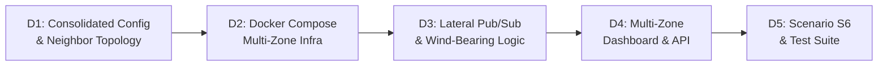

# Implementation Plan — Phase D: Multi-Zone Coordination & Lateral Spread Prediction

Phase D scales IGNIS from a single-zone simulation into a **3-zone network** with Fog-to-Fog lateral coordination. When a fire breaks out in one zone and the wind blows toward an adjacent zone, the downwind Fog Node **pre-emptively raises its own state** before its own sensors detect anything — validating the architecture's most novel claim (architecture §7).

This is the consolidated plan: it supersedes the initial draft and folds in every improvement raised in review (consolidated config, YAML anchors, dynamic zone/node discovery, vector wind averaging, transition-only lateral broadcasts, structured warning objects, and the resolved open questions on local dashboards and edge naming).

---

## Current State (After Phase C)

The system today runs **1 zone (4B)** with:
- 1 local MQTT broker → 3 edge nodes (E11, E12, E13) → 1 fog node runner
- 1 cloud broker → 1 cloud ingestor → InfluxDB → 1 NOC dashboard
- Advisory commands, heartbeats, dual reporting all functional

**Key assumptions Phase D must break:**

| Location | Hardcoded Assumption |
|----------|---------------------|
| [docker-compose.yml](file:///d:/projects/IGNIS/docker-compose.yml) | Single `mqtt-broker`, single `fog-node`, 3 edge nodes |
| [.env](file:///d:/projects/IGNIS/.env) | `LOCAL_MQTT_HOST=mqtt-broker`, `ZONE_ID=4B` |
| [database.py L295](file:///d:/projects/IGNIS/src/cloud_dashboard/database.py#L295) | `chart_data = {"labels": [], "E11": [], "E12": [], "E13": []}` |
| [database.py L333](file:///d:/projects/IGNIS/src/cloud_dashboard/database.py#L333) | `for node in ["E11", "E12", "E13"]:` |
| [routes.py L33](file:///d:/projects/IGNIS/src/cloud_dashboard/routes.py#L33) | `zone_id = request.app.state.zone_id` (single zone) |
| [zone_config.json](file:///d:/projects/IGNIS/config/zone_config.json) | No `neighbors` field, no multi-zone awareness |

---

## Sub-Phase Overview



---

## Sub-Phase D1 — Consolidated Zone Configuration

**Goal**: Create a single unified configuration file containing shared defaults and per-zone overrides with neighbor/bearing/distance metadata, instead of one JSON file per zone.

One config file eliminates duplication across zones. Shared `weights`, `sensor_limits`, and `state_thresholds` live under `defaults`; each zone entry only specifies what differs — `zone_name`, `neighbors`, and any future zone-specific overrides.

### Zone Layout (Simlipal Tiger Reserve)

```
         Zone 4A  (North)      GPS: 22.010, 86.340
              ↑ bearing 0°
              |  ~8 km
         Zone 4B  (Core)       GPS: 21.940, 86.320
              ↑ bearing 180°
              |  ~8 km
         Zone 4C  (South)      GPS: 21.870, 86.300
```

> [!IMPORTANT]
> **Bearing semantics**: `bearing_from_neighbor` means "the wind direction at which the neighbor's fire would blow toward us". For Zone 4C with neighbor 4B: `bearing_from_neighbor: 180.0` means "if 4B's wind blows ~180° (south), it points toward 4C". A ±45° tolerance cone covers real-world wind variability.

#### [DELETE] [config/zone_config.json](file:///d:/projects/IGNIS/config/zone_config.json)

Replaced by the consolidated file below.

#### [NEW] [config/zones_config.json](file:///d:/projects/IGNIS/config/zones_config.json)

```json
{
  "defaults": {
    "weights": {
      "temperature_c": 0.20,
      "humidity_pct": 0.15,
      "wind_speed_kmh": 0.10,
      "soil_moisture_pct": 0.15,
      "gas_ppm": 0.15,
      "thermal_anomaly_c": 0.15,
      "time_of_day": 0.05,
      "seasonal_baseline": 0.05
    },
    "sensor_limits": {
      "temperature_c":     { "min": 20.0, "max": 45.0,  "confirmation_threshold": 40.0 },
      "humidity_pct":      { "min": 15.0, "max": 70.0,  "confirmation_threshold": 25.0 },
      "wind_speed_kmh":    { "min": 0.0,  "max": 40.0,  "confirmation_threshold": 25.0 },
      "soil_moisture_pct": { "min": 5.0,  "max": 35.0,  "confirmation_threshold": 10.0 },
      "gas_ppm":           { "min": 10.0, "max": 100.0, "confirmation_threshold": 30.0 },
      "thermal_anomaly_c": { "min": 0.0,  "max": 10.0,  "confirmation_threshold": 3.0  }
    },
    "state_thresholds": {
      "GREEN": 0.0,
      "YELLOW": 0.35,
      "ORANGE": 0.60,
      "RED": 0.80
    },
    "lateral_warning_timeout_sec": 30
  },

  "zones": {
    "4A": {
      "zone_name": "Simlipal North Zone",
      "neighbors": [
        { "zone_id": "4B", "bearing_from_neighbor": 0.0, "bearing_tolerance": 45.0, "distance_km": 8.0 }
      ]
    },
    "4B": {
      "zone_name": "Simlipal Core Zone",
      "neighbors": [
        { "zone_id": "4A", "bearing_from_neighbor": 180.0, "bearing_tolerance": 45.0, "distance_km": 8.0 },
        { "zone_id": "4C", "bearing_from_neighbor": 0.0,   "bearing_tolerance": 45.0, "distance_km": 8.0 }
      ]
    },
    "4C": {
      "zone_name": "Simlipal South Zone",
      "neighbors": [
        { "zone_id": "4B", "bearing_from_neighbor": 180.0, "bearing_tolerance": 45.0, "distance_km": 8.0 }
      ]
    }
  }
}
```

Notes:
- `lateral_warning_timeout_sec` is configurable in `defaults` rather than hardcoded in the runner.
- `distance_km` is captured now even though it isn't consumed yet, to support future spread-time estimation without another schema change.

#### [MODIFY] [src/fog_node_runner.py](file:///d:/projects/IGNIS/src/fog_node_runner.py) — config loading

Replace `load_config` to load the consolidated file and merge defaults:
```python
def load_config(self, path: str) -> dict:
    with open(path, 'r') as f:
        full_config = json.load(f)
    defaults = full_config.get("defaults", {})
    zone_data = full_config.get("zones", {}).get(self.zone_id, {})
    # Merge: zone-specific overrides take precedence over defaults
    config = {**defaults, **zone_data}
    config["zone_id"] = self.zone_id
    return config
```

The `CONFIG_PATH` env var changes from `config/zone_config.json` to `config/zones_config.json` (set once, shared across all fog-node services in docker-compose since the file itself resolves per-zone data via `ZONE_ID`).

---

## Sub-Phase D2 — Docker Compose Multi-Zone Infrastructure

**Goal**: Expand docker-compose to run 3 independent zone stacks (each with its own local broker, 3 edge sims, and 1 fog runner), all sharing the existing central cloud broker, ingestor, InfluxDB, and dashboard. Use YAML anchors to keep the file maintainable.

Design decisions:
- Each zone gets its own local broker (simulates LoRa boundary isolation per the architecture).
- All fog nodes connect to the **same** central `cloud-broker` (the shared regional bus).
- YAML anchors (`x-*` extension fields) define templates for edge sims, fog nodes, and brokers; each zone service inherits the template and overrides only zone-specific variables (`ZONE_ID`, `LOCAL_MQTT_HOST`, GPS coordinates, ports).
- **Local control center**: only Zone 4B keeps a local control center (port 8000). The NOC dashboard is the multi-zone view, so standing up three local dashboards would add compose complexity without a corresponding benefit.
- **Edge node naming**: zone-prefixed identifiers — `4A-E1/E2/E3`, `4B-E1/E2/E3`, `4C-E1/E2/E3` — replacing the old bare `E11/E12/E13` scheme so node IDs are unambiguous once nodes exist across zones.
- The cloud-ingestor already subscribes to `ignis/v1/#` and parses `zone_id` from topic — no changes needed there beyond the lateral-event handling in D4.

#### [MODIFY] [docker-compose.yml](file:///d:/projects/IGNIS/docker-compose.yml)

```yaml
version: '3.8'

# =============================================
# YAML Anchor Templates
# =============================================
x-edge-template: &edge-template
  build: .
  command: python src/edge_sim.py
  env_file: [.env]
  restart: unless-stopped

x-fog-template: &fog-template
  build: .
  command: python src/fog_node_runner.py
  env_file: [.env]
  environment:
    - CONFIG_PATH=config/zones_config.json
  restart: unless-stopped

x-broker-template: &broker-template
  image: eclipse-mosquitto:2
  volumes:
    - ./config/mosquitto.conf:/mosquitto/config/mosquitto.conf:ro
  restart: always

services:
  # =============================================
  # Central Cloud Infrastructure (shared)
  # =============================================
  cloud-broker:
    image: eclipse-mosquitto:2
    container_name: ignis-cloud-broker
    ports: ["1884:1883"]
    volumes:
      - ./config/mosquitto_cloud.conf:/mosquitto/config/mosquitto.conf:ro
    restart: always

  influxdb:
    image: influxdb:2.7
    container_name: ignis-influxdb
    ports: ["8086:8086"]
    environment:
      - DOCKER_INFLUXDB_INIT_MODE=setup
      - DOCKER_INFLUXDB_INIT_USERNAME=admin
      - DOCKER_INFLUXDB_INIT_PASSWORD=adminpassword
      - DOCKER_INFLUXDB_INIT_ORG=ignis-org
      - DOCKER_INFLUXDB_INIT_BUCKET=ignis-telemetry
      - DOCKER_INFLUXDB_INIT_ADMIN_TOKEN=ignis-super-secret-token
    restart: always

  cloud-ingestor:
    build: .
    container_name: ignis-cloud-ingestor
    command: python src/cloud_ingestor/main.py
    depends_on: [cloud-broker, influxdb]
    env_file: [.env]
    restart: unless-stopped

  cloud-dashboard:
    build: .
    container_name: ignis-cloud-dashboard
    command: uvicorn src.cloud_dashboard.app:app --host 0.0.0.0 --port 9000
    ports: ["9000:9000"]
    depends_on: [cloud-broker, influxdb]
    env_file: [.env]
    volumes: [./historical:/app/historical]
    restart: unless-stopped

  # =============================================
  # Zone 4A — Simlipal North
  # =============================================
  mqtt-broker-4a:
    <<: *broker-template
    container_name: ignis-mqtt-broker-4a
    ports: ["1881:1883"]

  fog-node-4a:
    <<: *fog-template
    container_name: ignis-fog-node-4a
    depends_on: [mqtt-broker-4a, cloud-broker]
    environment:
      - ZONE_ID=4A
      - LOCAL_MQTT_HOST=mqtt-broker-4a
      - CONFIG_PATH=config/zones_config.json

  edge-sim-4a-e1:
    <<: *edge-template
    container_name: ignis-edge-4a-e1
    depends_on: [mqtt-broker-4a]
    environment:
      - NODE_ID=4A-E1
      - ZONE_ID=4A
      - MQTT_HOST=mqtt-broker-4a
      - GPS_LAT=22.010
      - GPS_LON=86.340
  # ... edge-sim-4a-e2, edge-sim-4a-e3 follow same pattern

  # =============================================
  # Zone 4B — Simlipal Core
  # =============================================
  mqtt-broker-4b:
    <<: *broker-template
    container_name: ignis-mqtt-broker-4b
    ports: ["1883:1883"]

  fog-node-4b:
    <<: *fog-template
    container_name: ignis-fog-node-4b
    depends_on: [mqtt-broker-4b, cloud-broker]
    environment:
      - ZONE_ID=4B
      - LOCAL_MQTT_HOST=mqtt-broker-4b
      - CONFIG_PATH=config/zones_config.json

  edge-sim-4b-e1:
    <<: *edge-template
    container_name: ignis-edge-4b-e1
    depends_on: [mqtt-broker-4b]
    environment:
      - NODE_ID=4B-E1
      - ZONE_ID=4B
      - MQTT_HOST=mqtt-broker-4b
      - GPS_LAT=21.940
      - GPS_LON=86.320
  # ... edge-sim-4b-e2, edge-sim-4b-e3

  # =============================================
  # Zone 4C — Simlipal South
  # =============================================
  mqtt-broker-4c:
    <<: *broker-template
    container_name: ignis-mqtt-broker-4c
    ports: ["1885:1883"]

  fog-node-4c:
    <<: *fog-template
    container_name: ignis-fog-node-4c
    depends_on: [mqtt-broker-4c, cloud-broker]
    environment:
      - ZONE_ID=4C
      - LOCAL_MQTT_HOST=mqtt-broker-4c
      - CONFIG_PATH=config/zones_config.json

  edge-sim-4c-e1:
    <<: *edge-template
    container_name: ignis-edge-4c-e1
    depends_on: [mqtt-broker-4c]
    environment:
      - NODE_ID=4C-E1
      - ZONE_ID=4C
      - MQTT_HOST=mqtt-broker-4c
      - GPS_LAT=21.870
      - GPS_LON=86.300
  # ... edge-sim-4c-e2, edge-sim-4c-e3

  # =============================================
  # Local Control Center (Zone 4B only)
  # =============================================
  control-center:
    build: .
    container_name: ignis-control-center
    command: uvicorn src.control_center.app:app --host 0.0.0.0 --port 8000
    ports: ["8000:8000"]
    depends_on: [mqtt-broker-4b]
    env_file: [.env]
    environment:
      - ZONE_ID=4B
      - LOCAL_MQTT_HOST=mqtt-broker-4b
    restart: unless-stopped
```

#### [MODIFY] [.env](file:///d:/projects/IGNIS/.env)

Remove per-zone settings (`LOCAL_MQTT_HOST`, `ZONE_ID`) — they are now per-service in docker-compose. Keep only shared cloud/infra config:
```env
CLOUD_MQTT_HOST=cloud-broker
CLOUD_MQTT_PORT=1883
INFLUX_URL=http://influxdb:8086
INFLUX_TOKEN=ignis-super-secret-token
INFLUX_ORG=ignis-org
INFLUX_BUCKET=ignis-telemetry
```

#### [MODIFY] [src/edge_sim.py](file:///d:/projects/IGNIS/src/edge_sim.py)

Currently reads `ZONE_ID` from `.env`. Confirm the edge sim reads `ZONE_ID` and `NODE_ID` from its container-level `environment:` block (already works via `os.environ.get`) and that the telemetry publish topic uses `self.zone_id`/`self.node_id` correctly with the new zone-prefixed node IDs.

---

## Sub-Phase D3 — Lateral Pub/Sub & Wind-Bearing Logic

**Goal**: Enable Fog Nodes to broadcast state + wind vector on state transitions, receive neighbor warnings, check wind alignment, and pre-emptively escalate.

Key design points:
- Lateral broadcasts fire only on state transitions, not every evaluation cycle, to avoid flooding the cloud broker.
- Wind direction averaging uses vector math (`atan2(mean_sin, mean_cos)`) rather than an arithmetic mean, so readings like 350° and 10° correctly average to ~0° instead of ~180°.
- Lateral warnings are stored as structured objects (`{zone_id, state, timestamp}`) rather than loose fields, so they're easy to serialize into the dashboard's lateral timeline later.

#### [MODIFY] [src/fog_node_runner.py](file:///d:/projects/IGNIS/src/fog_node_runner.py)

**New `__init__` fields:**
```python
# 6. Lateral Coordination State
self.neighbors = self.config.get("neighbors", [])
self.lateral_warning_timeout = self.config.get("lateral_warning_timeout_sec", 30)
self.active_lateral_warnings = {}  # zone_id -> {"zone_id": str, "state": str, "timestamp": float}
self.lateral_preemptive_active = False
```

**Extend `on_connect_cloud`** — subscribe to lateral topic:
```python
lateral_topic = "ignis/v1/fog/zone/+/lateral"
self.client_cloud.subscribe(lateral_topic)
logger.info(f"Subscribed to lateral coordination topic: {lateral_topic}")
```

**Extend `on_message_cloud`** — route by topic:
```python
topic = msg.topic
if "/advisory/" in topic and "/command" in topic:
    self._handle_advisory_command(payload)
elif "/lateral" in topic:
    self._handle_lateral_warning(payload)
```

**New method — `_handle_lateral_warning(payload)`:**
1. Extract `source_zone_id`, `state`, `wind_dir_deg`, `wind_speed_kmh`.
2. Skip if `source_zone_id == self.zone_id` (ignore own broadcasts).
3. Find the matching neighbor entry in `self.neighbors`.
4. Call `check_wind_alignment(wind_dir_deg, neighbor["bearing_from_neighbor"], neighbor["bearing_tolerance"])`.
5. If aligned AND source state ≥ YELLOW → upsert a structured warning:
   ```python
   self.active_lateral_warnings[source_zone_id] = {
       "zone_id": source_zone_id,
       "state": state,
       "timestamp": time.time()
   }
   ```
6. If not aligned → remove any existing warning for that zone.

**New static method — `check_wind_alignment`:**
```python
@staticmethod
def check_wind_alignment(wind_deg: float, target_bearing: float, tolerance: float) -> bool:
    """Returns True if wind_deg is within ±tolerance of target_bearing, handling 360° wrap."""
    diff = abs(wind_deg - target_bearing) % 360
    diff = min(diff, 360 - diff)
    return diff <= tolerance
```

**New static method — `compute_vector_wind_average`:**
```python
@staticmethod
def compute_vector_wind_average(readings: list) -> tuple:
    """Returns (avg_dir_deg, avg_speed_kmh) using circular vector averaging."""
    import math
    if not readings:
        return (0.0, 0.0)
    sin_sum = sum(math.sin(math.radians(r.get("wind_dir_deg", 0))) for r in readings)
    cos_sum = sum(math.cos(math.radians(r.get("wind_dir_deg", 0))) for r in readings)
    avg_dir = math.degrees(math.atan2(sin_sum / len(readings), cos_sum / len(readings))) % 360
    avg_speed = sum(r.get("wind_speed_kmh", 0) for r in readings) / len(readings)
    return (avg_dir, avg_speed)
```

**Modify `evaluate_and_publish_zone_status`:**

After computing `zone_state` from local sensors, **before** applying cloud override:

```python
# --- Lateral Pre-emptive Logic ---
# 1. Expire stale warnings
now = time.time()
self.active_lateral_warnings = {
    zid: w for zid, w in self.active_lateral_warnings.items()
    if now - w["timestamp"] < self.lateral_warning_timeout
}

# 2. Pre-emptive escalation: if any active warnings and we are GREEN
lateral_sources = []
if self.active_lateral_warnings and zone_state == "GREEN":
    zone_state = "YELLOW"
    self.lateral_preemptive_active = True
    lateral_sources = list(self.active_lateral_warnings.values())
else:
    self.lateral_preemptive_active = False
```

Add fields to `state_payload`:
```python
"preemptive_escalation": self.lateral_preemptive_active,
"lateral_warning_sources": lateral_sources  # structured list
```

**Lateral broadcast — only on state transitions.** Inside the existing `if zone_state != self.last_zone_state:` block, after publishing alerts:
```python
# Publish lateral broadcast on state transitions (YELLOW+)
if self.STATE_ORDER.get(zone_state, 0) >= self.STATE_ORDER["YELLOW"]:
    raw_readings = [r.get("raw_reading", {}) for r in active_records if r.get("raw_reading")]
    wind_dir_avg, wind_speed_avg = self.compute_vector_wind_average(raw_readings)
    self._publish_lateral_broadcast(zone_state, zone_whi, wind_dir_avg, wind_speed_avg)
```

**New method — `_publish_lateral_broadcast`:**
```python
def _publish_lateral_broadcast(self, zone_state, zone_whi, wind_dir, wind_speed):
    payload = {
        "message_type": "lateral_broadcast",
        "version": "1",
        "zone_id": self.zone_id,
        "state": zone_state,
        "whi": float(zone_whi),
        "wind_dir_deg": float(wind_dir),
        "wind_speed_kmh": float(wind_speed),
        "timestamp": time.strftime("%Y-%m-%dT%H:%M:%SZ", time.gmtime())
    }
    topic = f"ignis/v1/fog/zone/{self.zone_id}/lateral"
    self.client_cloud.publish(topic, json.dumps(payload))
    logger.info(f"Published lateral broadcast: {zone_state} wind={wind_dir:.0f}°")
```

---

## Sub-Phase D4 — Multi-Zone Dashboard & API

**Goal**: Upgrade the NOC dashboard to discover and display all active zones dynamically — no hardcoded zone or node lists anywhere.

#### [MODIFY] [src/cloud_dashboard/database.py](file:///d:/projects/IGNIS/src/cloud_dashboard/database.py)

1. **`get_all_zone_states()` [NEW]**: Query latest `zone_state` for **all** zones (no zone_id filter). Returns `[{zone_id, state, whi, timestamp, preemptive_escalation, lateral_warning_sources}, ...]`.
2. **`get_historical_chart_data(zone_id, minutes)`**: Replace hardcoded `["E11", "E12", "E13"]` with dynamic node discovery from the query results:
   ```python
   # Instead of: chart_data = {"labels": [], "E11": [], "E12": [], "E13": []}
   chart_data = {"labels": [], "nodes": {}}
   for ts in sorted_times:
       for node_id in time_map[ts]:
           if node_id not in chart_data["nodes"]:
               chart_data["nodes"][node_id] = []
   ```
3. **`get_lateral_events(minutes)` [NEW]**: Query the InfluxDB `lateral_events` measurement (written by the ingestor) for the timeline panel.
4. **`get_system_health(zone_id)`**: Already queries by `component` tag (`fog_node_{zone_id}`) — works for multiple zones without changes.

#### [MODIFY] [src/cloud_ingestor/mqtt_service.py](file:///d:/projects/IGNIS/src/cloud_ingestor/mqtt_service.py)

Add a handler for lateral broadcast messages (`/lateral` in topic):
```python
elif "lateral" in topic:
    zone_id = parts[4]
    self.process_lateral_event(payload, zone_id)
```

**New method `process_lateral_event`**: Writes to the `lateral_events` measurement in InfluxDB with tags `zone_id`, `target_direction` and fields `state`, `wind_dir_deg`, `wind_speed_kmh`.

#### [MODIFY] [src/cloud_dashboard/routes.py](file:///d:/projects/IGNIS/src/cloud_dashboard/routes.py)

1. **`GET /api/zones` [NEW]**: Returns all active zone states from `db.get_all_zone_states()`.
2. **`GET /api/snapshot?zone_id=4B`**: Accept optional `zone_id` query param (default: first configured zone).
3. **`GET /api/history?zone_id=4B&minutes=15`**: Accept `zone_id` query param.
4. **`GET /api/lateral-timeline?minutes=10` [NEW]**: Returns the lateral event log for the timeline panel.
5. **`POST /api/advisory`**: Accept `zone_id` in the request body to target any zone.

#### [MODIFY] [src/cloud_dashboard/app.py](file:///d:/projects/IGNIS/src/cloud_dashboard/app.py)

Remove the `app.state.zone_id` singleton. The dashboard is now zone-agnostic; zone selection is entirely client-driven.

#### [MODIFY] [src/cloud_dashboard/templates/index.html](file:///d:/projects/IGNIS/src/cloud_dashboard/templates/index.html)

| UI Component | Description |
|-------------|-------------|
| **Zone Overview Bar** | Top strip with zone cards for each active zone (fetched from `/api/zones`). Each card shows: zone name, state color, WHI, lateral warning badge |
| **Zone Selector Dropdown** | Switches the detail view — updates snapshot polling URL to `/api/snapshot?zone_id=X` and history to `/api/history?zone_id=X` |
| **Dynamic Chart Datasets** | Build Chart.js datasets from `response.nodes` keys instead of hardcoded E11/E12/E13 |
| **Lateral Warning Badge** | Visual indicator on zone cards when `preemptive_escalation` is `true` |
| **Lateral Coordination Timeline** | New panel showing the propagation sequence: `Zone 4B → RED → Broadcast → Zone 4C received → Wind verified → Zone 4C → YELLOW` |

---

## Sub-Phase D5 — Scenario S6 & Test Suite

**Goal**: Implement the lateral spread scenario and write comprehensive automated unit tests for bearing math and pre-emptive logic.

#### [MODIFY] [src/scenario.py](file:///d:/projects/IGNIS/src/scenario.py)

**New `get_lateral_spread_scenario()` method:**
- 6 steps targeting Zone 4B's edge nodes.
- Steps 0–1: baseline readings (GREEN), wind direction 180° (south toward 4C).
- Steps 2–3: escalating fire (temp↑, gas↑, thermal↑) → YELLOW → ORANGE, wind stays ~180°.
- Steps 4–5: full fire (RED), wind remains 180°.
- Zone 4A and 4C edge nodes continue baseline telemetry throughout.

#### [MODIFY] [src/control_center/scenario_service.py](file:///d:/projects/IGNIS/src/control_center/scenario_service.py)

Add `S6` to `start_scenario()`. S6 is a localized scenario targeting only Zone 4B's edge nodes (same pattern as S3). The `active_nodes` list uses the zone-prefixed naming (`4B-E1`, `4B-E2`, `4B-E3`).

#### [NEW] [tests/test_lateral_coordination.py](file:///d:/projects/IGNIS/tests/test_lateral_coordination.py)

All tests are mock-based (no Docker required):

| Test Case | Validates |
|-----------|-----------|
| `test_wind_alignment_direct_hit` | `check_wind_alignment(180, 180, 45)` → `True` |
| `test_wind_alignment_within_tolerance` | `check_wind_alignment(200, 180, 45)` → `True` |
| `test_wind_alignment_outside_tolerance` | `check_wind_alignment(270, 180, 45)` → `False` |
| `test_wind_alignment_wraparound` | `check_wind_alignment(350, 10, 30)` → `True` (crosses 0°) |
| `test_wind_alignment_wraparound_miss` | `check_wind_alignment(330, 10, 30)` → `False` |
| `test_vector_wind_avg_normal` | avg of [170°, 190°] → ~180° |
| `test_vector_wind_avg_wraparound` | avg of [350°, 10°] → ~0° (not 180°) |
| `test_lateral_warning_triggers_preemptive` | Mock lateral from 4B (state=RED, wind=180°) → 4C's `lateral_preemptive_active = True`, state = YELLOW |
| `test_lateral_warning_structured_object` | Verify warning stored as `{"zone_id": "4B", "state": "RED", "timestamp": ...}` |
| `test_lateral_warning_ignored_wrong_bearing` | Lateral from 4B with wind=0° → 4C does NOT escalate |
| `test_lateral_warning_expiry` | Warning older than `lateral_warning_timeout_sec` → cleaned up, preemptive drops |
| `test_own_broadcast_ignored` | Fog runner ignores lateral broadcasts from its own zone_id |
| `test_config_merge_defaults` | Verify `load_config` correctly merges `defaults` with zone-specific data |

---

## Verification Plan

### Automated Tests
```bash
python -m unittest tests/test_lateral_coordination.py
python -m unittest discover tests    # run all tests together
```

### Manual Verification — Scenario S6

1. Start the full stack:
   ```bash
   docker compose up --build
   ```
2. Open the NOC Dashboard at `http://localhost:9000`.
3. Verify the **Zone Overview Bar** shows 3 zones: 4A (GREEN), 4B (GREEN), 4C (GREEN).
4. Select **Zone 4C** in the dropdown — confirm baseline telemetry, all healthy.
5. Trigger **Scenario S6** from the local control center (`http://localhost:8000`).
6. Watch **Zone 4B** escalate: GREEN → YELLOW → ORANGE → RED.
7. Verify **Zone 4C** transitions pre-emptively to YELLOW with the lateral warning badge: "Lateral warning from Zone 4B".
8. Verify **Zone 4A** remains GREEN (wind direction is 180°/south — blows away from 4A).
9. Verify the **Lateral Coordination Timeline** panel shows the propagation sequence.
10. Stop the scenario → Zone 4B returns to GREEN → Zone 4C's lateral warning expires → returns to GREEN.

---

## Files Changed Summary

| Action | File | Sub-Phase |
|--------|------|-----------|
| DELETE | `config/zone_config.json` | D1 |
| NEW | `config/zones_config.json` | D1 |
| MODIFY | `docker-compose.yml` | D2 |
| MODIFY | `.env` | D2 |
| MODIFY | `src/edge_sim.py` | D2 |
| MODIFY | `src/fog_node_runner.py` | D1, D3 |
| MODIFY | `src/cloud_ingestor/mqtt_service.py` | D4 |
| MODIFY | `src/cloud_dashboard/database.py` | D4 |
| MODIFY | `src/cloud_dashboard/routes.py` | D4 |
| MODIFY | `src/cloud_dashboard/app.py` | D4 |
| MODIFY | `src/cloud_dashboard/templates/index.html` | D4 |
| MODIFY | `src/scenario.py` | D5 |
| MODIFY | `src/control_center/scenario_service.py` | D5 |
| NEW | `tests/test_lateral_coordination.py` | D5 |
