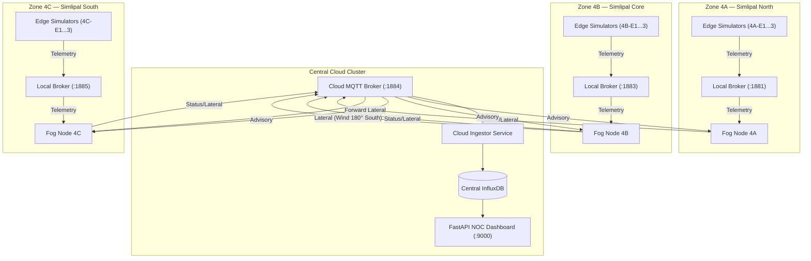

# Consolidated Walkthrough — Phase D: Multi-Zone Coordination

This document provides a consolidated technical walkthrough of the architectural upgrades and features implemented throughout **Phase D: Multi-Zone Coordination**.

---

## Architectural Overview

Phase D expands the single-zone IGNIS deployment into a hierarchical, multi-zone forest division system. Independent fog nodes coordinate autonomously by sharing lateral alerts downwind, while a centralized operations dashboard aggregates topology snapshots and coordinates regional operator advisory overrides.

---

## Sub-Phase Implementations

### Sub-Phase D1: Consolidated Configuration
- **Unification**: Deleted duplicate configuration copies and consolidated settings in [config/zones_config.json](file:///d:/projects/IGNIS/config/zones_config.json).
- **Fallback Merging**: Updated [src/fog_node_runner.py](file:///d:/projects/IGNIS/src/fog_node_runner.py) to automatically merge global sensor thresholds and weights in `defaults` with zone-specific metadata loaded via the `ZONE_ID` environment variable.

### Sub-Phase D2: Multi-Zone Infrastructure
- **Compose Orchestration**: Rewrote [docker-compose.yml](file:///d:/projects/IGNIS/docker-compose.yml) to spin up 3 independent zone stacks (MQTT broker, Fog Node runner, 3 edge simulators each) alongside shared cloud components (Cloud MQTT broker, InfluxDB, Ingestor, FastAPI NOC Dashboard).
- **YAML Anchors Enforced**: Leveraged anchors `<<: *edge-template`, `<<: *fog-template`, and `<<: *broker-template` to maintain a DRY docker layout.

### Sub-Phase D3: Lateral Pub/Sub & Wind-Bearing Logic
- **Lateral Advisory Routing**: Configured fog nodes to subscribe to neighbor coordination notices on the central cloud broker topic `ignis/v1/fog/zone/+/lateral`.
- **Wraparound-Safe Angular Tolerance**: Programmed `check_wind_alignment` utilizing circular modulo math to evaluate if a wind vector fits within a $\pm\text{tolerance}$ angle cone pointing at a downwind neighbor.
- **Trigonometric Wind Averaging**: Implemented `compute_vector_wind_average` to average wind bearings using trigonometry (vector sum of sine/cosine values), resolving arithmetic failures at the $0^\circ/360^\circ$ boundary.
- **Pre-emptive Warnings**: Programmed fog nodes to transition to `YELLOW` and toggle `preemptive_escalation` to `True` if a downwind warning from a neighboring zone is active, even if local sensor readings are GREEN.

### Sub-Phase D4: Multi-Zone Operations Dashboard
- **Ingestor Extensions**: Modified [src/cloud_ingestor/mqtt_service.py](file:///d:/projects/IGNIS/src/cloud_ingestor/mqtt_service.py) to route lateral broadcast topics and record coordinate notices into the InfluxDB `lateral_events` table.
- **Pivoted & Dynamic Database Queries**: Added `get_all_zone_states()`, upgraded `get_historical_chart_data()` to query dynamically discovered node IDs, and added `get_lateral_events()` in [src/cloud_dashboard/database.py](file:///d:/projects/IGNIS/src/cloud_dashboard/database.py).
- **Stateless Router API**: Upgraded snapshot, history, and advisory routes in [src/cloud_dashboard/routes.py](file:///d:/projects/IGNIS/src/cloud_dashboard/routes.py) to parse `zone_id` dynamically.
- **Interactive UI Panel**: Re-engineered [src/cloud_dashboard/templates/index.html](file:///d:/projects/IGNIS/src/cloud_dashboard/templates/index.html) to display active zone summaries at the top, a dropdown focus selector, dynamically generated telemetry charts, and a real-time fog propagation timeline.

### Sub-Phase D5: Scenario S6 & Test Coverage
- **Scenario S6 Generator**: Created `get_lateral_spread_scenario` in [src/scenario.py](file:///d:/projects/IGNIS/src/scenario.py) modeling downwind fire propagation.
- **Dynamic Control Center**: Revamped [src/control_center/scenario_service.py](file:///d:/projects/IGNIS/src/control_center/scenario_service.py) and [src/control_center/templates/index.html](file:///d:/projects/IGNIS/src/control_center/templates/index.html) to dynamically build simulator configurations based on the running zone ID.
- **Testing Verification**: Expanded [tests/test_lateral_coordination.py](file:///d:/projects/IGNIS/tests/test_lateral_coordination.py) with scenario checks. All unit tests pass.
