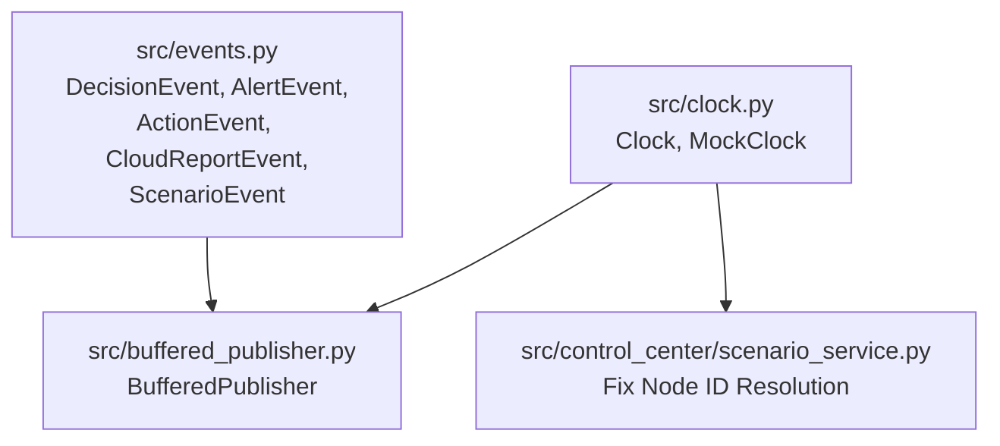

# Phase E1 Walkthrough: Foundations

Phase E1 establishes the common event model, clocks, publisher abstractions, and configuration improvements that serve as foundations for all chaos testing scenarios.

## Architectural Components

---

## 1. Common Event Model (`src/events.py`)

Standardized, transport-independent dataclasses serialize and deserialize details transmitted between the edge, fog, and cloud.

### Events Defined:
- **`DecisionEvent`**: Represents a fog node's decision process (e.g. WHI calculation, clamping).
- **`AlertEvent`**: Standardizes notifications and warning events emitted from fog nodes.
- **`ActionEvent`**: Records mitigation or recovery actions executed at the fog level.
- **`CloudReportEvent`**: Captures information about telemetry transmission status (e.g. whether it was buffered offline, time of flush).
- **`ScenarioEvent`**: Broadcasts lifecycle transitions for trial orchestrations (e.g. starts, step updates, trial completion).

Each class is serializable using:
- `to_dict()`: Converts instance attributes to a standard dictionary.
- `from_dict(d)`: Reconstructs the dataclass instance from a dictionary.

---

## 2. Clock Abstraction (`src/clock.py`)

To test time-dependent behaviors (such as message buffering, network disconnection periods, and message expirations) without mock-patching the standard library, we introduce a clock abstraction layer.

- **`Clock`**: Used in production. Directly delegates to Python's built-in `time.time()`, `time.sleep()`, and `time.strftime()`.
- **`MockClock`**: Used in testing. Stores simulated time as a float. Provides:
  - `advance(seconds)`: Manually increments the mock time.
  - `sleep(seconds)`: Simulates time lapse and records sleep periods inside `sleeps`.
  - `strftime(format, t)`: Translates simulated epochs into UTC timestamp strings.

---

## 3. Reusable Buffered Publisher (`src/buffered_publisher.py`)

A thread-safe caching component wrapper for the `paho.mqtt.client` instance that isolates publisher modules from raw network disruptions.

- **Locking**: Implements `threading.Lock` to guarantee safe thread operations when queuing telemetry or flushing.
- **Storage**: Uses `collections.deque(maxlen=5000)` ensuring $O(1)$ performance.
- **Direct Delivery**: If `is_connected` is `True`, it tries to publish directly. If it receives a failure return code (rc != 0), it enqueues the payload and marks the publish as failed.
- **Offline Mode**: If `is_connected` is `False`, messages are appended immediately to the buffer.
- **Flushing**: When `on_connect()` is triggered, calling `flush()` attempts to send buffered messages sequentially until the buffer is cleared or another disconnection is caught.

---

## 4. Scenario Service Node Resolution (`src/control_center/scenario_service.py`)

Replaced the hardcoded edge node targets (`E11`, `E12`, `E13`) within `_run_localized_scenario` with references to `self.active_nodes`:
- `self.active_nodes[0]` (Baseline edge node 1)
- `self.active_nodes[1]` (Target edge node)
- `self.active_nodes[2]` (Baseline edge node 2)

This ensures the orchestrator publishes steps to dynamic, zone-prefixed node topics (`ignis/v1/system/zone/{zone_id}/edge/{node}/control`) created in Phase D.
