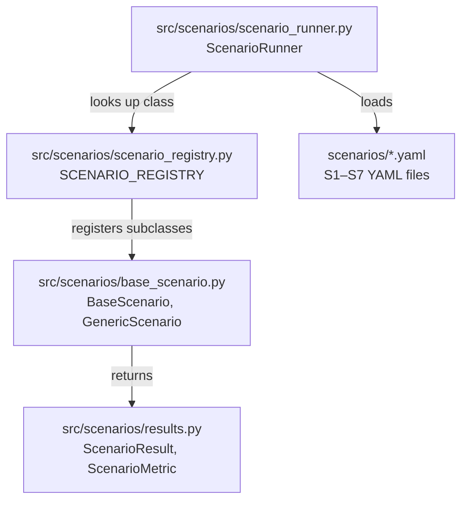

# Phase E3 Walkthrough: YAML Scenario Library & Scenario Package

Phase E3 migrates the testing scenarios from hardcoded Python logic to a decoupled, YAML-driven scenario library, managed by the new `scenarios` package.

## Package Architecture

---

## 1. Standardized YAML Scenario Format

All seven standard scenarios (S1-S7) are declared in `scenarios/*.yaml` under the project root using a structured format:
- `scenario_id`: E.g., `S1`, `S4`.
- `description`: Explains what the scenario simulates and validates.
- `target`: Specifies targeting metadata (e.g., `mode` as "global", "localized", or "multi_zone", `zone_ids`, and `target_node_index`).
- `steps`: An ordered list of steps defining step indexing, duration in seconds, `seasonal_baseline` levels, and spiked/normal sensor readings.
- `chaos_actions`: Used by Phase E5 to inject network or container failures.
- `expected_outcome`: Standardizes criteria to evaluate if a trial trial has passed (checking `final_state`, `max_state_allowed`, and clamping).

---

## 2. Decoupled Outcome Model (`src/scenarios/results.py`)

Eliminates structural dependencies from other modules. Models include:
- **`ScenarioMetric`**: Measures individual evaluations (e.g. state clamping logic).
- **`ScenarioResult`**: Aggregates the trials metadata, including execution durations, logs, parsing errors, metrics lists, and raw serialized MQTT messages captured during the run.

---

## 3. Scenario Base Abstractions (`src/scenarios/base_scenario.py`)

- **`BaseScenario`**: The abstract base class dictating `setup()`, `run()`, and `teardown()` patterns.
- **`GenericScenario`**: A concrete wrapper carrying default localized and global execution step loops:
  - Connects to target zones.
  - Dynamically formats node overrides based on target mode.
  - Sequentially publishes control messages and pauses according to the step durations.

---

## 4. Central Scenario Registry (`src/scenarios/scenario_registry.py`)

Maps scenario IDs (`S1` to `S7`) to their concrete classes. Features:
- Standard scenarios (S1, S2, S3, S6) leverage `GenericScenario` loops.
- `ScenarioS4` overrides `run()` to inject `mode="fault"` commands to test sensor clamp rules.
- S5 and S7 act as stubs that subclass `GenericScenario` for seamless resolution prior to E5 implementation.

---

## 5. YAML-Driven Scenario Runner (`src/scenarios/scenario_runner.py`)

Coordinates live trial execution:
- Loads the YAML definitions.
- Subscribes to the local MQTT broker (`ignis/v1/fog/zone/#`) to collect status updates published by the fog node runner.
- Invokes the registered scenario class.
- Runs trials $N$ times.
- Evaluates the captured MQTT events against the `expected_outcome` rules to flag trial results as passed or failed.
