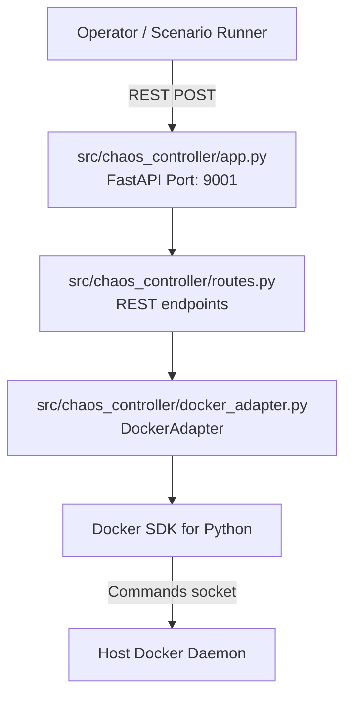

# Phase E4 Walkthrough: Chaos Controller Service

Phase E4 introduces the Chaos Controller service, which enables dynamic fault injection and network partition simulation across the IGNIS cluster via REST APIs.

## Architecture

---

## 1. Network Partition Separation Design

To simulate network partitions without cutting local intra-zone communications (fog↔edge node messages), the network layout was refactored:
- Introduced a dedicated `cloud-net` bridge network in `docker-compose.yml`.
- Central services (`cloud-broker`, `influxdb`, `cloud-ingestor`, `cloud-dashboard`) reside on `cloud-net`.
- Zone-specific edge nodes and brokers reside on the `default` bridge network.
- Fog Node runners (`ignis-fog-node-4a`/`4b`/`4c`) join both the `default` and `cloud-net` networks.
- A partition between a zone and the cloud is achieved by disconnecting that specific fog node container from `cloud-net`. Local processing and local ingestion continue normally, but telemetry buffering is triggered.

---

## 2. Docker Adapter (`src/chaos_controller/docker_adapter.py`)

The `DockerAdapter` class abstractly wraps all Docker SDK calls. Important components:
- **Lazy Initialization**: By using a `@property client` lookup pattern, `docker.from_env()` is only triggered when endpoints are actively queried. This isolates test cases from environment setup requirements during module imports.
- **Methods implemented**:
  - `disconnect(container_name, network_name)`: Removes container from the network interface.
  - `reconnect(container_name, network_name)`: Rejoins container to the network interface.
  - `kill(container_name)`: Gracefully stops the container (simulating container outage).
  - `restart(container_name)`: Starts/restarts the container.
  - `get_status(container_name)`: Queries status.

---

## 3. FastAPI Routing (`src/chaos_controller/routes.py`)

FastAPI routes map payloads to Docker actions:
- **`POST /api/chaos/disconnect_cloud`**: Sever connection for a zone. Supports Pydantic validation: `{zone_id: str, duration_sec: int}`. Uses FastAPI `BackgroundTasks` to automatically reconnect the network after `duration_sec`.
- **`POST /api/chaos/restore_cloud`**: Restores the network connection.
- **`POST /api/chaos/kill_container`**: Gracefully stops a container, with optional auto-restart background scheduling after `duration_sec`.
- **`POST /api/chaos/restart_container`**: Restarts the container.
- **`GET /api/chaos/status`**: Returns a JSON representation of all currently active fault injections (in-memory status tracking).
