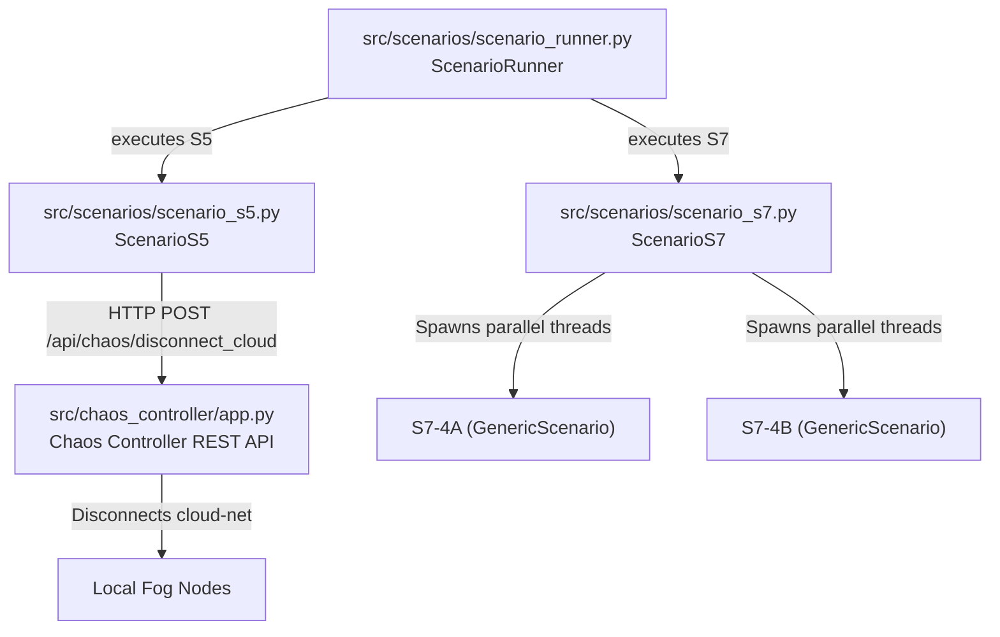

# Phase E5 Walkthrough: Scenario Automation with Fault Injection

Phase E5 integrates scenario execution with the Chaos Controller, enabling scenarios to automatically trigger cloud outages and container restarts at defined timeline offsets, and introduces parallel multi-zone scenario orchestration.

## Execution Design

---

## 1. Dynamic Inline Chaos Actions

To orchestrate faults at specific timeline coordinates:
- `GenericScenario` scans for the `chaos_actions` list inside the YAML file.
- It tracks the elapsed time of scenario execution.
- If a chaos action's `time_offset_sec` occurs within the current step interval, it triggers a REST API request to the Chaos Controller using python's `requests` library.
- **MockClock Integration**: Because actions trigger inline inside the step loop, they execute deterministically when using the `MockClock` in unit tests, with zero dependency on real-time background threads or sleep timings.

---

## 2. Scenario S5: Cloud Outage during Event (`src/scenarios/scenario_s5.py`)

Simulates a sudden ignition event accompanied by a cloud network partition:
- Resolves to `s5_cloud_outage.yaml`.
- Inherits the generic chaos execution loops from `GenericScenario`.
- Fires a `disconnect_cloud` command to the Chaos Controller at step 2 (t=8s).
- During the offline period (t=8s to 28s), it validates that the fog node buffers messages locally and logs actions to stdout.
- At t=28s, it triggers a `restore_cloud` or utilizes the auto-reconnection duration window, checking that BufferedPublisher flushes enqueued telemetry.

---

## 3. Scenario S7: Concurrent Multi-Zone Escalation (`src/scenarios/scenario_s7.py`)

Tests the IGNIS cluster's resilience during simultaneous fire outbreaks in parallel zones:
- Resolves to `s7_multi_zone.yaml`.
- Spawns parallel python threads for target zone IDs `4A` and `4B`.
- Each thread runs a dedicated `GenericScenario` loop wrapper.
- Joins threads and aggregates all execution logs, error arrays, and trial success flags into a unified `ScenarioResult`.
