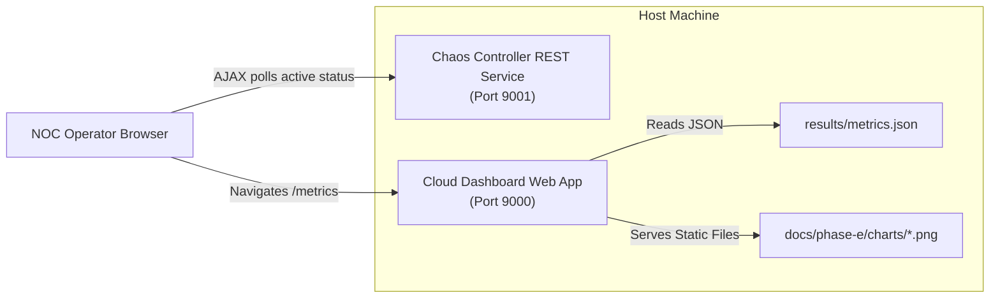

# Phase E7 Walkthrough: Tests, Dashboard, Documentation

Phase E7 connects all pieces of Fault and Chaos Testing together by integrating metrics analysis, plotted charts, and active fault injection status from the Chaos Controller directly into the IGNIS Cloud Dashboard NOC UI.

## Integration Architecture

---

## 1. CORS Middleware Enablement (`src/chaos_controller/app.py`)

- Because the dashboard frontend runs on port 9000 and the Chaos Controller service runs on port 9001, browser security blocks cross-origin requests.
- To enable the browser to query the Chaos Controller directly for active fault status in real-time, `CORSMiddleware` has been registered in the Chaos Controller's FastAPI app, allowing wildcard (`*`) origins.

---

## 2. Static Serving of Plotted Charts (`src/cloud_dashboard/app.py`)

- Modified the dashboard startup block to mount the `docs/phase-e/charts` directory as static files at `/charts`.
- Added automatic directory creation (`os.makedirs`) to prevent system startup crashes when folders are initialized inside new test environments.

---

## 3. Route Registration (`src/cloud_dashboard/routes.py`)

Added new route handlers:
- **`GET /api/metrics/latest`**: Resolves to `results/metrics.json`. Returns default fallback values if no experiment runs have occurred yet.
- **`GET /metrics`**: Serves the metrics dashboard template.

---

## 4. Glassmorphic NOC Metrics UI (`src/cloud_dashboard/templates/metrics.html`)

Implemented a beautiful NOC operations page matching the existing IGNIS UI:
- **Resilience Cards**: Displays metric parameters (Latency, Propagation, Clamping Rates, buffered queues) with live numerical indicators.
- **Visual Charts**: Integrates Matplotlib plotted PNGs from `/charts/` showing trends over trials.
- **Active Fault Card**: Performs AJAX polling loops every 2 seconds to `http://localhost:9001/api/chaos/status`, dynamically highlighting disconnected zones or offline nodes.
