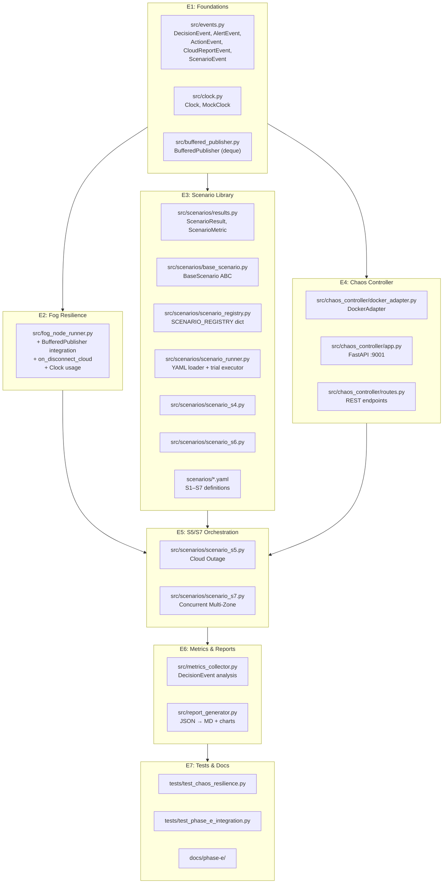

# Phase E — Fault and Chaos Testing: Implementation Plan

---

## Architecture Overview



---

## E1: Foundations

Four independent modules that all later sub-phases depend on.

---

### [NEW] [events.py](file:///d:/projects/IGNIS/src/events.py) — Common Event Model

Standardized dataclasses consumed by the metrics collector, report generator, dashboard, and tests. All transport-independent.

| Dataclass | Purpose | Key Fields |
|-----------|---------|------------|
| `DecisionEvent` | Fog state-change decision record | `scenario`, `zone_id`, `node_id`, `sensor_timestamp`, `decision_timestamp`, `previous_state`, `new_state`, `whi`, `confirmation_count`, `is_clamped` |
| `AlertEvent` | Alert publication record | `scenario`, `zone_id`, `timestamp`, `severity`, `source_node`, `whi` |
| `ActionEvent` | Autonomous action log entry | `scenario`, `zone_id`, `timestamp`, `actions[]`, `reason` |
| `CloudReportEvent` | Cloud-bound telemetry report | `scenario`, `zone_id`, `node_id`, `timestamp`, `was_buffered`, `buffer_flush_timestamp` |
| `ScenarioEvent` | Scenario lifecycle event | `scenario`, `event_type` (start/step/complete/error), `timestamp`, `step_index`, `total_steps` |

All classes provide `to_dict()` and `from_dict()` for JSON serialization.

---

### [NEW] [clock.py](file:///d:/projects/IGNIS/src/clock.py) — Clock Abstraction

Wraps `time.time()`, `time.sleep()`, and `time.strftime()` behind an injectable interface.

| Class | Usage |
|-------|-------|
| `Clock` | Production singleton — delegates to `time.*` |
| `MockClock` | Testing — deterministic time with `advance(seconds)` and sleep recording |

Components accept a `clock: Clock = default_clock` parameter, enabling fully deterministic unit tests without monkey-patching.

---

### [NEW] [buffered_publisher.py](file:///d:/projects/IGNIS/src/buffered_publisher.py) — Reusable Buffered MQTT Publisher

Eliminates duplicated buffering logic between `FogNodeRunner` and `CloudMQTTService`.

```python
class BufferedPublisher:
    def __init__(self, client, clock=default_clock, maxlen=5000)
    def publish(self, topic: str, payload: str) -> bool
    def flush(self) -> int
    def on_connect(self)
    def on_disconnect(self)
    @property
    def is_connected(self) -> bool
    @property
    def buffer_size(self) -> int
```

- Internal buffer: `collections.deque(maxlen=5000)` — O(1) FIFO with automatic eviction.
- `publish()` writes directly if connected, otherwise enqueues.
- `flush()` drains the buffer in order on reconnection, returns count of flushed messages.
- Thread-safe via `threading.Lock`.

---

### [MODIFY] [scenario_service.py](file:///d:/projects/IGNIS/src/control_center/scenario_service.py) — Fix Node ID Resolution

**Problem**: `_run_localized_scenario()` hardcodes `E11`/`E12`/`E13` (Phase B relics), but Phase D uses zone-prefixed IDs like `4B-E1`, `4B-E2`, `4B-E3`.

**Fix**: Replace all raw string references with dynamic lookups from `self.active_nodes`:
- Target node → `self.active_nodes[1]` (middle node, the "E12 equivalent")
- Baseline nodes → `self.active_nodes[0]` and `self.active_nodes[2]`
- Control topic construction uses `self.zone_id` and the dynamic node ID.

---

## E2: Fog Node Cloud-Disconnect Resilience

### [MODIFY] [fog_node_runner.py](file:///d:/projects/IGNIS/src/fog_node_runner.py)

| Change | Detail |
|--------|--------|
| **BufferedPublisher integration** | Replace all `self.client_cloud.publish(topic, payload)` calls with `self.cloud_publisher.publish(topic, payload)` |
| **Disconnect callback** | Add `on_disconnect_cloud(client, userdata, rc)` → calls `self.cloud_publisher.on_disconnect()` and logs the event |
| **Reconnect flush** | In `on_connect_cloud()`, call `self.cloud_publisher.on_connect()` then `self.cloud_publisher.flush()` |
| **Clock abstraction** | Replace `time.time()`, `time.strftime()`, and `time.sleep()` with injected `Clock` instance |
| **Local continuity logging** | During offline periods, log action records to stdout at INFO level to prove uninterrupted local operation |

The fog node's local broker connection (`client_local`) remains unbuffered since local-broker availability is a prerequisite for the fog node to function at all.

---

## E3: YAML Scenario Library & Scenario Package

### New Package Structure

```
src/scenarios/
 __init__.py
 results.py              # ScenarioResult + ScenarioMetric (decoupled)
 base_scenario.py        # BaseScenario abstract class only
 scenario_registry.py    # Central SCENARIO_REGISTRY dict
 scenario_runner.py      # YAML loader + trial executor
 scenario_s4.py          # S4 fault injection
 scenario_s6.py          # S6 lateral spread

scenarios/                   # YAML definitions (project root)
 s1_normal.yaml
 s2_slow_risk.yaml
 s3_sudden_ignition.yaml
 s4_sensor_fault.yaml
 s5_cloud_outage.yaml
 s6_lateral_spread.yaml
 s7_multi_zone.yaml
```

---

### [NEW] `src/scenarios/results.py` — Decoupled Result Model

> **Rationale**: `ScenarioResult` is consumed by the metrics collector, report generator, dashboard, and unit tests. These should not depend on `BaseScenario` just to access the result model.

```python
@dataclass
class ScenarioMetric:
    name: str                  # e.g. "fog_decision_latency"
    value: float
    unit: str                  # e.g. "seconds"
    passed: bool
    threshold: float           # target value for pass/fail
    details: str = ""

@dataclass
class ScenarioResult:
    scenario: str              # e.g. "S4"
    passed: bool
    duration_sec: float
    start_time: str
    end_time: str
    metrics: List[ScenarioMetric]
    events: List[dict]         # serialized DecisionEvent/AlertEvent list
    logs: List[str]
    errors: List[str]
    zone_ids: List[str]
    trial_index: int = 0       # for multi-trial runs
```

---

### [NEW] `src/scenarios/base_scenario.py` — Abstract Base Class

```python
class BaseScenario(ABC):
    scenario_id: str
    description: str
    yaml_path: str

    @abstractmethod
    def setup(self, mqtt_client, zone_id: str, clock: Clock) -> None
    
    @abstractmethod
    def run(self) -> ScenarioResult
    
    @abstractmethod
    def teardown(self) -> None
```

---

### [NEW] `src/scenarios/scenario_registry.py` — Central Registry

```python
SCENARIO_REGISTRY: dict[str, type[BaseScenario]] = {
    "S4": ScenarioS4,
    "S5": ScenarioS5,
    "S6": ScenarioS6,
    "S7": ScenarioS7,
}
```

The `ScenarioRunner` simply performs:
```python
scenario_class = SCENARIO_REGISTRY[name]
scenario = scenario_class()
result = scenario.run()
```

Benefits: eliminates conditional branching, simplifies dashboard integration, supports future plugin-style registration.

---

### [NEW] `src/scenarios/scenario_runner.py` — YAML-Driven Runner

Responsibilities:
1. **Loads YAML definitions** — parses sensor data steps, metadata, chaos actions.
2. **Executes scenarios** — publishes MQTT control commands step-by-step.
3. **Owns trial execution** — runs a scenario N times for statistical metrics (e.g., S4 false-positive rate).
4. **Produces `ScenarioResult[]`** — the metrics collector only analyzes completed results.

```
ScenarioRunner
        
         Executes scenario N times
         Produces ScenarioResult[]
                
                
MetricsCollector
        
         Computes statistics from ScenarioResult[]
```

---

### [NEW] YAML Scenario Definition Format

Each YAML file follows a standardized schema:

```yaml
# scenarios/s4_sensor_fault.yaml
scenario_id: "S4"
description: "Single sensor fault — validates 3-sensor confirmation rule"
version: "1.0"

target:
  mode: "localized"           # "global" | "localized" | "multi_zone"
  zone_ids: ["4B"]
  target_node_index: 1         # middle node

steps:
  - index: 0
    duration_sec: 4
    sensor_data:
      temperature_c: 38.0
      humidity_pct: 30.0
      # ... full sensor payload
    seasonal_baseline: 0.8

  - index: 1
    # ... subsequent steps

chaos_actions: []              # S5/S7 add chaos actions here

expected_outcome:
  final_state: "YELLOW"
  max_state_allowed: "YELLOW"  # ORANGE/RED = fail
  is_clamped: true

metrics_targets:
  false_positive_rate: 0.0
```

---

### [NEW] `src/scenarios/scenario_s4.py` / `scenario_s6.py`

Concrete `BaseScenario` subclasses that:
- Load their corresponding YAML definition.
- Override `run()` with scenario-specific MQTT orchestration logic.
- Return `ScenarioResult` with collected `DecisionEvent` lists.
- S4 uses the localized runner (fault on middle node only).
- S6 uses the global runner (all nodes in the zone escalate with wind bearing).

---

## E4: Chaos Controller Service

### New Package Structure

```
src/chaos_controller/
 __init__.py
 docker_adapter.py       # Abstracted Docker SDK operations
 routes.py               # FastAPI REST endpoints
 app.py                  # FastAPI application (:9001)
```

---

### [NEW] `src/chaos_controller/docker_adapter.py` — Docker Abstraction

```python
class DockerAdapter:
    def __init__(self, docker_client=None)
    def disconnect(self, container_name: str, network_name: str) -> dict
    def reconnect(self, container_name: str, network_name: str) -> dict
    def kill(self, container_name: str) -> dict
    def restart(self, container_name: str) -> dict
    def get_status(self, container_name: str) -> dict
```

All methods return structured `{"success": bool, "details": str, "timestamp": str}` dicts. The adapter encapsulates all Docker-specific logic, making it trivially mockable in tests.

**Deployment**: Host-side Python service using the Docker Python SDK (avoids socket mount permission issues on Windows Docker Desktop).

---

### [NEW] `src/chaos_controller/routes.py` — REST API

| Endpoint | Method | Body | Purpose |
|----------|--------|------|---------|
| `/api/chaos/disconnect_cloud` | POST | `{zone_id, duration_sec}` | Severs fog↔cloud link |
| `/api/chaos/restore_cloud` | POST | `{zone_id}` | Restores fog↔cloud link |
| `/api/chaos/kill_container` | POST | `{container_name, duration_sec}` | Stops container temporarily |
| `/api/chaos/restart_container` | POST | `{container_name}` | Restarts container |
| `/api/chaos/status` | GET | — | Returns active fault injections |

---

### [NEW] `src/chaos_controller/app.py` — FastAPI Service

```python
app = FastAPI(title="IGNIS Chaos Controller", version="1.0")
# Mounts routes from routes.py
# Runs on port 9001
```

---

### [MODIFY] [docker-compose.yml](file:///d:/projects/IGNIS/docker-compose.yml) — Network Isolation

Add an explicit `cloud-net` Docker network:
- Fog nodes + cloud-broker + cloud-ingestor + cloud-dashboard all join `cloud-net`.
- The chaos controller disconnects individual fog nodes from `cloud-net` specifically.
- Local zone networks remain unaffected (fog↔edge communication continues).

```yaml
networks:
  cloud-net:
    driver: bridge
```

---

## E5: S5 & S7 Orchestration

### [NEW] `src/scenarios/scenario_s5.py` — Cloud Outage During Event

```
Timeline:
    t=0s    Trigger S3 (Sudden Ignition) on Zone 4B
    t=8s    Fog reaches YELLOW/ORANGE (step 2)
    t=8s    POST /api/chaos/disconnect_cloud {zone_id: "4B", duration_sec: 20}
    t=8-28s Fog continues locally (S3 steps 3-5 execute)
             Local broker still receives state/alert/action_log
             Cloud-bound messages queue in BufferedPublisher
             Local stdout logs prove uninterrupted operation
    t=28s   POST /api/chaos/restore_cloud {zone_id: "4B"}
    t=29s   BufferedPublisher.flush() drains queued messages
    t=30s   Verify flushed data appears in InfluxDB
    t=31s   Collect offline continuity metrics → ScenarioResult
```

---

### [NEW] `src/scenarios/scenario_s7.py` — Concurrent Multi-Zone Escalation

Default: **2 zones (4A, 4B)**. Future extension: `--zones 4A,4B,4C`.

```
Timeline:
    t=0s    Simultaneously trigger S3 on Zone 4A AND Zone 4B
            (two parallel MQTT control streams)
    t=0-24s Both zones escalate through GREEN → YELLOW → ORANGE → RED
    t=24s   Subscribe to both zones' state topics, collect all messages
    t=25s   Assert:
             Zero cross-contamination (no zone_id mismatches)
             Zero dropped messages (all telemetry in InfluxDB)
             Cloud dashboard reflects both zones independently
    t=26s   Collect concurrent-zone integrity metrics → ScenarioResult
```

---

## E6: Metrics Collector & Report Generator

### [NEW] `src/metrics_collector.py` — Analysis Only

Consumes `ScenarioResult[]` (not raw MQTT). Computes 5 Section 7 metrics:

| Metric | Source | Computation |
|--------|--------|-------------|
| **Fog Decision Latency** | `DecisionEvent` from S3 runs | `decision_timestamp - sensor_timestamp` |
| **Lateral Propagation Time** | `DecisionEvent` from S6 runs | Source zone escalation → neighbor pre-emptive change |
| **False-Positive Rate** | `ScenarioResult[]` from N×S4 trials | Count of ORANGE/RED states ÷ total trials |
| **Offline Continuity** | `ScenarioResult` from S5 | Local operations uninterrupted + buffer flush success |
| **Concurrent-Zone Integrity** | `ScenarioResult` from S7 | Cross-talk count + message loss count |

CLI: `python -m src.metrics_collector --results-dir results/ --trials 10`

Trial count is configurable:

| Mode | `--trials` |
|------|-----------|
| CI | 5 |
| Default | 10 |
| Research | 50 |
| Stress | 100 |

**Output**: `results/metrics.json` — raw experiment data preserved for future HTML/PDF reports.

---

### [NEW] `src/report_generator.py` — JSON → Markdown + Charts

```
metrics.json
    ↓
Report Generator
     docs/phase-e/section7_metrics_report.md
     docs/phase-e/charts/decision_latency.png
     docs/phase-e/charts/lateral_propagation.png
     docs/phase-e/charts/false_positive_rate.png
     docs/phase-e/charts/offline_continuity.png
     docs/phase-e/charts/message_integrity.png
```

Uses `matplotlib` for dissertation-ready visualizations embedded in the markdown report.

---

## E7: Tests, Dashboard, Documentation

### [NEW] `tests/test_chaos_resilience.py` — Unit Tests

| Test | What it validates |
|------|-------------------|
| `test_buffered_publisher_queuing` | Messages enqueue when disconnected |
| `test_buffered_publisher_flush` | All queued messages publish in order on reconnect |
| `test_buffered_publisher_overflow` | deque evicts oldest when maxlen exceeded |
| `test_fog_runner_offline_queuing` | FogNodeRunner integration with BufferedPublisher |
| `test_s4_node_id_resolution` | Localized scenario uses zone-prefixed node IDs |
| `test_clock_mockability` | MockClock produces deterministic timestamps |
| `test_scenario_result_serialization` | ScenarioResult round-trips through JSON |
| `test_scenario_registry_lookup` | Registry resolves all scenario IDs |

---

### [NEW] `tests/test_phase_e_integration.py` — End-to-End Integration Test

Validates the **complete Phase E workflow** in sequence:

1. Execute Scenario S5 via `ScenarioRunner`.
2. Trigger cloud disconnection via chaos controller API.
3. Verify fog node continues local operation (state/alerts published to local broker).
4. Restore cloud connectivity.
5. Verify buffered messages flush to cloud broker.
6. Verify `MetricsCollector` produces valid metrics from the `ScenarioResult`.
7. Verify `ReportGenerator` produces a valid markdown report file.

> Detects wiring issues between modules and validates the complete pipeline before Phase F.

---

### [MODIFY] Control Center Dashboard

- Add **S5 (Cloud Outage)** and **S7 (Concurrent Escalation)** scenario buttons.
- Buttons call `ScenarioService` → `ScenarioRunner` → `BaseScenario.run()` (not direct script launch).
- Add a **Chaos Status** indicator panel that polls `GET /api/chaos/status`.

---

### [NEW] Documentation

- `docs/phase-e/walkthrough.md` — Full technical walkthrough of all implementations.
- `docs/phase-e/testing.md` — Testing and verification procedures.
- `docs/phase-e/section7_metrics_report.md` — Auto-generated metrics report.

---

## Verification Plan

### Automated Tests
```bash
# Full test suite including new chaos resilience + integration tests
python -m unittest discover tests
```

### Scenario Execution
```bash
# Start cluster
docker compose up --build -d

# Run chaos controller (host-side)
uvicorn src.chaos_controller.app:app --host 0.0.0.0 --port 9001

# Execute scenarios and collect metrics
python -m src.scenarios.scenario_runner --scenario S4 --trials 10
python -m src.scenarios.scenario_runner --scenario S5
python -m src.scenarios.scenario_runner --scenario S7

# Generate report
python -m src.report_generator --input results/metrics.json
```

### Manual Verification
- Trigger S4 from dashboard → verify YELLOW clamp (no ORANGE/RED)
- Trigger S5 from dashboard → observe fog continues locally, cloud data flushes on reconnect
- Trigger S7 from dashboard → verify NOC shows both zones independently
- Review generated `section7_metrics_report.md` with embedded charts

---

## Complete File Manifest

| Sub-Phase | Action | File |
|-----------|--------|------|
| E1 | NEW | `src/events.py` |
| E1 | NEW | `src/clock.py` |
| E1 | NEW | `src/buffered_publisher.py` |
| E1 | MODIFY | `src/control_center/scenario_service.py` |
| E2 | MODIFY | `src/fog_node_runner.py` |
| E3 | NEW | `src/scenarios/__init__.py` |
| E3 | NEW | `src/scenarios/results.py` |
| E3 | NEW | `src/scenarios/base_scenario.py` |
| E3 | NEW | `src/scenarios/scenario_runner.py` |
| E3 | NEW | `src/scenarios/scenario_registry.py` |
| E3 | NEW | `src/scenarios/scenario_s4.py` |
| E3 | NEW | `src/scenarios/scenario_s6.py` |
| E3 | NEW | `scenarios/s1_normal.yaml` — `scenarios/s7_multi_zone.yaml` |
| E4 | NEW | `src/chaos_controller/__init__.py` |
| E4 | NEW | `src/chaos_controller/docker_adapter.py` |
| E4 | NEW | `src/chaos_controller/routes.py` |
| E4 | NEW | `src/chaos_controller/app.py` |
| E4 | MODIFY | `docker-compose.yml` |
| E5 | NEW | `src/scenarios/scenario_s5.py` |
| E5 | NEW | `src/scenarios/scenario_s7.py` |
| E6 | NEW | `src/metrics_collector.py` |
| E6 | NEW | `src/report_generator.py` |
| E7 | NEW | `tests/test_chaos_resilience.py` |
| E7 | NEW | `tests/test_phase_e_integration.py` |
| E7 | MODIFY | `src/control_center/scenario_service.py` |
| E7 | MODIFY | `src/control_center/templates/index.html` |
| E7 | NEW | `docs/phase-e/walkthrough.md` |
| E7 | NEW | `docs/phase-e/testing.md` |
