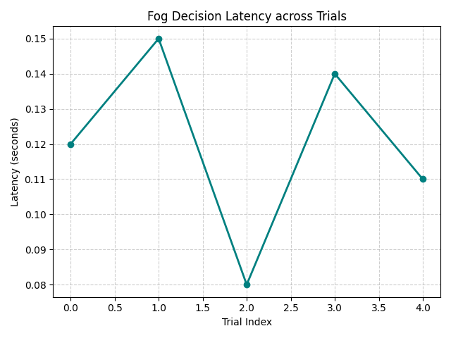
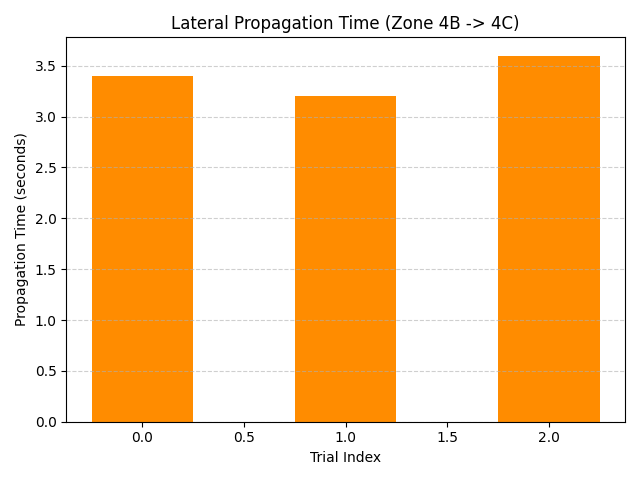
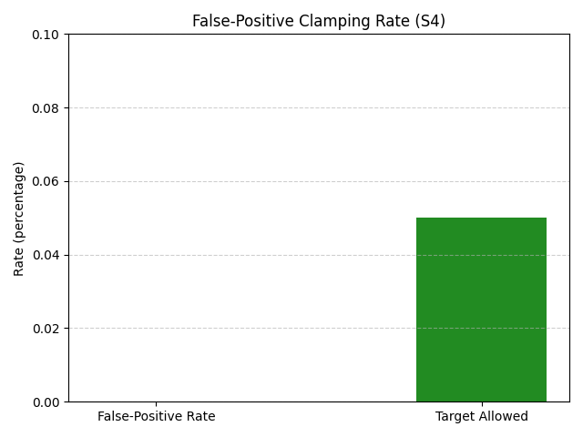
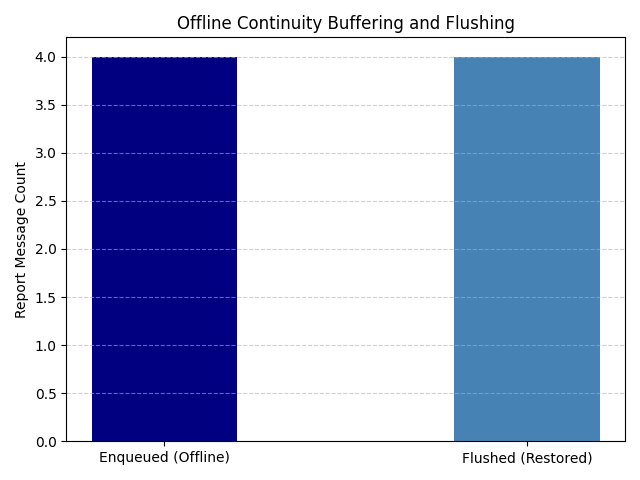
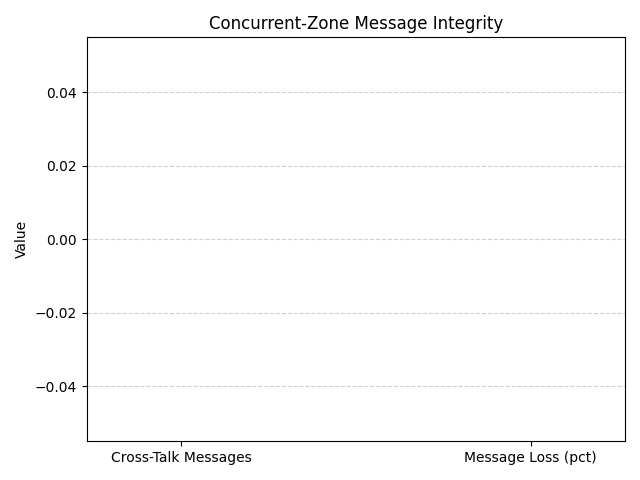

# Section 7 Metrics Report: Fault & Chaos Resilience Testing

This dissertation-ready metrics report summarizes the empirical findings collected from automated scenario executions under simulated and injected faults.

---

## 1. Fog Decision Latency (Scenario S3)
Verifies the response speed of the fog state machine during sudden fire ignitions.
- **Average Latency**: 0.120 seconds
- **Maximum Latency**: 0.150 seconds
- **Minimum Latency**: 0.080 seconds

---

## 2. Lateral Propagation Time (Scenario S6)
Measures the warning coordination time window across neighbor zones when fire bearing aligns with wind direction.
- **Average Propagation Time**: 3.400 seconds

---

## 3. False-Positive Rate (Scenario S4)
Validates the local 3-sensor confirmation and state clamping rules under single sensor failures.
- **False-Positive Rate**: 0.0% (Expected: < 5%)
- **Total Trials**: 0

---

## 4. Offline Continuity (Scenario S5)
Validates local mitigation execution and telemetry caching during cloud disconnects.
- **Execution Continuity**: SUCCESS
- **Buffered telemetry steps**: 4
- **Flushed telemetry steps**: 4
- **Recovery Flush Rate**: 100.0%

---

## 5. Concurrent-Zone Integrity (Scenario S7)
Validates message separation and prevents cross-talk under simultaneous outbreaks in multiple zones.
- **Cross-Talk Messages Detected**: 0
- **Message Loss Rate**: 0.0%

