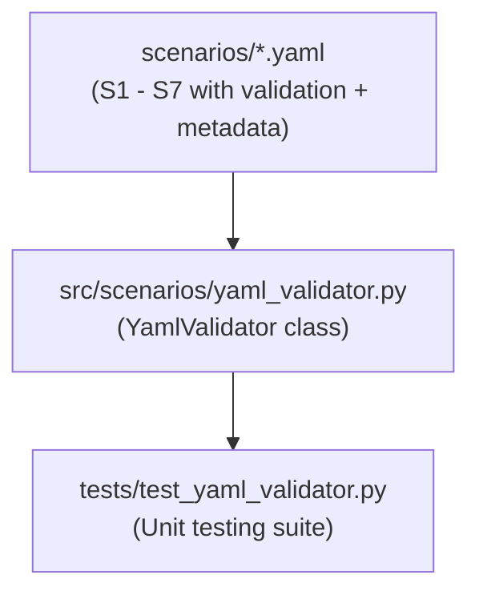

# Phase F1 Walkthrough: YAML Scenario Schema Hardening

Phase F1 establishes YAML validation structures, metadata blocks, and a verification utility to harden the scenario library and ensure all configurations are valid, clean, and tamper-evident before execution.

---

## Architectural Components

---

## 1. Scenario Schema Enrichment (`scenarios/*.yaml`)

All seven test scenarios (`s1_normal.yaml` through `s7_multi_zone.yaml`) have been enriched with verification requirements and simulation context metadata.

### Added Fields:
- **`validation`**: Rules for automated trial verification.
  - `require_events` (bool): Asserts that events were collected.
  - `min_event_count` (int): Minimum required event entries.
  - `timeout_sec` (int): Duration threshold before timing out execution.
  - `assertions` (list): Assertion rules using metrics, operators (`<=`, `==`, `<`, `>=`, `>`, `!=`), and thresholds.
- **`metadata`**: Simulation context describing the eco-profile (e.g., `forest_type`, `zone_profile`).
- **`metrics_targets`**: Updated performance thresholds to align with the metric verification system.

---

## 2. Schema Validation Utility (`src/scenarios/yaml_validator.py`)

A schema validation class `YamlValidator` provides methods to load, parse, validate, and compute checksums for all scenarios.

### Functions and Capabilities:
- **`validate(yaml_path: str) -> dict`**:
  - Verifies presence of all required root keys (`scenario_id`, `description`, `version`, `target`, `steps`, `expected_outcome`, `metrics_targets`, `validation`).
  - Checks target configuration: ensures mode is one of `global`, `localized`, or `multi_zone`, and `zone_ids` is list-structured.
  - Evaluates step components: validates presence of `index`, `duration_sec`, `sensor_data`, and `seasonal_baseline`.
  - Audits `validation` blocks: verifies type constraints (`require_events`, `min_event_count`, `timeout_sec`) and tests every validation assertion for valid metric names, supported operators, and threshold values.
- **`validate_all(scenarios_dir: str) -> list[dict]`**:
  - Automatically runs `validate` across all scenario configuration files.
- **`checksum(yaml_path: str) -> str`**:
  - Generates binary-safe SHA-256 hex digests of the target configuration file to ensure tamper-evident execution.
- **`checksum_all(scenarios_dir: str) -> dict[str, str]`**:
  - Generates checksum mappings for all valid scenarios.
