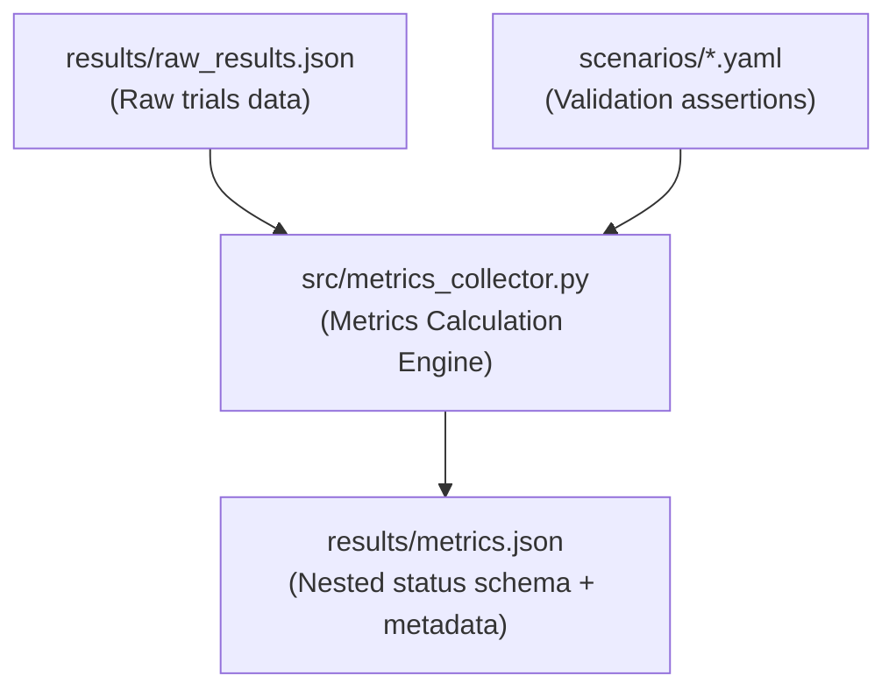

# Phase F2 Walkthrough: Metrics Collector Hardening

Phase F2 hardens the simulation metrics collection and reporting by removing mock fallback values, implementing robust statistical methods (including Student-t confidence intervals), validating scenarios dynamically against custom assertions, and gathering comprehensive environment reproducibility metadata.

---

## Architectural Components

---

## 1. Metrics Collector Hardening (`src/metrics_collector.py`)

The metrics collection engine has been completely rewritten to support automated validation and statistical verification.

### Key Modifications:
- **Fallback Elimination**: Mock arrays for latency and propagation times have been deleted. If a scenario lacks target events, it is flagged as `INVALID` with a descriptive reason.
- **Statistical Aggregation**: Computes sample size, min, max, mean, median, sample standard deviation, and a 95% confidence interval (CI).
- **Student-t Confidence Intervals**: 
  - Uses `scipy.stats.t.interval()` if available.
  - Otherwise, falls back to a custom precomputed critical values table (indexes $df = 1$ to $29$, mapped to $\alpha = 0.05$ two-tailed test bounds) to avoid forced external dependencies.
- **Dynamic Assertions**: Evaluates metrics dynamically against operators (`<=`, `==`, `<`, `>=`, `>`, `!=`) defined under the YAML configuration's `validation.assertions` block.
- **Nested Schema Mapping**: Restructured final output schemas to group outputs per scenario: `{status, reason, trials, metrics: {metric_name: {statistics_or_value, status, reason, threshold, operator}}}`.
- **Backward Compatibility**: Kept the legacy fields `avg_sec` and `avg_propagation_sec` nested in calculation dicts to prevent integration regressions with the Cloud Dashboard or Report Generator.

---

## 2. Reproducibility Metadata

Every metrics run outputs an `experiment_metadata` dictionary containing details needed to replicate the trial parameters:
- **RNG Seeding and Trials**: Trial count and execution seed values.
- **System and platform**: OS version, machine CPU architecture, timezone, hostnames, and Python versions.
- **Git Provenance**: Automatically retrieves the current active git commit hash (`git rev-parse --short HEAD`).
- **Scenario integrity**: Collects SHA-256 scenario checksums and version tags.
