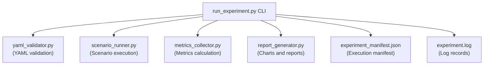

# Phase F3 Walkthrough: Experiment Orchestrator

Phase F3 implements a unified orchestrator script `src/run_experiment.py` that links scenario configuration schema validation, clean executions, raw trial runs, statistical calculation, chart and report updates, and reproducibility manifest logging into a single automated pipeline.

---

## Architectural Components

---

## 1. Pipeline Implementation (`src/run_experiment.py`)

The orchestrator script establishes a robust 9-stage execution sequence:

1. **YAML Validation (Stage 1)**: Invokes `YamlValidator` to check all configuration structures and checksums. If errors are found, the pipeline aborts.
2. **Clean Outputs (Stage 2)**: Purges previous output results files and charts if the `--clean` flag is set.
3. **Run Scenarios (Stage 3)**: Executes target scenarios S1–S7 sequentially for the requested trials. Integrates a deterministic global random seed.
4. **Verify Completeness (Stage 4)**: Verifies that each executed scenario produced event records.
5. **Compute Metrics (Stage 5)**: Invokes `compute_metrics` to compute min/max/mean/median/std_dev/CI aggregates and evaluates dynamic assertions.
6. **Generate Charts (Stage 6)**: Updates Matplotlib visualizations under the target reports directory.
7. **Generate Report (Stage 7)**: Compiles the final results markdown writeup.
8. **Generate Manifest (Stage 8)**: Exposes run parameters, system environment variables, git hashes, and file paths.
9. **Summary Table (Stage 9)**: Outputs a clean tabular overview of scenario pass/fail results to stdout.

---

## 2. Seeding and Replays

To verify experiment reproducibility, `run_experiment.py` uses random seeding:
- If `--seed N` is provided, the seed is set globally in Python.
- If omitted, a random seed is auto-generated.
- The seed value is recorded inside `metrics.json` and `experiment_manifest.json` for deterministic trial replay.
