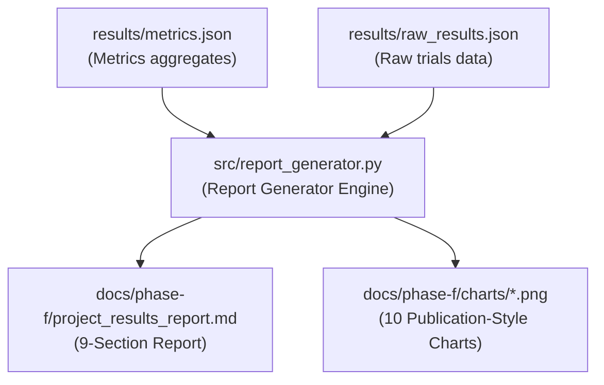

# Phase F4 Walkthrough: Consolidated Report Generator

Phase F4 implements the reporting and visualization layer of the IGNIS simulation results pipeline. It expands the metrics reporting system by generating 10 publication-ready Matplotlib charts using raw trial datasets, and compiling a comprehensive, dissertation-ready results writeup containing 9 research sections.

---

## Architectural Components

---

## 1. Publication-Style Visualizations

The report generator automatically creates 10 printer-friendly Matplotlib visualizations. All charts are configured with white backgrounds, clean grids, and grayscale-compatible palettes:

- **`decision_latency_boxplot.png`**: Box plot depicting the variance and median value of S3 decision latencies.
- **`decision_latency_histogram.png`**: Density distribution histogram of S3 decision latencies.
- **`lateral_propagation_comparison.png`**: Bar chart comparison of adjacent zone warn coordination durations across trials (S6).
- **`lateral_propagation_ci.png`**: Statistical interval chart displaying the S6 mean propagation time alongside its 95% Student-t confidence intervals.
- **`false_positive_trend.png`**: Line plot showcasing the cumulative false-positive rate trend during sensor failures (S4).
- **`offline_buffering_timeline.png`**: Grouped bar chart tracking the message caching and flushing timeline during local standalone operations (S5).
- **`message_integrity_heatmap.png`**: Annotated crosstalk matrix showing message mapping by zone during simultaneous outbreaks (S7).
- **`scenario_comparison_summary.png`**: Comparative bar chart of mean execution durations across all scenarios.
- **`state_transition_timeline.png`**: Step-wise state transition timeline showing GREEN -> YELLOW -> ORANGE -> RED progression (S3).
- **`execution_timeline.png`**: Gantt-style horizontal timeline representing pipeline scenario ordering and durations.

*Note: Individual chart generation is wrapped in resilient try/except blocks, ensuring the final report compiles successfully even if specific matplotlib outputs fail.*

---

## 2. 9-Section Report Compiler

The compiler compiles the results into a markdown document following standard dissertation structure:
1. **Executive Summary**: Overall compliance verdict and statistics.
2. **Experimental Setup**: Specific trial parameters, database versions, broker configs, and system environment details.
3. **Scenario Execution**: Summary result tables and execution gantt timeline.
4. **Experimental Results**: Dedicated sections for scenarios S1-S7 containing raw tables and relevant charts.
5. **Cross-Scenario Analysis**: Duration and scalability comparison.
6. **Architecture Validation Summary**: Mapping empirical evidence to Section 12 core architecture claims.
7. **Discussion**: Analysis of latencies against performance targets.
8. **Limitations**: Gaps relating to synthetic datasets and simulated RF environments.
9. **Conclusion**: Compliance verdict and recommendations.
