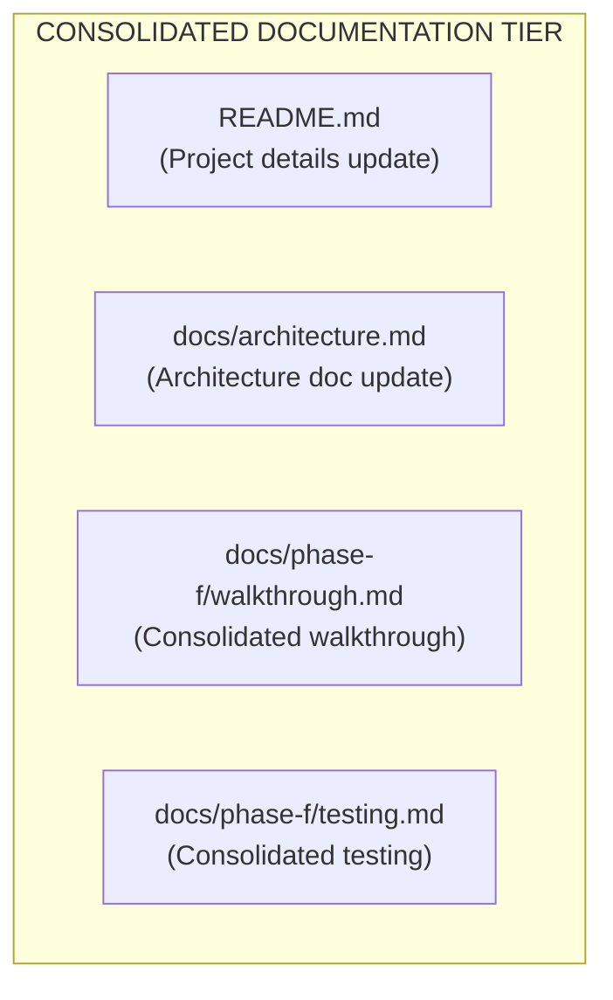

# Phase F5 Walkthrough: Documentation & README Update

Phase F5 finalizes the Scenario Library & Reporting phase by updating the project's repository README, modifying the design architecture document, and compiling technical walkthrough and testing procedures.

---

## Architectural / Document Components

---

## 1. Project README Update (`README.md`)

The repository root [README.md](file:///d:/projects/IGNIS/README.md) has been modified to integrate details for all completed development stages:
- **Phase Status Table**: Marked Phases C, D, E, and F as complete (`✅`) in the summary table.
- **Completed Phases Sections**: Added descriptive headings and summaries for:
  - *Phase C*: Cloud integration layer (Timeseries DB, central broker, Grafana).
  - *Phase D*: Multi-zone & lateral coordination.
  - *Phase E*: Fault & chaos resilience testing (Chaos Controller service).
  - *Phase F*: Scenario library & consolidated reporting.
- **Project Structure**: Updated the directory tree layout to include `docs/phase-f/`, `scenarios/`, `src/scenarios/yaml_validator.py`, and `src/run_experiment.py`.
- **Running Instructions**: Added terminal execution guidelines for running the new Experiment Orchestrator CLI pipeline.

---

## 2. System Architecture Update (`docs/architecture.md`)

The system architecture document [architecture.md](file:///d:/projects/IGNIS/docs/architecture.md) has been updated in **Section 13 (Development Phases)**:
- Expanded the `Phase F` node inside the development phases mermaid chart with a detailed label description.
- Inserted a conceptual paragraph describing Phase F's integration as the validation and reporting layer verifying real-time performance claims.

---

## 3. Consolidated Documentation

Consolidated documentation files have been added directly under `docs/phase-f/`:
- **Consolidated Walkthrough**: [walkthrough.md](file:///d:/projects/IGNIS/docs/phase-f/walkthrough.md) provides a unified progression overview of sub-phases F1 to F4.
- **Consolidated Testing**: [testing.md](file:///d:/projects/IGNIS/docs/phase-f/testing.md) outlines the testing strategy, test cases, and terminal execution commands.
