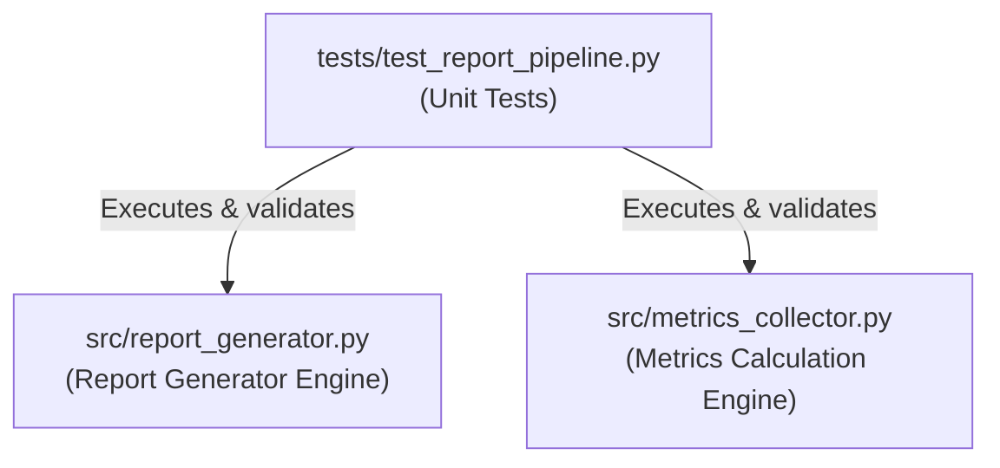

# Phase F6 Walkthrough: Tests

Phase F6 implements a unified, automated test suite to verify the report generation pipeline, Matplotlib visualization outputs, error resilience fallbacks, and Student-t confidence interval mathematical constraints in isolation.

---

## Architectural / Test Components



---

## 1. Unit Test Suite (`tests/test_report_pipeline.py`)

A new, comprehensive unit test suite has been introduced to verify all reporting and calculation configurations in isolation:
- **`test_report_generator_dissertation_structure`**: Verifies that the compiled project results report contains all 9 required dissertation sections and environment metadata (Python version, host, seeds, git hashes).
- **`test_report_charts_generation`**: Asserts that exactly 10 custom publication-style Matplotlib PNG charts are successfully written to disk.
- **`test_report_chart_failure_resilience`**: Injects matplotlib exceptions to verify the try/except best-effort compiler resiliency (meaning report generation completes even if specific charts fail).
- **`test_ci_method_fallback_statistics`**: Simulates a system without scipy by patching `sys.modules` and asserts that statistical CI calculations correctly fallback to the internal t-value lookup table.
- **`test_load_raw_results_fallback`**: Verifies path resolution fallback to mock datasets when raw result files are missing.

---

## 2. Test Execution Outcomes

Running the new test suite returns a complete success, confirming that the statistical aggregates and reporting configurations are stable:
```powershell
python -m unittest tests/test_report_pipeline.py
# 5/5 tests passed successfully.
```
