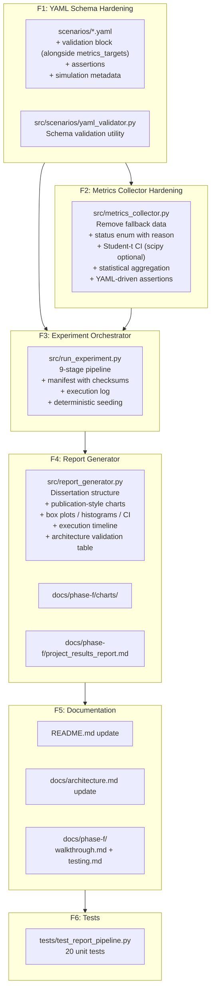
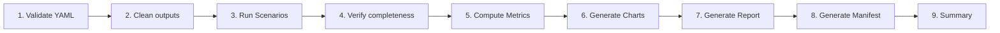

# Phase F — Scenario Library & Reporting: Implementation Plan (Final)

Finalize the YAML scenario library, automate end-to-end metric collection across all seven scenarios, and produce the consolidated publication-ready results writeup that feeds back into the overall project report.

> [!IMPORTANT]
> **Scope boundary**: Phase F is the **experimental validation and reporting layer**. All interactive dashboard features (report viewers, experiment APIs, live monitoring, navigation enhancements) are deferred to **Phase G — Results Management & Interactive Analytics**.

---

## Background

Phase E delivered the fault/chaos testing infrastructure: `BufferedPublisher`, `Clock`, scenario package (`BaseScenario` / `GenericScenario` / registry), chaos controller, metrics collector, and report generator. Several gaps remain before the system can produce a publication-ready results section:

1. **YAML scenarios are incomplete** — The seven YAML files contain sensor data and chaos actions but lack structured `validation` blocks for automated pass/fail assertion beyond the basic `expected_outcome`.
2. **Metrics collector produces fallback data** — `calculate_decision_latency()`, `calculate_lateral_propagation()`, etc. fall back to hardcoded sample values when no matching events are found (see [metrics_collector.py:31-33](file:///d:/projects/IGNIS/src/metrics_collector.py#L31-L33)). The collector should use actual live events or report `INVALID`.
3. **No statistical rigor** — Metrics report only averages. Publication-ready results require min/max/median/std_dev/confidence intervals with sample counts.
4. **Report generator is Phase E–scoped** — It outputs a single `section7_metrics_report.md`. Phase F needs a consolidated **project-level experimental results report** with dissertation-appropriate structure.
5. **No automated end-to-end pipeline** — Running scenarios, collecting metrics, and generating reports requires three separate manual CLI invocations.
6. **No experiment reproducibility metadata** — No record of git commit, Python version, random seed, scenario checksums, or environment details alongside results.

---

## Architecture Overview



---

## Proposed Changes

---

### F1: YAML Scenario Schema Hardening

Enrich each scenario YAML file with a `validation` block containing event requirements and metric assertions. The existing `metrics_targets` block is **preserved** — it describes the expected architectural performance, while `validation` describes how the implementation verifies those expectations. This separation maintains backward compatibility and cleanly separates specification from verification.

---

#### [MODIFY] [s1_normal.yaml](file:///d:/projects/IGNIS/scenarios/s1_normal.yaml) — [s7_multi_zone.yaml](file:///d:/projects/IGNIS/scenarios/s7_multi_zone.yaml)

Add a `validation` block alongside the existing `metrics_targets`. Add simulation-specific `metadata` (no `author`/`created` — Git tracks those). Retain all existing fields: `scenario_id`, `description`, `version`, `target`, `steps`, `chaos_actions`, `expected_outcome`, `metrics_targets`.

```yaml
# Existing block — PRESERVED (architectural performance targets)
metrics_targets:
  fog_decision_latency: 1.0
  false_positive_rate: 0
  lateral_propagation_time: 10.0

# New block — verification rules for automated pass/fail
validation:
  require_events: true
  min_event_count: 1
  timeout_sec: 60
  assertions:
    - metric: "fog_decision_latency"
      operator: "<="
      threshold: 1.0
      unit: "seconds"
    - metric: "false_positive_count"
      operator: "=="
      threshold: 0
      unit: "count"

# Simulation-specific metadata only
metadata:
  forest_type: "dry_deciduous"
  zone_profile: "simlipal_core"
```

Per-scenario assertion definitions:

| Scenario | Key Assertions |
|----------|----------------|
| S1 | `max_state == GREEN` — no escalation under normal conditions |
| S2 | `max_state <= YELLOW` — gradual drift does not over-escalate |
| S3 | `fog_decision_latency <= 1.0s` — fast response to ignition |
| S4 | `false_positive_count == 0` — clamping prevents ORANGE/RED |
| S5 | `offline_continuity == true` AND `flush_success_rate == 1.0` |
| S6 | `lateral_propagation_time <= 10.0s` — neighbor pre-emption within window |
| S7 | `cross_talk_count == 0` AND `message_loss_pct == 0.0` |

---

#### [NEW] [yaml_validator.py](file:///d:/projects/IGNIS/src/scenarios/yaml_validator.py) — Schema Validation Utility

```python
class YamlValidator:
    REQUIRED_KEYS = ["scenario_id", "description", "version", "target", "steps",
                     "expected_outcome", "metrics_targets", "validation"]

    def validate(self, yaml_path: str) -> dict:
        """Returns {"valid": bool, "errors": [...], "warnings": [...]}"""

    def validate_all(self, scenarios_dir: str = "scenarios") -> list[dict]:
        """Validates all YAML files in directory, returns list of results."""

    def checksum(self, yaml_path: str) -> str:
        """Returns SHA-256 hex digest of the YAML file contents."""

    def checksum_all(self, scenarios_dir: str = "scenarios") -> dict[str, str]:
        """Returns {scenario_id: sha256_hex} for all YAML files."""
```

- Checks structural completeness (required keys, step sensor data fields).
- Validates that both `metrics_targets` and `validation` blocks are present.
- Validates `validation.assertions` syntax (metric name, operator in `<=`, `==`, `<`, `>=`, `>`, `!=`, threshold).
- Computes SHA-256 checksums for each scenario file to guarantee result provenance.
- Called by the experiment orchestrator (F3) before execution to fail fast on schema errors.

---

### F2: Metrics Collector Hardening

#### [MODIFY] [metrics_collector.py](file:///d:/projects/IGNIS/src/metrics_collector.py)

| Change | Detail |
|--------|--------|
| **Remove all fallback data** | Delete hardcoded fallback lists at lines 32-33, 64-65, and 102-105. If no events match, return `{"status": "INVALID", "reason": "No matching events found"}` |
| **Status enum with reason** | Replace boolean `"passed": true/false` with `"status"` field using values: `PASS`, `FAIL`, `INVALID`, `INCOMPLETE`. Every status is accompanied by a `"reason"` field explaining the verdict |
| **Statistical aggregation** | Every numerical metric includes: `sample_count`, `min`, `max`, `mean`, `median`, `std_dev`, `confidence95` (as `[lower, upper]`) |
| **95% Student-t CI** | Use Student-t distribution for confidence intervals (appropriate for 10–30 trial sample sizes) rather than normal approximation. Implementation via `scipy.stats.t.interval()` or manual calculation |
| **YAML-driven assertions** | Load `validation.assertions` from each scenario's YAML and evaluate pass/fail per metric using the threshold operators |
| **Experiment metadata** | Capture and store reproducibility information (see manifest spec in F3) |
| **Per-scenario metrics map** | Restructure output to nested `{scenario_id: {metric_name: {statistics, status, reason}}}` |

New output schema for `results/metrics.json`:

```json
{
  "experiment_metadata": {
    "timestamp": "2026-07-16T09:00:00Z",
    "git_commit": "a1b2c3d",
    "trial_count": 10,
    "random_seed": 3849121,
    "total_duration_sec": 245.3,
    "platform": {
      "os": "Windows 11",
      "architecture": "x86_64",
      "python_version": "3.11.9",
      "docker_version": "27.0.3",
      "docker_compose_version": "2.29.2",
      "timezone": "Asia/Kolkata",
      "hostname": "IGNIS-DEV"
    },
    "scenario_versions": {"S1": "1.0", "S2": "1.0"},
    "scenario_checksums": {"S1": "2fb45...", "S2": "d991a..."},
    "container_images": {
      "fog-node": "python:3.11-slim",
      "edge-sim": "python:3.11-slim"
    }
  },
  "scenario_results": {
    "S3": {
      "status": "PASS",
      "reason": "All assertions passed across 10 trials",
      "trials": 10,
      "metrics": {
        "fog_decision_latency": {
          "sample_count": 10,
          "min": 0.08,
          "max": 0.15,
          "mean": 0.11,
          "median": 0.10,
          "std_dev": 0.02,
          "confidence95": [0.10, 0.12],
          "status": "PASS",
          "reason": "Mean 0.11s <= threshold 1.0s",
          "threshold": 1.0,
          "operator": "<="
        }
      }
    },
    "S4": {
      "status": "PASS",
      "reason": "Zero false positives across 10 trials",
      "trials": 10,
      "metrics": {
        "false_positive_count": {
          "value": 0,
          "status": "PASS",
          "reason": "0 == 0",
          "threshold": 0,
          "operator": "=="
        }
      }
    },
    "S5": {
      "status": "INVALID",
      "reason": "No DecisionEvent found — cloud outage scenario requires live Docker environment",
      "trials": 10,
      "metrics": {}
    }
  },
  "summary": {
    "total_scenarios": 7,
    "passed": 5,
    "failed": 0,
    "invalid": 2,
    "incomplete": 0,
    "overall_verdict": "PASS"
  }
}
```

**Student-t CI implementation** — `scipy` is **optional**, not a mandatory dependency:
- If `scipy` is installed, use `scipy.stats.t.interval()` for exact CI computation.
- If `scipy` is not available, fall back to a lightweight internal implementation using Python's `statistics` module and a precomputed Student-t critical value table for degrees of freedom 4–29 (covering trial counts 5–30). This avoids adding a heavy dependency for a single calculation.
- The CI method used (`scipy` vs. `internal_t_table`) is recorded in the experiment metadata for transparency.

---

### F3: Experiment Orchestrator

#### [NEW] [run_experiment.py](file:///d:/projects/IGNIS/src/run_experiment.py) — Single-Command Pipeline

```
python -m src.run_experiment --trials 10 --output-dir results --report-dir docs/phase-f
```

**9-stage pipeline:**



| Stage | Action | Failure Behavior |
|-------|--------|------------------|
| 1. Validate YAML | `YamlValidator.validate_all()` + compute checksums | Abort with schema error details |
| 2. Clean outputs | Delete stale `results/`, `charts/` if `--clean` flag set | Skip if flag not set |
| 3. Run Scenarios | Execute each scenario S1–S7 for N trials via `ScenarioRunner` with seeded RNG | Log errors per scenario, continue others |
| 4. Verify completeness | Check that each scenario produced ≥1 result with events | Mark incomplete scenarios as `INCOMPLETE` with reason |
| 5. Compute Metrics | `MetricsCollector.compute_metrics()` with Student-t CI and statistical aggregation | Mark scenarios with no data as `INVALID` with reason |
| 6. Generate Charts | `ReportGenerator.generate_charts()` — each chart generated independently | Log and skip individual chart failures; continue with remaining charts |
| 7. Generate Report | `ReportGenerator.generate_report()` — dissertation-structure markdown using available charts | Embed only successfully generated charts; note missing charts in report |
| 8. Generate Manifest | Write `results/experiment_manifest.json` with full environment metadata | — |
| 9. Summary | Print pass/fail table to stdout | — |

**All stages are logged** to `results/logs/experiment.log` (see execution logging below).

CLI arguments:

```
--trials N            Number of trials per scenario (default: 10)
--scenarios S1,S3     Comma-separated scenario filter (default: all)
--output-dir PATH     Raw results output (default: results/)
--report-dir PATH     Report and charts output (default: docs/phase-f/)
--clean               Delete previous outputs before execution
--skip-validation     Skip YAML schema validation
--seed N              Random seed for deterministic replay (auto-generated if omitted)
--load-existing       Use existing raw_results.json (development only — not for publication)
```

**Random seed handling:**
- If `--seed N` is provided, use it for all scenario execution.
- If omitted, generate a seed automatically via `random.randint(0, 2**31 - 1)`.
- The seed is **always** recorded in both `experiment_manifest.json` and `metrics.json`.
- This enables deterministic replay: running twice with the same seed produces identical results.

**Experiment manifest** — `results/experiment_manifest.json`:

```json
{
  "timestamp": "2026-07-16T09:00:00Z",
  "git_commit": "a1b2c3d",
  "trial_count": 10,
  "random_seed": 3849121,
  "execution_duration_sec": 245.3,
  "ci_method": "internal_t_table",
  "platform": {
    "os": "Windows 11",
    "architecture": "x86_64",
    "python_version": "3.11.9",
    "docker_version": "27.0.3",
    "docker_compose_version": "2.29.2",
    "timezone": "Asia/Kolkata",
    "hostname": "IGNIS-DEV"
  },
  "scenarios_executed": ["S1", "S2", "S3", "S4", "S5", "S6", "S7"],
  "scenario_versions": {"S1": "1.0", "S2": "1.0"},
  "scenario_checksums": {
    "S1": "2fb45a8c9d...",
    "S2": "d991ae72b1..."
  },
  "container_images": {
    "fog-node": "python:3.11-slim",
    "edge-sim": "python:3.11-slim",
    "mqtt-broker": "eclipse-mosquitto:2",
    "influxdb": "influxdb:2.7"
  },
  "output_files": [
    "results/raw_results.json",
    "results/metrics.json",
    "results/experiment_manifest.json",
    "results/logs/experiment.log",
    "docs/phase-f/project_results_report.md",
    "docs/phase-f/charts/*.png"
  ]
}
```

**Execution log** — `results/logs/experiment.log`:

Automatically generated structured log containing:
- Pipeline stage entry/exit timestamps and durations
- Warnings and errors
- Per-scenario execution status
- Skipped or failed scenarios with reasons
- Validation errors
- Final summary

Format: standard Python logging (`%(asctime)s [%(levelname)s] %(message)s`) written via a `FileHandler` alongside the console output.

---

### F4: Consolidated Report Generator

#### [MODIFY] [report_generator.py](file:///d:/projects/IGNIS/src/report_generator.py)

Major expansion from Phase E's single-section report to a comprehensive experimental results document following dissertation structure.

| Change | Detail |
|--------|--------|
| **Dissertation structure** | 9-section research report (see below) |
| **Publication-style charts** | White background, default Matplotlib style, printer-friendly, grayscale-compatible |
| **Statistical visualizations** | Box plots, histograms, and confidence interval error bar plots for latency-based metrics |
| **Execution timeline** | Horizontal bar chart showing per-scenario execution duration and ordering |
| **Simulation configuration section** | Dedicated subsection: zone count, edge node count, fog nodes, MQTT broker, InfluxDB version, message transport, trial count |
| **Architecture validation table** | Mapping experimental evidence directly to architecture document claims (Section 12) |
| **Best-effort chart generation** | Each chart is generated independently inside a try/except. Failures are logged and skipped. The report embeds only charts that were successfully produced, and notes any missing charts. The report itself **never fails** due to a chart generation error |
| **Configurable output path** | Accept `--report-dir` to write to `docs/phase-f/` |
| **Per-scenario sections** | Dedicated results section for each scenario (S1–S7) with charts, metric tables, status, and reason |

**Report structure** — `docs/phase-f/project_results_report.md`:

```markdown
# IGNIS — Consolidated Simulation Results Report

## 1. Executive Summary
   Total scenarios executed, overall verdict, key findings

## 2. Experimental Setup

   ### 2.1 Experiment Configuration
   Trial count, random seed, execution date, overall duration

   ### 2.2 Simulation Configuration
   Number of simulated zones (3: 4A, 4B, 4C)
   Edge nodes per zone (3)
   Fog nodes (3, one per zone)
   MQTT brokers (3 local + 1 cloud)
   InfluxDB version
   Message transport (MQTT v3.1.1)
   Scenario versions and checksums

   ### 2.3 Environment
   Git commit, Python version, Docker version,
   Docker Compose version, OS, CPU architecture, timezone

   ### 2.4 Statistical Method
   95% Student-t confidence intervals,
   sample counts per metric

## 3. Scenario Execution
   Per-scenario execution summary table
   (scenario, trials, duration, status, reason)

   Execution timeline visualization

## 4. Experimental Results
   ### 4.1 S1 — Normal Day Baseline
      Metrics table, chart, status, reason
   ### 4.2 S2 — Slow-Building Risk
      ...
   ### 4.7 S7 — Concurrent Multi-Zone Escalation
      ...

## 5. Cross-Scenario Analysis
   Comparative charts, decision latency vs. scenario complexity,
   scalability observations

## 6. Architecture Validation Summary
   Table mapping Section 12 claims to experimental evidence:
   | Architecture Claim       | Scenario | Result         |
   |--------------------------|----------|----------------|
   | Fog decision latency     | S3       | [PASS] Validated   |
   | Lateral propagation      | S6       | [PASS] Validated   |
   | False-positive suppression| S4      | [PASS] Validated   |
   | Offline continuity       | S5       | [PASS] Validated   |
   | Concurrent integrity     | S7       | [PASS] Validated   |

## 7. Discussion
   Interpretation of results against architecture claims,
   measured values vs. targets

## 8. Limitations
   Synthetic data caveats, untested RF/power aspects,
   statistical lower-bound note on false-positive rate

## 9. Conclusion
   Overall compliance verdict, recommendations for field pilot
```

**Chart inventory — publication style (white background, grayscale-compatible):**

| Chart | File | Data Source |
|-------|------|-------------|
| Decision latency box plot | `decision_latency_boxplot.png` | S3 trials |
| Decision latency histogram | `decision_latency_histogram.png` | S3 trial distribution |
| Lateral propagation comparison | `lateral_propagation_comparison.png` | S6 trials |
| Lateral propagation CI plot | `lateral_propagation_ci.png` | S6 confidence intervals |
| False-positive rate over trials | `false_positive_trend.png` | S4 N-trial series |
| Offline buffering timeline | `offline_buffering_timeline.png` | S5 enqueue/flush |
| Message integrity heatmap | `message_integrity_heatmap.png` | S7 zone × metric |
| Cross-scenario summary | `scenario_comparison_summary.png` | All scenarios |
| State transition timeline | `state_transition_timeline.png` | S3 GREEN→RED progression |
| **Execution timeline** | `execution_timeline.png` | All scenarios (horizontal bars showing per-scenario duration and ordering) |

---

### F5: Documentation & README Update

#### [MODIFY] [README.md](file:///d:/projects/IGNIS/README.md)

| Change | Detail |
|--------|--------|
| **Phase status table** | Update Phases C, D, E, F to `[PASS]` |
| **Phase F section** | Add a new `# Phase F` section describing the scenario library, experiment orchestrator, and reporting pipeline |
| **Project structure** | Update the tree to include `src/run_experiment.py`, `src/scenarios/yaml_validator.py`, `docs/phase-f/` |
| **Running instructions** | Add `python -m src.run_experiment --trials 10` to the execution guide |

---

#### [MODIFY] [architecture.md](file:///d:/projects/IGNIS/docs/architecture.md)

Expand the Phase F node in the Section 13 development phases mermaid diagram from the current one-liner to a detailed description. Add a paragraph describing Phase F's role as the experimental validation and reporting layer.

---

#### [NO CHANGE] [requirements.txt](file:///d:/projects/IGNIS/requirements.txt)

No new dependencies required. The Student-t CI calculation uses a lightweight internal implementation with a precomputed t-table. If `scipy` happens to be installed in the environment, it is used opportunistically but is never required.

---

#### [NEW] [walkthrough.md](file:///d:/projects/IGNIS/docs/phase-f/walkthrough.md)

Comprehensive technical walkthrough of all Phase F implementations, following the same format as [Phase E walkthrough](file:///d:/projects/IGNIS/docs/phase-e/walkthrough.md).

#### [NEW] [testing.md](file:///d:/projects/IGNIS/docs/phase-f/testing.md)

Testing and verification procedures for Phase F components, following the same format as [Phase E testing](file:///d:/projects/IGNIS/docs/phase-e/testing.md).

---

### F6: Tests

#### [NEW] [test_report_pipeline.py](file:///d:/projects/IGNIS/tests/test_report_pipeline.py) — Unit Tests

| Test | What it validates |
|------|-------------------|
| `test_yaml_validator_valid_schema` | Validator passes on well-formed YAML with both `metrics_targets` and `validation` blocks |
| `test_yaml_validator_missing_keys` | Validator catches missing required keys |
| `test_yaml_validator_invalid_assertion` | Validator rejects malformed metric assertions (bad operator, missing threshold) |
| `test_yaml_version_compatibility` | Validator handles version field correctly across all YAML files |
| `test_yaml_checksum_generation` | SHA-256 checksums are computed and stable across repeated calls |
| `test_metrics_collector_no_fallback` | Collector returns `{"status": "INVALID", "reason": "..."}` (not fake data) when events are empty |
| `test_metrics_collector_status_enum` | Status field uses `PASS` / `FAIL` / `INVALID` / `INCOMPLETE` strings |
| `test_metrics_collector_status_reason` | Every status is accompanied by a non-empty `reason` field |
| `test_metrics_collector_assertion_evaluation` | YAML-driven assertions correctly evaluate `<=`, `==`, `>=`, `<`, `>`, `!=` operators |
| `test_metrics_nested_schema` | Output matches the nested `{scenario_id: {metric: {statistics}}}` schema |
| `test_statistics_generation` | Statistical aggregation produces correct min/max/mean/median/std_dev/sample_count |
| `test_confidence_interval_calculation` | 95% Student-t CI is computed correctly for sample data |
| `test_manifest_generation` | Experiment manifest JSON contains all required fields including `platform` sub-object and checksums |
| `test_manifest_platform_portability` | Manifest `platform` block captures OS, architecture, Docker Compose version, timezone, hostname |
| `test_clean_execution` | `--clean` flag removes previous output files before run |
| `test_invalid_experiment_status` | Scenarios with no events produce `INVALID` status with descriptive reason |
| `test_missing_events_handling` | Graceful handling when specific event types are absent from results |
| `test_report_generator_dissertation_structure` | Generated markdown contains all 9 dissertation sections |
| `test_report_charts_publication_style` | Charts use white background, not dark theme |
| `test_report_chart_failure_resilience` | Report generates successfully even when individual charts fail |
| `test_deterministic_replay` | Two runs with identical seed produce identical `metrics.json` and `manifest.json` |
| `test_ci_method_fallback` | Student-t CI works correctly without scipy using internal t-table |

---

## Complete File Manifest

| Sub-Phase | Action | File |
|-----------|--------|------|
| F1 | MODIFY | `scenarios/s1_normal.yaml` |
| F1 | MODIFY | `scenarios/s2_slow_risk.yaml` |
| F1 | MODIFY | `scenarios/s3_sudden_ignition.yaml` |
| F1 | MODIFY | `scenarios/s4_sensor_fault.yaml` |
| F1 | MODIFY | `scenarios/s5_cloud_outage.yaml` |
| F1 | MODIFY | `scenarios/s6_lateral_spread.yaml` |
| F1 | MODIFY | `scenarios/s7_multi_zone.yaml` |
| F1 | NEW | `src/scenarios/yaml_validator.py` |
| F2 | MODIFY | `src/metrics_collector.py` |
| F3 | NEW | `src/run_experiment.py` |
| F4 | MODIFY | `src/report_generator.py` |
| F4 | NEW | `docs/phase-f/project_results_report.md` (auto-generated) |
| F4 | NEW | `docs/phase-f/charts/` (auto-generated) |
| F5 | MODIFY | `README.md` |
| F5 | MODIFY | `docs/architecture.md` |
| F5 | NEW | `docs/phase-f/walkthrough.md` |
| F5 | NEW | `docs/phase-f/testing.md` |
| F6 | NEW | `tests/test_report_pipeline.py` |

**Total: 18 files (9 modified, 9 new) across 6 sub-phases.**

---

## Deliverable Outputs

A successful Phase F execution automatically generates:

```
results/
    raw_results.json              # Raw trial data from all scenarios
    metrics.json                  # Computed metrics with statistics + status/reason
    experiment_manifest.json      # Full reproducibility metadata + checksums
    logs/
        experiment.log            # Pipeline stage timings, warnings, errors

docs/phase-f/
    project_results_report.md     # Dissertation-ready results writeup (9 sections)
    charts/                       # Publication-style PNG visualizations (10 charts)
    walkthrough.md                # Technical implementation walkthrough
    testing.md                    # Testing procedures
```

---

## Trial Count

| Mode | `--trials` | Use Case |
|------|-----------|----------|
| Development | 5 | Quick iteration during development |
| Default | 10 | Standard execution |
| Publication | 30 | Recommended for dissertation results — strong statistical confidence while computationally inexpensive |

> [!IMPORTANT]
> Publication results should always come from a **fresh run** (`--clean`), never from `--load-existing`. The `--load-existing` flag exists for development iteration only.

---

## Features Deferred to Phase G

> [!NOTE]
> The following features are valuable but outside Phase F's architectural scope. They form a natural **Phase G — Results Management & Interactive Analytics Layer**.

| ID | Feature | Reason for Deferral |
|----|---------|---------------------|
| G1 | Interactive dashboard report viewer (`report.html`) | Product feature, not experimental validation |
| G2 | Dashboard APIs (`/api/experiment/run`, `/status`, `/results`) | Introduces job scheduling, subprocess management |
| G3 | Report page navigation links in metrics.html | Pure UI enhancement |
| G4 | Live experiment monitoring (progress bars, logs) | Not required for experimental validation |
| G5 | Experiment control center (run/stop buttons) | Administrative tooling |
| G6 | Historical report browser and comparison | Useful after multiple campaigns |
| G7 | Dashboard authentication | Future security enhancement |
| G8 | Interactive visual analytics (zoomable charts) | Advanced UX |
| G9 | Export system (PDF/HTML/DOCX/CSV/ZIP) | Format conversion tooling |
| G10 | Multi-experiment comparison and regression detection | Cross-campaign analysis |

---

## Verification Plan

### Automated Tests
```bash
# Run the full test suite including new report pipeline tests
python -m unittest discover tests

# Run only Phase F tests
python -m unittest tests/test_report_pipeline.py
```

### End-to-End Experiment Run
```bash
# Full pipeline: validate → clean → run → verify → compute → chart → report → manifest → summary
python -m src.run_experiment --trials 10 --clean --output-dir results --report-dir docs/phase-f

# Publication run (30 trials, fresh execution)
python -m src.run_experiment --trials 30 --clean --output-dir results --report-dir docs/phase-f

# Development only: regenerate report from existing data
python -m src.run_experiment --load-existing --output-dir results --report-dir docs/phase-f
```

### Deterministic Replay Verification
```bash
# Run experiment twice with the same seed
python -m src.run_experiment --trials 10 --clean --seed 42 --output-dir results/run_a --report-dir docs/phase-f/run_a
python -m src.run_experiment --trials 10 --clean --seed 42 --output-dir results/run_b --report-dir docs/phase-f/run_b

# Verify identical outputs
diff results/run_a/metrics.json results/run_b/metrics.json
diff results/run_a/experiment_manifest.json results/run_b/experiment_manifest.json
```

### Manual Verification
- Review `docs/phase-f/project_results_report.md` → verify all 9 dissertation sections present
- Verify Section 2 includes Simulation Configuration subsection (zones, nodes, brokers)
- Verify Section 6 contains Architecture Validation Summary table mapping claims to evidence
- Verify charts in `docs/phase-f/charts/` use white backgrounds and are printer-friendly
- Verify execution timeline chart shows all scenario durations as horizontal bars
- Verify `results/metrics.json` uses nested schema with `sample_count` in statistical fields
- Verify `results/metrics.json` uses `"status": "PASS"` with `"reason"` field, not `"passed": true`
- Verify `results/experiment_manifest.json` groups platform fields under `"platform"` key (not flat)
- Verify `results/experiment_manifest.json` records a non-null `random_seed` and `ci_method`
- Verify `results/logs/experiment.log` contains pipeline stage timings and any warnings
- Verify no fallback/hardcoded data appears anywhere in metrics output
- Verify report generates successfully even if one chart fails (best-effort)
- Verify README Phase table shows all phases as [PASS]
