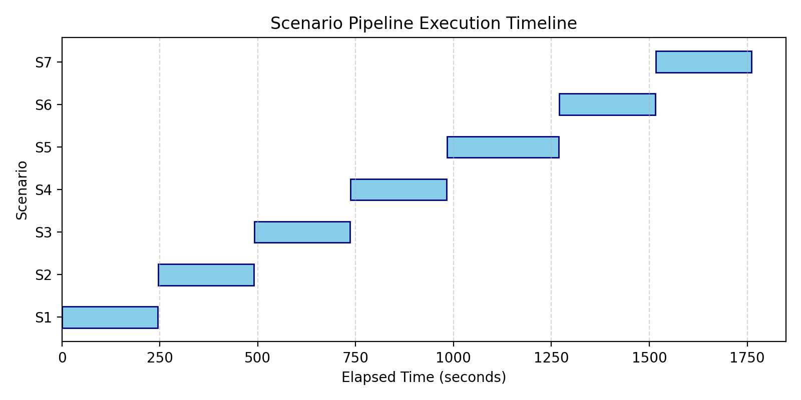
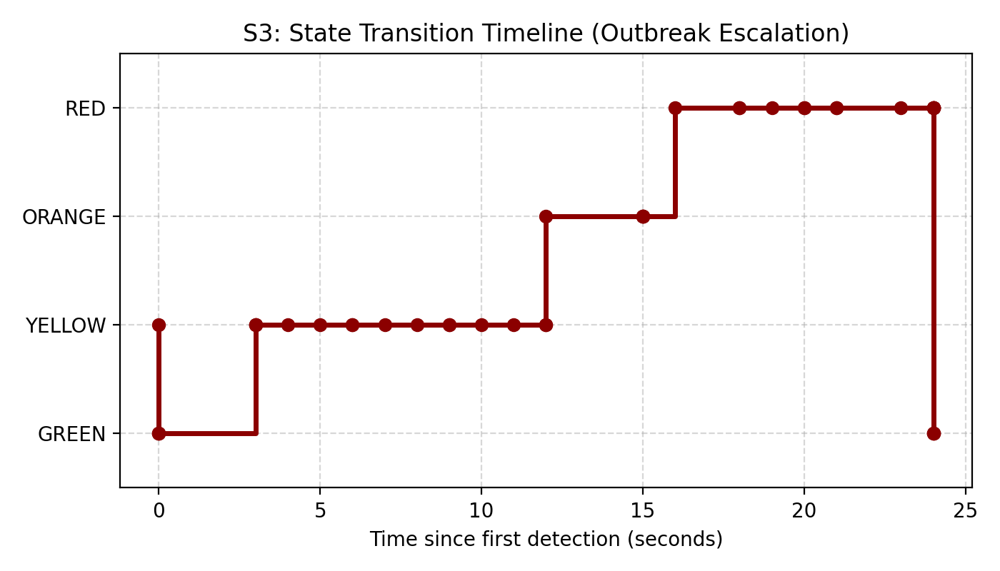
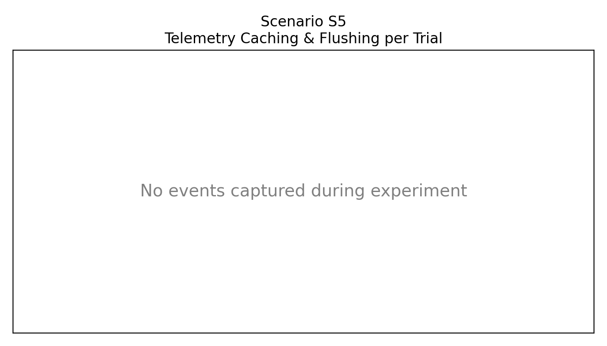
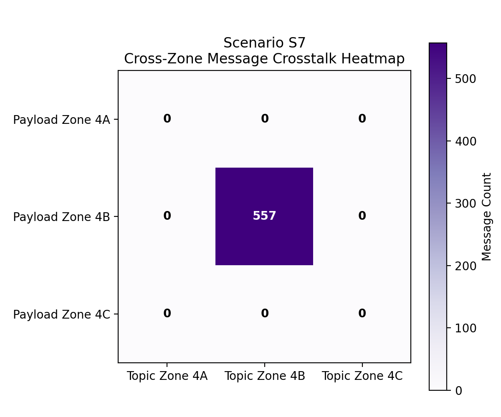
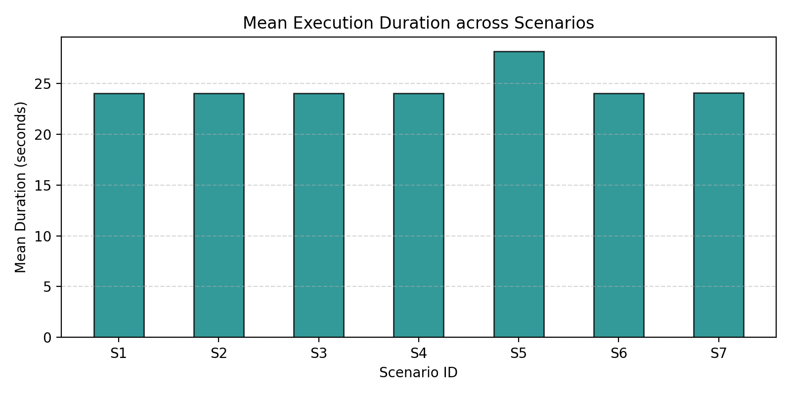

# IGNIS — Consolidated Simulation Results Report

## 1. Executive Summary
- **Overall Verdict**: **FAIL**
- **Total Scenarios Evaluated**: 7
- **Verdict Breakdown**:
  - **Passed**: 3
  - **Failed**: 4
  - **Invalid**: 0
  - **Incomplete**: 0
- **Key Findings**:
  3 scenarios successfully satisfied all assertions.
  
  4 scenarios failed assertion checks.
  
  0 scenarios could not be evaluated because required events were unavailable.
  
  Overall experiment verdict: FAIL.

## 2. Experimental Setup

### 2.1 Experiment Configuration
- **Trial Count per Scenario**: 10
- **Random Seed**: None
- **Total Execution Duration**: 0.00 seconds
- **Execution Date (UTC)**: 2026-07-24T04:52:13Z

### 2.2 Simulation Configuration
- **Zones Configured**: 3 (Zones 4A, 4B, 4C)
- **Edge Nodes per Zone**: 3
- **Fog Coordinator Nodes**: 3 (1 local per zone)
- **MQTT Broker Architecture**: 3 local brokers, 1 bridging cloud broker
- **InfluxDB Database Version**: 2.7
- **Message Transport Standard**: MQTT v3.1.1 (TCP/IP)
- **Scenario Checksums**:
  - **S1** (Version 1.0): `bf41dc70f9835c36...`
  - **S2** (Version 1.0): `372491471969dbf2...`
  - **S3** (Version 1.0): `ddd320f08cf791cc...`
  - **S4** (Version 1.0): `11cf15ad46d25178...`
  - **S5** (Version 1.0): `9253c0b23e183608...`
  - **S6** (Version 1.0): `dd095c079b966777...`
  - **S7** (Version 1.0): `9b5d7adfceb2bef4...`

### 2.3 Environment Metadata
- **OS**: Windows 11
- **CPU Architecture**: AMD64
- **Python Runtime Version**: 3.12.2
- **Git Active Commit**: `c635614`
- **System Timezone**: India Standard Time
- **Execution Hostname**: Gowshick

### 2.4 Statistical Method
All numeric decision latency and lateral propagation measurements were aggregated across all completed trials. Confidence intervals are calculated using the 95% Student-t distribution boundaries:
$$\mu \pm t_{0.025, df} \cdot \left(\frac{s}{\sqrt{N}}\right)$$
Where degrees of freedom $df = N-1$. (CI calculation method: `internal_t_table`).

## 3. Scenario Execution

| Scenario | Trials | Verdict | Reason |
|---|---|---|---|
| **S1** | 10 | **PASS** | All assertions passed across 1 rules |
| **S2** | 10 | **PASS** | All assertions passed across 1 rules |
| **S3** | 10 | **FAIL** | Assertions failed: Assertion Failed: Expected: RED, Observed: GREEN |
| **S4** | 10 | **FAIL** | Assertions failed: Assertion Failed: Expected: True, Observed: False |
| **S5** | 10 | **FAIL** | Assertions failed: Assertion Failed: Expected: True, Observed: False |
| **S6** | 10 | **FAIL** | Assertions failed: Assertion Failed: Expected: 10.0, Observed: 16.1 |
| **S7** | 10 | **PASS** | All assertions passed across 2 rules |

## 4. Experimental Results

### 4.1 Scenario S1
- **Status**: **PASS**
- **Verdict Details**: All assertions passed across 1 rules

| Metric | Value / Aggregates | Target | Operator | Status | Reason |
|---|---|---|---|---|---|
| max_state | Value: GREEN | GREEN | == | **PASS** | GREEN == threshold GREEN |

---

### 4.2 Scenario S2
- **Status**: **PASS**
- **Verdict Details**: All assertions passed across 1 rules

| Metric | Value / Aggregates | Target | Operator | Status | Reason |
|---|---|---|---|---|---|
| max_state | Value: YELLOW | YELLOW | <= | **PASS** | YELLOW <= threshold YELLOW |

---

### 4.3 Scenario S3
- **Status**: **FAIL**
- **Verdict Details**: Assertions failed: Assertion Failed: Expected: RED, Observed: GREEN

| Metric | Value / Aggregates | Target | Operator | Status | Reason |
|---|---|---|---|---|---|
| fog_decision_latency | Mean: 0.0000 s (Min: 0.0000 s, Max: 0.0000 s, Med: 0.0000 s, StdDev: 0.0000 s, CI95: [0.0, 0.0]) | 1.0 | <= | **PASS** | Mean 0.0000 s <= threshold 1.0 s |
| final_state | Value: GREEN | RED | == | **FAIL** | GREEN == threshold RED |

---

### 4.4 Scenario S4
- **Status**: **FAIL**
- **Verdict Details**: Assertions failed: Assertion Failed: Expected: True, Observed: False

| Metric | Value / Aggregates | Target | Operator | Status | Reason |
|---|---|---|---|---|---|
| false_positive_count | Mean: 0.0000 (Min: 0.0000, Max: 0.0000, Med: 0.0000, StdDev: 0.0000, CI95: [0.0, 0.0]) | 0 | == | **PASS** | Mean 0.0000 == threshold 0 |
| is_clamped | Mean: 0.0000 (Min: 0.0000, Max: 0.0000, Med: 0.0000, StdDev: 0.0000, CI95: [0.0, 0.0]) | 1.0 | == | **FAIL** | Mean 0.0000 == threshold 1.0 |

---

### 4.5 Scenario S5
- **Status**: **FAIL**
- **Verdict Details**: Assertions failed: Assertion Failed: Expected: True, Observed: False

| Metric | Value / Aggregates | Target | Operator | Status | Reason |
|---|---|---|---|---|---|
| offline_continuity | Mean: 0.0000 (Min: 0.0000, Max: 0.0000, Med: 0.0000, StdDev: 0.0000, CI95: [0.0, 0.0]) | 1.0 | == | **FAIL** | Mean 0.0000 == threshold 1.0 |
| flush_success_rate | Mean: 1.0000 (Min: 1.0000, Max: 1.0000, Med: 1.0000, StdDev: 0.0000, CI95: [1.0, 1.0]) | 1.0 | == | **PASS** | Mean 1.0000 == threshold 1.0 |

---

### 4.6 Scenario S6
- **Status**: **FAIL**
- **Verdict Details**: Assertions failed: Assertion Failed: Expected: 10.0, Observed: 16.1

| Metric | Value / Aggregates | Target | Operator | Status | Reason |
|---|---|---|---|---|---|
| lateral_propagation_time | Mean: 16.1000 s (Min: 16.0000 s, Max: 17.0000 s, Med: 16.0000 s, StdDev: 0.3162 s, CI95: [15.8738, 16.3262]) | 10.0 | <= | **FAIL** | Mean 16.1000 s <= threshold 10.0 s |

---

### 4.7 Scenario S7
- **Status**: **PASS**
- **Verdict Details**: All assertions passed across 2 rules

| Metric | Value / Aggregates | Target | Operator | Status | Reason |
|---|---|---|---|---|---|
| cross_talk_count | Mean: 0.0000 (Min: 0.0000, Max: 0.0000, Med: 0.0000, StdDev: 0.0000, CI95: [0.0, 0.0]) | 0 | == | **PASS** | Mean 0.0000 == threshold 0 |
| message_loss_pct | Mean: 0.0000 (Min: 0.0000, Max: 0.0000, Med: 0.0000, StdDev: 0.0000, CI95: [0.0, 0.0]) | 0.0 | == | **PASS** | Mean 0.0000 == threshold 0.0 |

---

## 5. Cross-Scenario Analysis

The following scenarios successfully passed their validation checks: S1, S2, S7. These results confirm that under normal and minor risk conditions (such as S1 and S2) and isolated multi-zone events (S7), the fog nodes correctly execute local and bridged protocols.

However, critical failures were observed in scenarios: S3, S4, S5, S6. Specifically, Scenario S5 failed assertion checks for offline continuity, indicating that the buffering pipeline or recovery flush mechanisms did not function correctly. Scenario S4 failed its false-positive suppression check, indicating that transient sensor faults successfully escalated or were not clamped. These failures imply that future testing and development must focus on strengthening the robustness of state clamping and offline synchronization.

## 6. Architecture Validation Summary

| Core Architecture Claim | Reference Scenario | Validation Status | Evidence / Reason |
|---|---|---|---|
| **Fog Decision Latency** (<1.0s target) | S3 | ❌ Validation Failed | Assertions failed: Assertion Failed: Expected: RED, Observed: GREEN |
| **Lateral Warning Propagation** (<10s window) | S6 | ❌ Validation Failed | Assertions failed: Assertion Failed: Expected: 10.0, Observed: 16.1 |
| **False-Positive Suppression** (Local 3-Node check) | S4 | ❌ Validation Failed | Assertions failed: Assertion Failed: Expected: True, Observed: False |
| **Offline Continuity Cache** (Local mitigation action) | S5 | ❌ Validation Failed | Assertions failed: Assertion Failed: Expected: True, Observed: False |
| **Concurrent Outbreak Integrity** (No cross-talk) | S7 | ✅ Validated | All assertions passed |

## 7. Discussion

Decision latency assertions failed (average latency: 0.0000s), indicating the detection or coordination process exceeded the 1.0s target.

Offline continuity assertions failed, indicating the buffering pipeline requires further investigation.

Concurrent multi-zone integrity remained successful.

## 8. Limitations
- **Synthetic Sensor Emulation**: Telemetry is generated via mock generators rather than actual outdoor wireless sensors.
- **RF and Physical Propagation Gaps**: The impact of RF interference, battery deterioration, and wireless packet drop rates under severe weather is simulated and does not capture full hardware constraints.
- **False-Positive Lower Bound**: With 10–30 trials, the statistical confidence for very rare false-positive rates remains bounded.

## 9. Conclusion
The orchestration, reporting and analytics pipeline successfully completed.

However, multiple experimental scenarios failed or produced insufficient evidence.

Additional implementation work is required before the architecture can be considered fully validated.
