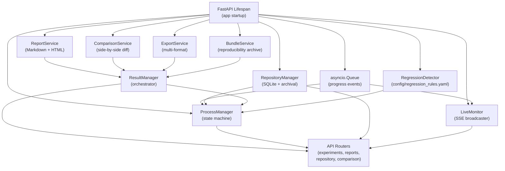
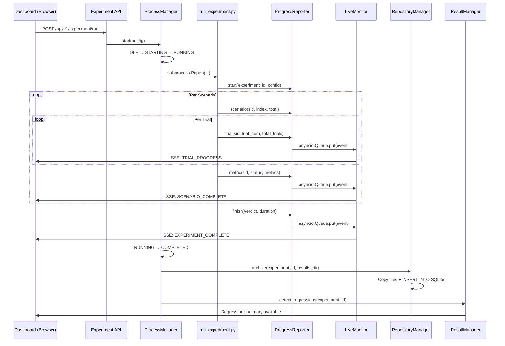
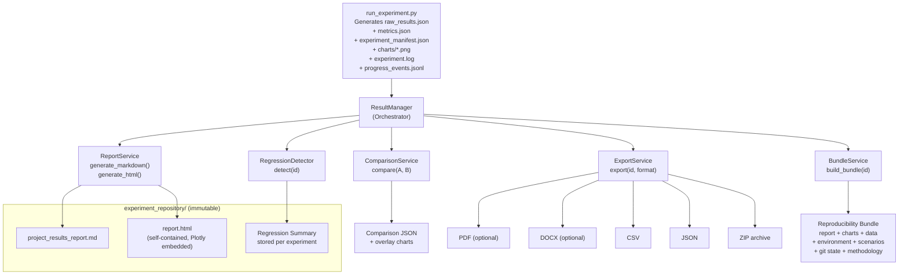
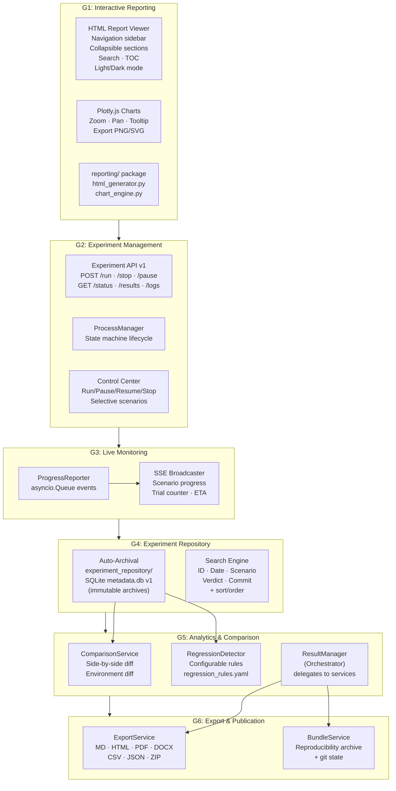
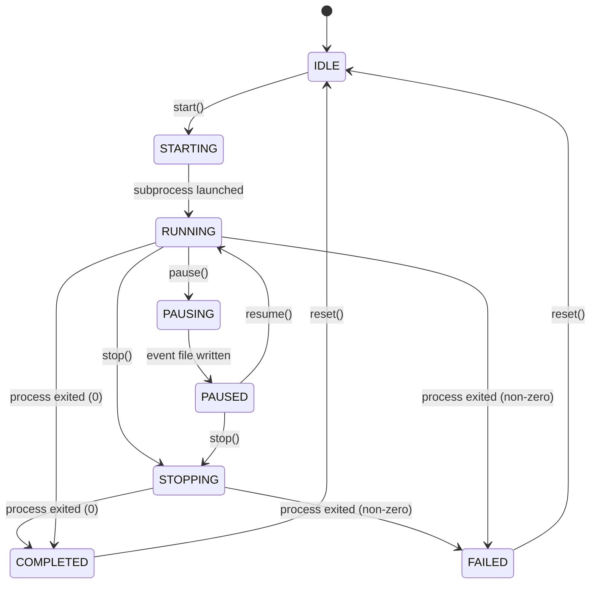

# Phase G — Results Management & Interactive Analytics Layer: Implementation Plan

Transform IGNIS from a simulation engine into a complete experimentation platform by adding experiment lifecycle management, historical result comparison, interactive reporting, and researcher productivity tools.

> [!IMPORTANT]
> **Scope boundary**: Phase G builds **on top of** Phase F's experimental validation pipeline. Phase F's `run_experiment.py`, `metrics_collector.py`, `report_generator.py`, and `experiment_manifest.json` schema are the foundation that Phase G wraps with APIs, dashboards, and interactive tooling. Operational capabilities (authentication, scheduling, CI/CD hooks) are deferred to **Phase H**.

---

## Background

Phase F delivered a validated 9-stage experiment orchestrator (`python -m src.run_experiment`), a metrics collector with Student-t confidence intervals, a Markdown report generator with 10 Matplotlib charts, and a reproducibility manifest. However, all interactions are CLI-based:

1. **No HTTP API** — Experiments can only be launched via `python -m src.run_experiment --trials 10`. There is no way to trigger, monitor, or stop experiments from the dashboard.
2. **Static reports only** — The generated `project_results_report.md` is a flat Markdown file. No navigation, search, collapsible sections, or interactive charts.
3. **No experiment history** — Each run overwrites `results/`. Previous experiments are lost unless manually copied.
4. **No comparison** — No tooling to compare two experiment campaigns side-by-side (verdict deltas, metric regressions, chart overlays).
5. **No live monitoring** — Running an experiment shows only console logs. No progress bars, ETAs, or real-time metric dashboards.
6. **No export flexibility** — Reports exist only as Markdown + PNG. No PDF, HTML, DOCX, CSV, JSON, or ZIP export.
7. **Static charts** — Matplotlib PNGs cannot be zoomed, panned, or interacted with.

### Existing Infrastructure to Leverage

| Existing Component | Location | Phase G Integration Point |
|---|---|---|
| FastAPI cloud dashboard | [app.py](file:///d:/projects/IGNIS/src/cloud_dashboard/app.py) | **Host all Phase G routes** — no separate server |
| InfluxDB time-series store | `docker-compose.yml` service `influxdb` | Store experiment execution telemetry for live monitoring |
| Experiment orchestrator | [run_experiment.py](file:///d:/projects/IGNIS/src/run_experiment.py) | Wrap with subprocess management for API-driven execution |
| Metrics collector | [metrics_collector.py](file:///d:/projects/IGNIS/src/metrics_collector.py) | Source data for interactive analytics and comparisons |
| Report generator | [report_generator.py](file:///d:/projects/IGNIS/src/report_generator.py) | Extend with HTML output and interactive chart backends |
| Experiment manifest | [experiment_manifest.json](file:///d:/projects/IGNIS/results/experiment_manifest.json) | Foundation for repository metadata |
| Dashboard templates | [index.html](file:///d:/projects/IGNIS/src/cloud_dashboard/templates/index.html), [metrics.html](file:///d:/projects/IGNIS/src/cloud_dashboard/templates/metrics.html) | Dark glassmorphism design system to reuse |
| YAML scenarios | `scenarios/*.yaml` | Scenario selection UI for experiment control center |
| Docker Compose | [docker-compose.yml](file:///d:/projects/IGNIS/docker-compose.yml) | No new services — cloud-dashboard gains experiment capabilities |

---

## Architecture Overview

### Unified Cloud Dashboard

All Phase G functionality is merged into the existing Cloud Dashboard (port 9000). No separate experiment server. All API endpoints are versioned under `/api/v1/`.

```
Cloud Dashboard (Port 9000)
├── routes/
│   ├── dashboard.py          # Existing NOC dashboard routes
│   ├── experiments.py        # G2: Experiment lifecycle API (/api/v1/experiment/*)
│   ├── reports.py            # G1: Report viewer routes (/api/v1/reports/*)
│   ├── repository.py         # G4: Experiment repository API (/api/v1/repository/*)
│   └── comparison.py         # G5: Experiment comparison API (/api/v1/experiments/*)
├── services/
│   ├── process_manager.py    # G2: Subprocess lifecycle (state machine)
│   ├── progress_reporter.py  # G3: Structured progress events
│   ├── live_monitor.py       # G3: SSE progress broadcaster
│   ├── result_manager.py     # G5/G6: Orchestrator (delegates to services below)
│   ├── report_service.py     # G1: Markdown + HTML generation
│   ├── comparison_service.py # G5: Side-by-side comparison
│   ├── export_service.py     # G6: Multi-format export
│   ├── bundle_service.py     # G6: Reproducibility bundle
│   ├── repository_manager.py # G4: Auto-archival + SQLite (SOLE writer to experiment_repository/)
│   └── regression_detector.py# G5: Configurable regression analysis
├── reporting/                 # G1: Consolidated report generation
│   ├── __init__.py
│   ├── html_generator.py     # Interactive HTML report engine
│   ├── chart_engine.py       # Plotly.js chart configuration generator
│   └── templates.py          # Report template utilities
└── templates/
    ├── index.html             # Existing (enhanced with navbar)
    ├── metrics.html           # Existing (enhanced with interactive charts)
    ├── experiments.html       # G2: Experiment control page
    ├── reports.html           # G1: Report browser
    ├── charts.html            # G1: Interactive chart gallery
    ├── scenarios.html         # G2: Scenario browser
    ├── repository.html        # G4: Repository browser
    ├── comparison.html        # G5: Side-by-side comparison
    ├── settings.html          # G6: Export preferences
    └── partials/
        └── navbar.html        # Shared navigation
```

### Service Dependency Injection

Services are constructed during the FastAPI lifespan and stored in `app.state`. Construction order reflects dependency chain:



All routers access services exclusively through `request.app.state`. No service imports another service directly — dependencies are injected at construction.

### Runtime Architecture

The following diagram shows how components interact at runtime during an experiment lifecycle:



### Result Lifecycle

Experiment data flows through the system in a defined lifecycle:



### Dependency Graph



---

## Design Constraints

### Single-Experiment Constraint

> Only one experiment may be active at any given time. Any subsequent execution request is rejected with HTTP 409 (Conflict) until the current experiment completes or is stopped.

This simplifies the `ProcessManager` state machine, avoids resource contention on `results/`, and matches the single-researcher deployment model. Multi-experiment concurrency can be introduced in Phase H if needed.

### Archive Immutability

> Archived experiments are **immutable**. Every execution receives a new Experiment ID. Archived experiments are never modified or overwritten. Re-running an experiment with the same configuration creates a new archive entry with a new ID and timestamp.

This guarantees reproducibility and auditability. A researcher can always trace back to the exact conditions under which any historical result was produced.

### Directory Ownership

| Directory | Owner (SOLE writer) | Readers |
|---|---|---|
| `results/` | `run_experiment.py` | `RepositoryManager`, `ReportService`, `ExportService`, `BundleService` |
| `experiment_repository/` | `RepositoryManager` | `ComparisonService`, `RegressionDetector`, `ExportService`, `BundleService`, API routes |
| `reports/` | `ReportService` | API routes, `ExportService`, `BundleService` |
| `config/` | User (manual edits) | `RegressionDetector`, `run_experiment.py` |

No other service writes to these directories. This prevents race conditions and makes data flow auditable.

### Thread-Safety

> `ProcessManager` is **not thread-safe**. It is protected by FastAPI's single-process execution model (uvicorn with 1 worker). State transitions are sequential — concurrent API requests are serialized by the event loop. If multi-worker deployment is introduced (Phase H), `ProcessManager` must be guarded by a lock or moved to a separate coordinator process.

### Retention Policy

> Phase G implements **unlimited retention**. All archived experiments are preserved indefinitely. A configurable retention policy (keep last N experiments, archive older than X days) may be introduced in Phase H when storage management becomes operationally relevant.

### Experiment ID Format

Experiment IDs use a timestamp + random suffix to prevent collisions:

```
exp-20260723T153000Z-7a3f
    │                  │
    └─ ISO 8601 UTC    └─ 4-char hex suffix (random)
```

This ensures uniqueness even for sub-second launches while remaining human-readable and sortable.

---

## API Contract

### Versioning

All API endpoints are prefixed with `/api/v1/`. Future phases may introduce `/api/v2/` without breaking existing clients.

### Response Envelope

All API responses follow a consistent JSON envelope:

**Success responses:**

```json
{
  "status": "success",
  "data": { ... }
}
```

**Error responses:**

```json
{
  "status": "error",
  "error": {
    "code": "EXPERIMENT_RUNNING",
    "message": "An experiment is already in progress. Stop or wait for completion before launching another.",
    "details": {
      "active_experiment_id": "exp-20260723T153000Z-7a3f",
      "state": "RUNNING"
    }
  }
}
```

### Standard Error Codes

| HTTP Status | Error Code | Condition |
|---|---|---|
| 400 | `INVALID_REQUEST` | Malformed payload, missing required fields, invalid scenario ID |
| 404 | `EXPERIMENT_NOT_FOUND` | Experiment ID does not exist in repository |
| 409 | `EXPERIMENT_RUNNING` | Attempt to start while another experiment is active |
| 409 | `INVALID_STATE_TRANSITION` | Attempt to pause when not running, resume when not paused, etc. |
| 501 | `EXPORT_UNAVAILABLE` | Optional dependency (`weasyprint`, `python-docx`) not installed |
| 500 | `INTERNAL_ERROR` | Unexpected server error |

### Optional Dependency Degradation

| Dependency | Feature | When Absent |
|---|---|---|
| `weasyprint` | PDF export | `GET /api/v1/experiment/export/{id}?format=pdf` → HTTP 501 with message: `"PDF export requires weasyprint. Install with: pip install weasyprint"` |
| `python-docx` | DOCX export | `GET /api/v1/experiment/export/{id}?format=docx` → HTTP 501 with message: `"DOCX export requires python-docx. Install with: pip install python-docx"` |
| Neither | All other features | Fully functional. Dashboard, HTML reports, CSV/JSON/ZIP exports, comparison, regression detection all work normally. |

---

## Logging Strategy

All services use Python's standard `logging` module with a hierarchical logger namespace:

```
ignis.dashboard            # Cloud dashboard routes
ignis.experiment           # Experiment API routes
ignis.process_manager      # ProcessManager state transitions
ignis.live_monitor         # SSE event broadcasting
ignis.repository           # RepositoryManager archival + SQLite operations
ignis.reporting            # HTML/Markdown report generation
ignis.comparison           # ComparisonService operations
ignis.regression           # RegressionDetector analysis
ignis.export               # ExportService operations
ignis.bundle               # BundleService operations
```

Log output destinations:

| Logger | Destination | Purpose |
|---|---|---|
| `ignis.*` | Console (stdout) | Real-time monitoring during development |
| `ignis.*` | `results/logs/dashboard.log` | Persistent dashboard operational log |
| `experiment_orchestrator` | `results/logs/experiment.log` | Per-experiment execution log (existing Phase F logger, unchanged) |

Log level defaults to `INFO` in production, configurable via `LOG_LEVEL` environment variable.

---

## Non-Functional Requirements

| Requirement | Target | Measurement |
|---|---|---|
| HTML report generation | < 5 seconds for 30-trial / 7-scenario experiment | Wall clock from `generate_html()` call to file write |
| Repository search query | < 100ms for 1,000 experiments | SQLite query execution time |
| SSE event latency | < 500ms from `ProgressReporter.trial()` to browser receipt | Measured via timestamp comparison |
| SQLite startup | < 1 second including schema creation/migration | `RepositoryManager.__init__()` duration |
| ZIP export generation | < 10 seconds for complete experiment archive | Wall clock for ZIP assembly |
| Interactive chart render | < 2 seconds per chart in browser | Plotly.js render time in Chrome DevTools |
| Standalone HTML report | Opens and renders fully without internet connectivity | Manual test: airplane mode + open `report.html` |

---

## Proposed Changes

Phase G is organized into **6 focused sub-phases** plus infrastructure.

---

### G1 — Interactive Reporting

**Objective**: Replace the static Markdown report with an interactive HTML report powered by Plotly.js as the sole charting library. Consolidate all reporting logic into a single `reporting/` package.

---

#### [NEW] `src/cloud_dashboard/reporting/__init__.py` — Package init

#### [NEW] `src/cloud_dashboard/reporting/html_generator.py` — HTML Report Engine

Converts the same `metrics.json` data that `report_generator.py` uses into a rich, self-contained `report.html` file.

**Self-containment strategy**:
- All CSS and JS are inlined into the HTML file.
- **Plotly.js is embedded locally** (minified, ~3.5MB) inside the HTML file — no CDN dependency. This ensures the report works fully offline and can be shared as a single portable file.
- Dashboard pages load Plotly.js via CDN for faster page loads (acceptable since the dashboard requires network access anyway).

| Feature | Implementation |
|---|---|
| Navigation sidebar | Fixed left sidebar with clickable section links, auto-highlighting current section via `IntersectionObserver` |
| Collapsible sections | `<details>/<summary>` elements for each scenario, expandable metric tables, chart descriptions |
| Collapse / Expand All | Top-level buttons to toggle all `<details>` elements simultaneously |
| Full-text search | Client-side search with live highlighting, next/previous match navigation, and match counter |
| Keyboard shortcuts | `Ctrl+F` / `/` to open search, `Escape` to close, `Enter` / `Shift+Enter` for next/previous match |
| Table of contents | Auto-generated TOC from H2/H3 headings, rendered in the sidebar |
| Interactive charts | Embedded Plotly.js charts rendered inline (Plotly embedded, not CDN) |
| Expandable scenario details | Each scenario card expands to show per-trial data, raw metrics, and assertion details |
| Metric highlighting | Color-coded PASS/FAIL/INVALID badges with conditional styling |
| Light/Dark mode | CSS custom properties toggle via a button in the header; preference saved to `localStorage` |

#### [NEW] `src/cloud_dashboard/reporting/chart_engine.py` — Plotly.js Chart Engine

Generates Plotly.js chart configurations from `metrics.json` and `raw_results.json`. **Plotly.js is the sole charting library** — no Chart.js.

| Chart Type | Plotly Trace Type |
|---|---|
| Decision latency box plot | `box` |
| Decision latency histogram | `histogram` |
| Lateral propagation comparison | `bar` |
| Lateral propagation CI plot | `scatter` with error bars |
| False-positive rate trend | `scatter` (line mode) |
| Offline buffering timeline | `bar` (grouped) |
| Message integrity heatmap | `heatmap` |
| Cross-scenario summary | `bar` |
| State transition timeline | `scatter` (step mode) |
| Execution timeline (Gantt) | `bar` (horizontal) |

All charts support: zoom, pan, hover tooltips, legend toggle, PNG export via `Plotly.toImage()`, SVG export.

#### [NEW] `src/cloud_dashboard/reporting/templates.py` — Report Template Utilities

Shared HTML template fragments, CSS variable definitions, and Plotly.js embedding helper.

#### [NEW] `reports/assets/css/report.css` — Report stylesheet (dev source; inlined during generation)

#### [NEW] `reports/assets/js/report.js` — Report interactivity (dev source; inlined during generation)

**Deliverables**:

| File | Description |
|---|---|
| `src/cloud_dashboard/reporting/__init__.py` | Package init |
| `src/cloud_dashboard/reporting/html_generator.py` | HTML report generation engine |
| `src/cloud_dashboard/reporting/chart_engine.py` | Plotly.js chart configuration generator |
| `src/cloud_dashboard/reporting/templates.py` | Report template utilities |
| `reports/assets/css/report.css` | Report styles (dev source) |
| `reports/assets/js/report.js` | Report interactivity (dev source) |
| `reports/report.html` | Generated output (auto-generated) |

---

### G2 — Experiment Management

**Objective**: Expose the experiment orchestrator as versioned HTTP endpoints and provide a dashboard control center for launching, stopping, and configuring experiments.

---

#### [NEW] `src/cloud_dashboard/routes/experiments.py` — Experiment API Routes (v1)

| Endpoint | Method | Payload / Params | Success Response | Error Responses |
|---|---|---|---|---|
| `/api/v1/experiment/run` | POST | `{"trials": 30, "seed": 4321, "clean": true, "scenarios": "all"}` | `{"status":"success","data":{"experiment_id":"exp-20260723T153000Z-7a3f","state":"STARTED"}}` | 400 `INVALID_REQUEST`, 409 `EXPERIMENT_RUNNING` |
| `/api/v1/experiment/stop` | POST | `{"experiment_id": "..."}` | `{"status":"success","data":{"state":"STOPPING"}}` | 404 `EXPERIMENT_NOT_FOUND`, 409 `INVALID_STATE_TRANSITION` |
| `/api/v1/experiment/pause` | POST | `{"experiment_id": "..."}` | `{"status":"success","data":{"state":"PAUSING"}}` | 404, 409 |
| `/api/v1/experiment/resume` | POST | `{"experiment_id": "..."}` | `{"status":"success","data":{"state":"RUNNING"}}` | 404, 409 |
| `/api/v1/experiment/restart` | POST | `{"experiment_id": "...", "config": {...}}` | `{"status":"success","data":{"experiment_id":"exp-new","state":"STARTED"}}` | 409 |
| `/api/v1/experiment/clean` | POST | — | `{"status":"success","data":{"state":"CLEANED"}}` | 500 |
| `/api/v1/experiment/load` | POST | `{"path": "results/raw_results.json"}` | `{"status":"success","data":{"state":"LOADED"}}` | 400, 404 |
| `/api/v1/experiment/status` | GET | `?experiment_id=...` | `{"status":"success","data":{"state":"RUNNING","current_scenario":"S4","trial":7,...}}` | 404 |
| `/api/v1/experiment/results` | GET | `?experiment_id=...` | `{"status":"success","data":{...metrics.json...}}` | 404 |
| `/api/v1/experiment/logs` | GET | `?experiment_id=...&tail=100` | `{"status":"success","data":{"lines":[...]}}` | 404 |

#### Selective Scenario Execution

| Request Payload | Behavior |
|---|---|
| `{"scenarios": "S3"}` | Run only scenario S3 |
| `{"scenarios": "S4,S5,S6"}` | Run S4, S5, and S6 |
| `{"scenarios": "failed"}` | Re-run only scenarios that previously FAILED |
| `{"scenarios": "all"}` | Run all S1–S7 (default) |

#### [NEW] `src/cloud_dashboard/services/process_manager.py` — Subprocess Lifecycle Manager (State Machine)

Manages the lifecycle of `run_experiment.py` as a subprocess using an explicit state machine:



Invalid state transitions raise `InvalidStateTransition` exceptions that the API translates to HTTP 409 responses.

**Failure recovery policy**: When the subprocess exits with a non-zero code:
1. State transitions to `FAILED`
2. All logs are preserved in `results/logs/experiment.log`
3. Partial results (any completed scenarios) are preserved in `results/`
4. The failed experiment is archived to `experiment_repository/` with `overall_verdict: "FAILED"`
5. The `ProcessManager` remains in `FAILED` state until `reset()` is called (triggered automatically by the next `start()` request, or manually via API)
6. No automatic retry — the researcher must explicitly re-launch

Key behaviors:
- Generates experiment IDs in format `exp-{ISO8601}Z-{4hex}` (e.g., `exp-20260723T153000Z-7a3f`)
- Tracks PID for stop/status queries
- Receives structured progress events from `ProgressReporter` via `asyncio.Queue`
- Cooperative pause via event file (checked between trials — Windows-compatible)
- After COMPLETED/FAILED: triggers `RepositoryManager.archive()` and `RegressionDetector.detect()`
- **Not thread-safe** — protected by single FastAPI worker process

#### [NEW] `src/cloud_dashboard/routes/reports.py` — Report API Routes (v1)

| Endpoint | Method | Description |
|---|---|---|
| `/reports` | GET | Report browser page |
| `/charts` | GET | Interactive chart gallery page |
| `/scenarios` | GET | Scenario browser page |
| `/api/v1/reports/list` | GET | `{"status":"success","data":{"reports":[...]}}` |
| `/api/v1/reports/{id}` | GET | `{"status":"success","data":{...report content...}}` |

#### [NEW] `src/cloud_dashboard/templates/experiments.html` — Experiment Control Page

The central experiment management page:
- Experiment launch form (trial count, seed, scenario selector, clean toggle)
- Live progress panel (consumed from G3 SSE stream)
- Run / Pause / Resume / Stop controls (grayed out based on current `ProcessManager` state)
- Latest results summary

#### [NEW] `src/cloud_dashboard/templates/reports.html` — Report Browser

- Lists all generated reports from the experiment repository
- Inline preview of Markdown reports
- Link to open interactive HTML report in new tab
- Export buttons (links to G6)

#### [NEW] `src/cloud_dashboard/templates/charts.html` — Interactive Chart Gallery

- All 10 chart types rendered as interactive Plotly.js (loaded via CDN in dashboard)
- Scenario filter dropdown
- Chart export controls

#### [NEW] `src/cloud_dashboard/templates/scenarios.html` — Scenario Browser

- Renders all 7 YAML scenario files as readable cards
- Shows validation status, assertions, metadata
- Checkbox selection for targeted experiment runs

#### [NEW] `src/cloud_dashboard/templates/partials/navbar.html` — Shared Navigation

A consistent sidebar navigation component included in all pages:

| Link | Target |
|---|---|
| Dashboard | `/` (existing NOC dashboard) |
| Experiments | `/experiments` |
| Reports | `/reports` |
| Charts | `/charts` |
| Metrics | `/metrics` (existing, enhanced) |
| Scenarios | `/scenarios` |
| Repository | `/repository` |
| Settings | `/settings` |

**Deliverables**:

| File | Description |
|---|---|
| `src/cloud_dashboard/routes/experiments.py` | Experiment lifecycle API (v1) |
| `src/cloud_dashboard/routes/reports.py` | Report and chart routes (v1) |
| `src/cloud_dashboard/services/process_manager.py` | State-machine subprocess manager |
| `src/cloud_dashboard/templates/experiments.html` | Experiment control page |
| `src/cloud_dashboard/templates/reports.html` | Report browser |
| `src/cloud_dashboard/templates/charts.html` | Interactive chart gallery |
| `src/cloud_dashboard/templates/scenarios.html` | Scenario browser |
| `src/cloud_dashboard/templates/partials/navbar.html` | Shared navigation |

---

### G3 — Live Monitoring

**Objective**: Provide real-time experiment progress visibility using an async event queue and Server-Sent Events.

---

#### [NEW] `src/cloud_dashboard/services/progress_reporter.py` — Structured Progress Reporter

Replaces ad-hoc stdout parsing with a clean, typed progress reporting interface. The reporter emits structured JSON events to an **`asyncio.Queue`** — not an intermediate file — eliminating filesystem polling.

```python
class ProgressReporter:
    def __init__(self, event_queue: asyncio.Queue):
        """Initialize reporter with shared async event queue."""

    def start(self, experiment_id: str, config: dict):
        """Emit EXPERIMENT_STARTED event with full configuration."""

    def scenario(self, scenario_id: str, index: int, total: int):
        """Emit SCENARIO_STARTED event."""

    def trial(self, scenario_id: str, trial: int, total_trials: int):
        """Emit TRIAL_PROGRESS event."""

    def metric(self, scenario_id: str, status: str, metrics: dict):
        """Emit SCENARIO_COMPLETE event with computed metrics."""

    def finish(self, overall_verdict: str, duration_sec: float):
        """Emit EXPERIMENT_COMPLETE event."""
```

Each method puts a structured event dict onto the queue:

```json
{"event": "TRIAL_PROGRESS", "scenario": "S4", "trial": 7, "total_trials": 10, "elapsed_sec": 120.5, "timestamp": "..."}
{"event": "SCENARIO_COMPLETE", "scenario": "S4", "status": "PASS", "duration_sec": 45.2, "timestamp": "..."}
{"event": "EXPERIMENT_COMPLETE", "verdict": "PASS", "duration_sec": 245.3, "timestamp": "..."}
```

Progress events are **also persisted** to `results/progress_events.jsonl` for debugging, replay, and archival. This file is archived alongside other experiment data (see G4).

#### [MODIFY] [run_experiment.py](file:///d:/projects/IGNIS/src/run_experiment.py)

Replace console-only logging with `ProgressReporter` calls at each pipeline stage:
- After each trial: `reporter.trial(sid, trial_num, total_trials)`
- After each scenario: `reporter.metric(sid, status, metrics)`
- At pipeline end: `reporter.finish(verdict, duration)`

The existing logger remains for `experiment.log` — the `ProgressReporter` is an additional structured channel.

#### [NEW] `src/cloud_dashboard/services/live_monitor.py` — SSE Progress Broadcaster

Consumes events from the `asyncio.Queue` and broadcasts to connected SSE clients.

| Data Point | Source | Update Frequency |
|---|---|---|
| Current scenario (e.g., "Running S4") | `SCENARIO_STARTED` event | Per scenario |
| Trial progress (e.g., "Trial 7 / 10") | `TRIAL_PROGRESS` event | Per trial |
| Elapsed time | Server-side timer | Every 2 seconds |
| ETA | Estimated from elapsed time + progress ratio | Every 5 seconds |
| Current metrics snapshot | `SCENARIO_COMPLETE` event | Per scenario completion |
| Latest log lines | Tail of `experiment.log` | Every 2 seconds |

SSE endpoint: `GET /api/v1/experiment/stream`

**Deliverables**:

| File | Description |
|---|---|
| `src/cloud_dashboard/services/progress_reporter.py` | Structured progress reporter (asyncio.Queue) |
| `src/cloud_dashboard/services/live_monitor.py` | SSE progress broadcaster |
| Updated `src/run_experiment.py` | ProgressReporter integration |

---

### G4 — Experiment Repository

**Objective**: Automatically archive every experiment into a persistent, searchable repository backed by SQLite with a normalized relational schema and built-in migration support.

---

#### [NEW] `src/cloud_dashboard/services/repository_manager.py` — Experiment Repository Manager

`RepositoryManager` is the **sole writer** to `experiment_repository/`. No other service writes to this directory.

After every experiment completes (COMPLETED or FAILED), automatically copy all outputs to a timestamped directory:

```
experiment_repository/
    metadata.db                                    # SQLite index (normalized, versioned)
    2026-07-20_15-30-00_exp-20260720T153000Z-a1b2/
        raw_results.json
        metrics.json
        experiment_manifest.json
        regression_summary.json                    # Added by G5
        progress_events.jsonl                      # Archived progress events
        logs/
            experiment.log
        charts/
            *.png
        report.md
        report.html
    2026-07-22_09-00-00_exp-20260722T090000Z-c3d4/
        ...
```

> **Immutability policy**: Archived experiments are **never modified or overwritten**. Every execution receives a new Experiment ID. Re-running an experiment with the same configuration creates a new archive entry with a new ID and timestamp. This guarantees reproducibility and auditability.

#### [NEW] `experiment_repository/metadata.db` — SQLite Experiment Index (Normalized, Versioned)

Normalized relational schema with explicit version tracking:

```sql
-- Schema version tracking via SQLite PRAGMA
PRAGMA user_version = 1;

CREATE TABLE experiments (
    experiment_id           TEXT PRIMARY KEY,
    directory               TEXT NOT NULL,
    timestamp               TEXT NOT NULL,
    seed                    INTEGER,
    git_commit              TEXT,
    trial_count             INTEGER,
    overall_verdict         TEXT,
    execution_duration_sec  REAL,
    platform_os             TEXT,
    platform_python         TEXT,
    platform_docker         TEXT,
    hostname                TEXT,
    regression_rules_hash   TEXT    -- SHA-256 of regression_rules.yaml at execution time
);

CREATE TABLE experiment_scenarios (
    id              INTEGER PRIMARY KEY AUTOINCREMENT,
    experiment_id   TEXT NOT NULL REFERENCES experiments(experiment_id),
    scenario_id     TEXT NOT NULL,        -- e.g., "S3"
    verdict         TEXT NOT NULL,        -- PASS, FAIL, INVALID, INCOMPLETE
    duration_sec    REAL,
    trial_count     INTEGER,
    latency_mean    REAL,                 -- fog_decision_latency mean (nullable)
    latency_ci_low  REAL,                 -- 95% CI lower bound (nullable)
    latency_ci_high REAL                  -- 95% CI upper bound (nullable)
);

CREATE INDEX idx_exp_timestamp ON experiments(timestamp);
CREATE INDEX idx_exp_verdict ON experiments(overall_verdict);
CREATE INDEX idx_exp_commit ON experiments(git_commit);
CREATE INDEX idx_scenario_exp ON experiment_scenarios(experiment_id);
CREATE INDEX idx_scenario_verdict ON experiment_scenarios(verdict);
```

**Schema versioning**: The `PRAGMA user_version` stores the current schema version (starting at `1`). `RepositoryManager` checks this value at startup and runs migration scripts if the database schema is outdated.

#### [NEW] `src/cloud_dashboard/services/repository_migrations.py` — Schema Migration Manager

```python
class RepositoryMigrations:
    CURRENT_VERSION = 1

    def migrate(self, db_path: str):
        """Check PRAGMA user_version and apply migrations sequentially."""

    def _migrate_v0_to_v1(self, conn):
        """Initial schema creation."""
```

Even though Phase G only defines schema v1, the migration infrastructure exists from day one. Future phases add migration functions (e.g., `_migrate_v1_to_v2`) without restructuring.

#### Experiment Search

Searchable fields:

| Search Field | Type | Example |
|---|---|---|
| Experiment ID | Exact / prefix | `?id=exp-20260723` |
| Date | Range | `?from=2026-07-01&to=2026-07-25` |
| Scenario | Contains | `?scenario=S3` |
| Overall Verdict | Exact match | `?verdict=FAIL` |
| Git Commit | Prefix match | `?commit=a1b2c` |

**Sorting support:**

| Parameter | Values | Default |
|---|---|---|
| `?sort=` | `timestamp`, `verdict`, `duration`, `trial_count` | `timestamp` |
| `?order=` | `asc`, `desc` | `desc` |

Example: `GET /api/v1/repository?verdict=FAIL&sort=timestamp&order=desc`

#### [NEW] `src/cloud_dashboard/routes/repository.py` — Repository API Routes (v1)

| Endpoint | Method | Response |
|---|---|---|
| `/repository` | GET | Repository browser page |
| `/api/v1/repository` | GET | `{"status":"success","data":{"experiments":[...],"total":42}}` |
| `/api/v1/repository/{experiment_id}` | GET | `{"status":"success","data":{...full experiment details...}}` |
| `/api/v1/repository/{experiment_id}/regressions` | GET | `{"status":"success","data":{...regression summary...}}` |

#### [NEW] `src/cloud_dashboard/templates/repository.html` — Repository Browser

- Timeline view of all historical experiments
- Filter controls for date, verdict, scenario, commit
- Sort controls (timestamp, verdict, duration)
- Click to load experiment details and reports

**Deliverables**:

| File | Description |
|---|---|
| `src/cloud_dashboard/services/repository_manager.py` | Auto-archiver + normalized SQLite |
| `src/cloud_dashboard/services/repository_migrations.py` | Schema migration manager |
| `src/cloud_dashboard/routes/repository.py` | Repository API routes (v1) |
| `src/cloud_dashboard/templates/repository.html` | Repository browser UI |
| `experiment_repository/metadata.db` | SQLite index (auto-created) |

---

### G5 — Analytics & Comparison

**Objective**: Enable side-by-side experiment comparison with automatic regression detection using configurable rules, orchestrated by a `ResultManager` that delegates to dedicated services.

---

#### [NEW] `src/cloud_dashboard/services/result_manager.py` — Result Manager (Orchestrator)

`ResultManager` serves as the public API for all result operations. It delegates internally to dedicated services — **it contains no business logic itself**:

```python
class ResultManager:
    """Orchestrator for all result-related operations.
    
    Delegates to dedicated services — contains no business logic.
    """

    def __init__(self,
                 report_service: ReportService,
                 comparison_service: ComparisonService,
                 export_service: ExportService,
                 bundle_service: BundleService):
        self._report = report_service
        self._comparison = comparison_service
        self._export = export_service
        self._bundle = bundle_service

    def generate_markdown(self, metrics: dict, output_path: str):
        return self._report.generate_markdown(metrics, output_path)

    def generate_html(self, metrics: dict, output_path: str):
        return self._report.generate_html(metrics, output_path)

    def compare(self, experiment_a: str, experiment_b: str) -> dict:
        return self._comparison.compare(experiment_a, experiment_b)

    def export(self, experiment_id: str, format: str) -> bytes:
        return self._export.export(experiment_id, format)

    def build_reproducibility_bundle(self, experiment_id: str) -> str:
        return self._bundle.build(experiment_id)
```

#### [NEW] `src/cloud_dashboard/services/report_service.py` — Report Generation Service

Wraps the existing `report_generator.py` and the new `reporting/html_generator.py`:

```python
class ReportService:
    def generate_markdown(self, metrics: dict, output_path: str): ...
    def generate_html(self, metrics: dict, output_path: str): ...
```

#### [NEW] `src/cloud_dashboard/services/comparison_service.py` — Comparison Service

Given two experiment IDs, produces a structured comparison:

| Comparison Axis | Implementation |
|---|---|
| Verdicts | Per-scenario PASS/FAIL diff with change indicators (✅→❌, ❌→✅, unchanged) |
| Metrics | Mean, median, CI side-by-side with delta and % change |
| Charts | Overlaid Plotly.js charts with Experiment A vs. Experiment B series |
| Latency | Decision latency and lateral propagation comparison with statistical significance |
| False positives | FP rate comparison with trend direction |
| Message loss | Cross-talk count delta |
| Environment diff | Python version, Docker version, Git branch, scenario hashes, dependency versions |
| Manifest differences | Side-by-side manifest comparison highlighting any metadata changes |

Regression highlighting (automatic color-coded indicators):
- 🟢 **Improved**: Metric moved in favorable direction
- 🟡 **Unchanged**: Within configured threshold
- 🔴 **Regressed**: Metric moved in unfavorable direction or verdict changed PASS→FAIL

#### [NEW] `src/cloud_dashboard/routes/comparison.py` — Comparison API Routes (v1)

| Endpoint | Method | Response |
|---|---|---|
| `/comparison` | GET | Comparison view page |
| `/api/v1/experiments/compare` | GET | `?a={id}&b={id}` — `{"status":"success","data":{...full comparison...}}` |
| `/api/v1/experiments/compare/summary` | GET | `?a={id}&b={id}` — `{"status":"success","data":{...summary diff...}}` |

#### [NEW] `src/cloud_dashboard/templates/comparison.html` — Comparison View

Two-column layout with synchronized scrolling. Dropdown selectors for Experiment A and Experiment B.

#### [NEW] `src/cloud_dashboard/services/regression_detector.py` — Automatic Regression Analyzer

Runs automatically after every experiment completes. Compares the new experiment against the most recent archived experiment using **configurable rules**.

Output: **Regression Summary**

```
┌─────────────────────────────────────────────────────────┐
│              REGRESSION SUMMARY                         │
├─────────────────────────────────────────────────────────┤
│ Decision latency increased 18%    (0.11s → 0.13s)   🔴 │
│ False positives increased         (0 → 2)            🔴 │
│ Message loss unchanged            (0% → 0%)          🟢 │
│ Scenario S3 changed               PASS → FAIL        🔴 │
│ Lateral propagation improved 5%   (3.4s → 3.2s)     🟢 │
└─────────────────────────────────────────────────────────┘
```

#### [NEW] `config/regression_rules.yaml` — Configurable Regression Rules

```yaml
# Regression detection thresholds
# direction: "lower" means lower values are better (regression = increase)
# direction: "higher" means higher values are better (regression = decrease)
# threshold_pct: percentage change that triggers a regression alert
# zero_tolerance: if true, ANY increase from 0 is flagged as regression

rules:
  decision_latency:
    metric_path: "scenario_results.S3.metrics.fog_decision_latency.mean"
    threshold_pct: 10
    direction: lower
    unit: "seconds"

  lateral_propagation:
    metric_path: "scenario_results.S6.metrics.lateral_propagation_time.mean"
    threshold_pct: 10
    direction: lower
    unit: "seconds"

  false_positive_count:
    metric_path: "scenario_results.S4.metrics.false_positive_count.mean"
    threshold_pct: 0
    direction: lower
    zero_tolerance: true

  message_loss:
    metric_path: "scenario_results.S7.metrics.message_loss_pct.mean"
    threshold_pct: 0
    direction: lower
    zero_tolerance: true

  scenario_verdicts:
    type: "verdict_transition"
    alert_on: "PASS_TO_FAIL"

  overall_verdict:
    type: "verdict_transition"
    alert_on: "PASS_TO_FAIL"
```

#### Regression Rules Versioning

The SHA-256 hash of `config/regression_rules.yaml` is stored in every experiment manifest (`regression_rules_hash` field) and in the SQLite `experiments` table. This ensures historical comparisons remain reproducible even if regression thresholds change later. When viewing an archived regression summary, the system can warn if the current rules differ from those used at the time of detection.

**Deliverables**:

| File | Description |
|---|---|
| `src/cloud_dashboard/services/result_manager.py` | Orchestrator (delegates to services) |
| `src/cloud_dashboard/services/report_service.py` | Report generation service |
| `src/cloud_dashboard/services/comparison_service.py` | Side-by-side comparison |
| `src/cloud_dashboard/services/regression_detector.py` | Configurable regression analyzer |
| `src/cloud_dashboard/routes/comparison.py` | Comparison API routes (v1) |
| `src/cloud_dashboard/templates/comparison.html` | Comparison view UI |
| `config/regression_rules.yaml` | Configurable regression thresholds |

---

### G6 — Export & Publication

**Objective**: One-click export of experiment results in multiple formats and generation of complete reproducibility bundles.

---

#### [NEW] `src/cloud_dashboard/services/export_service.py` — Multi-Format Exporter

| Format | Method | Contents |
|---|---|---|
| **Markdown** | Copy existing `project_results_report.md` | Report only |
| **HTML** | Copy generated `report.html` | Self-contained interactive report (Plotly embedded) |
| **PDF** | `weasyprint` conversion from HTML (optional) | Printable report with charts |
| **DOCX** | `python-docx` generation from metrics JSON (optional) | Formatted Word document |
| **CSV** | `csv` module — scenario results table + per-metric rows | Tabular metrics data |
| **JSON** | Structured export of `metrics.json` + `manifest.json` | Machine-readable |
| **ZIP** | Bundle all: metrics, charts, logs, manifest, report | Complete archive |

#### [NEW] `src/cloud_dashboard/services/bundle_service.py` — Reproducibility Bundle Builder

Bundles everything a researcher needs to reproduce and verify results:

```
reproducibility_bundle_exp-20260723T153000Z-7a3f/
    README.md                      # How to reproduce
    report/
        project_results_report.md  # Markdown report
        report.html                # Interactive HTML report (Plotly embedded)
    charts/
        *.png                      # Static charts
    data/
        metrics.json               # Computed metrics
        raw_results.json           # Raw trial data
        experiment_manifest.json   # Full reproducibility metadata
        progress_events.jsonl      # Archived progress events
    environment/
        requirements.txt           # Python dependencies
        docker-compose.yml         # Docker configuration (snapshot)
        platform_metadata.json     # OS, Python, Docker versions
        git_state.json             # Git branch, status, and diff of uncommitted changes
    scenarios/
        s1_normal.yaml             # All scenario definitions
        ...
        s7_multi_zone.yaml
    logs/
        experiment.log             # Execution log
    methodology/
        architecture.md            # Architecture document
        statistical_method.md      # CI calculation methodology
        regression_rules.yaml      # Regression rules snapshot
```

**Git state capture** (`git_state.json`):

```json
{
  "branch": "main",
  "commit": "a1b2c3d",
  "commit_message": "Phase G: add comparison engine",
  "status": "modified:   src/run_experiment.py\nnew file:   src/cloud_dashboard/services/comparison_service.py",
  "has_uncommitted_changes": true,
  "diff_summary": "2 files changed, 145 insertions(+), 3 deletions(-)"
}
```

#### Export API Endpoints (v1)

| Endpoint | Method | Response |
|---|---|---|
| `/settings` | GET | Settings / export preferences page |
| `/api/v1/experiment/export/{id}` | GET | `?format=pdf` — File download (or 501 if unavailable) |
| `/api/v1/experiment/export/{id}` | GET | `?format=zip` — ZIP archive download |
| `/api/v1/experiment/export/formats` | GET | `{"status":"success","data":{"available":["md","html","csv","json","zip"],"unavailable":{"pdf":"requires weasyprint","docx":"requires python-docx"}}}` |
| `/api/v1/experiment/{id}/reproduce` | POST | Generate reproducibility bundle ZIP |

#### [NEW] `src/cloud_dashboard/templates/settings.html` — Settings Page

- Export format preferences
- Default trial count and seed configuration

**Deliverables**:

| File | Description |
|---|---|
| `src/cloud_dashboard/services/export_service.py` | Multi-format export logic |
| `src/cloud_dashboard/services/bundle_service.py` | Reproducibility bundle builder |
| `src/cloud_dashboard/templates/settings.html` | Settings page |

---

## Infrastructure Changes

---

#### [MODIFY] [cloud_dashboard/app.py](file:///d:/projects/IGNIS/src/cloud_dashboard/app.py)

| Change | Detail |
|---|---|
| Mount new routers | Include `experiments`, `reports`, `repository`, `comparison` routers under `/api/v1/` prefix |
| Static file paths | Mount `reports/`, `experiment_repository/` for file serving |
| Volume mounts | Ensure `results/`, `experiment_repository/`, `scenarios/`, `reports/` are accessible |
| Lifespan | Construct all services in dependency order (see DI diagram); store in `app.state` |
| Shared event queue | Create `asyncio.Queue` for progress events, shared between `ProcessManager` and `LiveMonitor` |
| Logging | Configure `ignis.*` logger hierarchy with console + file handlers |

#### [MODIFY] [cloud_dashboard/routes.py](file:///d:/projects/IGNIS/src/cloud_dashboard/routes.py)

Refactor existing routes to use the shared navbar partial. Add navigation links to all new pages.

#### [MODIFY] [report_generator.py](file:///d:/projects/IGNIS/src/report_generator.py)

Add report versioning metadata block to every generated report:

```json
{
  "report_version": "1.0.0",
  "git_commit": "a1b2c3d",
  "experiment_id": "exp-20260723T153000Z-7a3f",
  "generation_time": "2026-07-23T15:35:00Z",
  "schema_version": "2.0",
  "generator_version": "phase-g-1.0",
  "project_phase": "Phase G"
}
```

#### [MODIFY] [metrics_collector.py](file:///d:/projects/IGNIS/src/metrics_collector.py)

Add `experiment_id` field to the `experiment_metadata` block in `metrics.json`.

#### [MODIFY] [run_experiment.py](file:///d:/projects/IGNIS/src/run_experiment.py)

- Integrate `ProgressReporter` for structured event emission
- Store `regression_rules_hash` (SHA-256 of `config/regression_rules.yaml`) in `experiment_manifest.json`
- Persist progress events to `results/progress_events.jsonl`

#### [MODIFY] [docker-compose.yml](file:///d:/projects/IGNIS/docker-compose.yml)

**No new services.** Update the existing `cloud-dashboard` service to mount additional volumes:

```yaml
cloud-dashboard:
  # ... existing config unchanged ...
  volumes:
    - ./historical:/app/historical
    - ./docs:/app/docs
    - ./results:/app/results                                # NEW
    - ./experiment_repository:/app/experiment_repository     # NEW
    - ./scenarios:/app/scenarios                             # NEW
    - ./reports:/app/reports                                 # NEW
    - ./config:/app/config                                   # NEW
```

#### [MODIFY] [requirements.txt](file:///d:/projects/IGNIS/requirements.txt)

```
# Existing
paho-mqtt==1.6.1
fastapi>=0.100.0
uvicorn>=0.22.0
pydantic>=2.0
influxdb-client>=1.36.0
python-dotenv>=1.0.0

# Phase G additions
sse-starlette>=1.6.0        # Server-Sent Events for live monitoring (G3)
aiofiles>=23.0               # Async file operations for streaming logs
pyyaml>=6.0                  # Regression rules config parsing

# Optional (export features — not required for core functionality)
# weasyprint>=60.0           # PDF export (G6) — HTTP 501 if absent
# python-docx>=0.8.0         # DOCX export (G6) — HTTP 501 if absent
```

#### [MODIFY] [README.md](file:///d:/projects/IGNIS/README.md)

Update Phase status table, add Phase G section, update project structure tree.

#### [MODIFY] [docs/architecture.md](file:///d:/projects/IGNIS/docs/architecture.md)

Add Phase G node to Section 13 development phases diagram.

#### [NEW] `docs/phase-g/walkthrough.md` — Phase G technical walkthrough

#### [NEW] `docs/phase-g/testing.md` — Phase G testing procedures

---

## Complete File Manifest

| Sub-Phase | Action | File | Description |
|---|---|---|---|
| G1 | NEW | `src/cloud_dashboard/reporting/__init__.py` | Package init |
| G1 | NEW | `src/cloud_dashboard/reporting/html_generator.py` | HTML report generation engine |
| G1 | NEW | `src/cloud_dashboard/reporting/chart_engine.py` | Plotly.js chart configuration generator |
| G1 | NEW | `src/cloud_dashboard/reporting/templates.py` | Report template utilities |
| G1 | NEW | `reports/assets/css/report.css` | Report stylesheet (dev source) |
| G1 | NEW | `reports/assets/js/report.js` | Report interactivity (dev source) |
| G2 | NEW | `src/cloud_dashboard/routes/experiments.py` | Experiment lifecycle API (v1) |
| G2 | NEW | `src/cloud_dashboard/routes/reports.py` | Report and chart routes (v1) |
| G2 | NEW | `src/cloud_dashboard/services/process_manager.py` | State-machine subprocess manager |
| G2 | NEW | `src/cloud_dashboard/templates/experiments.html` | Experiment control page |
| G2 | NEW | `src/cloud_dashboard/templates/reports.html` | Report browser |
| G2 | NEW | `src/cloud_dashboard/templates/charts.html` | Interactive chart gallery |
| G2 | NEW | `src/cloud_dashboard/templates/scenarios.html` | Scenario browser |
| G2 | NEW | `src/cloud_dashboard/templates/partials/navbar.html` | Shared navigation |
| G3 | NEW | `src/cloud_dashboard/services/progress_reporter.py` | Structured progress reporter (asyncio.Queue) |
| G3 | NEW | `src/cloud_dashboard/services/live_monitor.py` | SSE progress broadcaster |
| G3 | MODIFY | `src/run_experiment.py` | ProgressReporter + regression rules hash |
| G4 | NEW | `src/cloud_dashboard/services/repository_manager.py` | Auto-archiver + normalized SQLite |
| G4 | NEW | `src/cloud_dashboard/services/repository_migrations.py` | Schema migration manager |
| G4 | NEW | `src/cloud_dashboard/routes/repository.py` | Repository API routes (v1) |
| G4 | NEW | `src/cloud_dashboard/templates/repository.html` | Repository browser UI |
| G5 | NEW | `src/cloud_dashboard/services/result_manager.py` | Orchestrator (delegates to services) |
| G5 | NEW | `src/cloud_dashboard/services/report_service.py` | Report generation service |
| G5 | NEW | `src/cloud_dashboard/services/comparison_service.py` | Side-by-side comparison |
| G5 | NEW | `src/cloud_dashboard/services/regression_detector.py` | Configurable regression analyzer |
| G5 | NEW | `src/cloud_dashboard/routes/comparison.py` | Comparison API routes (v1) |
| G5 | NEW | `src/cloud_dashboard/templates/comparison.html` | Comparison view UI |
| G5 | NEW | `config/regression_rules.yaml` | Configurable regression thresholds |
| G6 | NEW | `src/cloud_dashboard/services/export_service.py` | Multi-format export logic |
| G6 | NEW | `src/cloud_dashboard/services/bundle_service.py` | Reproducibility bundle builder |
| G6 | NEW | `src/cloud_dashboard/templates/settings.html` | Settings page |
| — | MODIFY | `src/cloud_dashboard/app.py` | Mount routers, DI lifecycle, logging |
| — | MODIFY | `src/cloud_dashboard/routes.py` | Navbar integration, refactored routes |
| — | MODIFY | `src/report_generator.py` | Report versioning metadata + project_phase |
| — | MODIFY | `src/metrics_collector.py` | Experiment ID field |
| — | MODIFY | `docker-compose.yml` | Additional volume mounts (no new services) |
| — | MODIFY | `requirements.txt` | Phase G dependencies (+ pyyaml) |
| — | MODIFY | `README.md` | Phase G documentation |
| — | MODIFY | `docs/architecture.md` | Phase G in development phases |
| — | NEW | `docs/phase-g/walkthrough.md` | Technical walkthrough |
| — | NEW | `docs/phase-g/testing.md` | Testing procedures |
| — | NEW | `tests/test_experiment_api.py` | API endpoint tests |
| — | NEW | `tests/test_html_report.py` | HTML report generation tests |
| — | NEW | `tests/test_live_monitor.py` | Live monitoring tests |
| — | NEW | `tests/test_repository_manager.py` | Repository archival tests |
| — | NEW | `tests/test_sqlite_repository.py` | SQLite schema, insert, query, migration tests |
| — | NEW | `tests/test_comparison_engine.py` | Comparison engine tests |
| — | NEW | `tests/test_regression_detector.py` | Regression detection tests |
| — | NEW | `tests/test_export_engine.py` | Export engine tests |

**Total: 49 files (9 modified, 40 new) across 6 sub-phases + infrastructure.**

---

## Features Deferred to Phase H

> [!NOTE]
> The following features are valuable but outside Phase G's scope. They form a natural **Phase H — Operational & CI/CD Layer**.

| Feature | Reason for Deferral |
|---|---|
| Dashboard authentication | Multi-user deployment feature — IGNIS is single-researcher |
| User roles (Admin/Researcher/Viewer) | Administrative capability |
| Session management | Operational feature |
| Experiment scheduling (cron) | CI/CD workflow |
| Nightly regression runs | Continuous integration feature |
| Git hook integration (post-merge) | Development workflow automation |
| Multi-experiment concurrency | Requires resource management beyond current scope |
| Repository retention policies | Unlimited retention for Phase G; configurable cleanup in Phase H |

---

## Acceptance Criteria

### Functional

| # | Criterion | Sub-Phase |
|---|---|---|
| 1 | Experiments can be launched from the dashboard via `POST /api/v1/experiment/run` | G2 |
| 2 | ProcessManager enforces state machine transitions; concurrent run requests return HTTP 409 | G2 |
| 3 | Failed experiments preserve logs and partial results; archive with `FAILED` verdict | G2 |
| 4 | Real-time experiment progress is visible (scenario, trial, ETA) via SSE backed by asyncio.Queue | G3 |
| 5 | Historical experiments are stored automatically in `experiment_repository/` with normalized SQLite metadata | G4 |
| 6 | Archived experiments are immutable — re-runs create new entries | G4 |
| 7 | Any two experiments can be compared side-by-side with regression highlighting and environment diffs | G5 |
| 8 | Reports are available in both Markdown and interactive HTML formats (HTML is fully offline with embedded Plotly) | G1 |
| 9 | Charts are interactive (zoom, pan, tooltip) and exportable (PNG, SVG) via Plotly.js as sole charting library | G1 |
| 10 | Reports can be exported as PDF, DOCX, HTML, ZIP, JSON, and CSV (PDF/DOCX optional with HTTP 501 fallback) | G6 |
| 11 | Regression analysis automatically detects changes using configurable YAML rules; rule hashes are versioned in manifests | G5 |
| 12 | All experiment metadata remains reproducible and traceable (version, commit, ID, project_phase) | G5 |
| 13 | Experiments are searchable by ID, date, scenario, verdict, and commit with sort/order support | G4 |
| 14 | Reproducibility bundles include git branch, status, and diff of uncommitted changes | G6 |
| 15 | All API responses follow the standardized JSON envelope (`{"status":"success","data":{...}}` / `{"status":"error","error":{...}}`) | All |

### Architectural

| # | Criterion |
|---|---|
| 16 | `ResultManager` contains no business logic — it only delegates to sub-services |
| 17 | Services communicate only through public interfaces (no direct imports between services) |
| 18 | `RepositoryManager` is the only component that writes to `experiment_repository/` |
| 19 | `run_experiment.py` is the only component that writes to `results/` |
| 20 | HTML reports open and render fully without internet connectivity |
| 21 | Dashboard remains fully functional if optional dependencies (`weasyprint`, `python-docx`) are absent |
| 22 | SQLite schema version is tracked via `PRAGMA user_version` and migration path exists |
| 23 | All API endpoints are prefixed with `/api/v1/` |

---

## Verification Plan

### Automated Tests

```bash
# Run all Phase G tests
python -m unittest discover tests -p "test_*.py"

# Run specific test modules
python -m unittest tests/test_experiment_api.py
python -m unittest tests/test_html_report.py
python -m unittest tests/test_live_monitor.py
python -m unittest tests/test_repository_manager.py
python -m unittest tests/test_sqlite_repository.py
python -m unittest tests/test_comparison_engine.py
python -m unittest tests/test_regression_detector.py
python -m unittest tests/test_export_engine.py
```

#### SQLite Repository Tests (`test_sqlite_repository.py`)

Independent test suite validating:
- Schema creation (both `experiments` and `experiment_scenarios` tables)
- `PRAGMA user_version` is set correctly
- Insert operations (single experiment, multiple scenarios)
- Query operations (filter by verdict, date range, commit prefix)
- Sort/order operations (ascending, descending, multiple columns)
- JOIN queries (find experiments where specific scenario failed)
- Index performance (queries use expected indexes)
- Migration execution (`v0` → `v1`)
- Edge cases (empty database, duplicate experiment IDs, null fields)

### API Integration Testing

```bash
# Start the dashboard (includes experiment API)
uvicorn src.cloud_dashboard.app:app --port 9000

# Launch experiment via API
curl -X POST http://localhost:9000/api/v1/experiment/run \
  -H "Content-Type: application/json" \
  -d '{"trials": 5, "seed": 42, "clean": true}'

# Verify concurrent run is rejected (409)
curl -X POST http://localhost:9000/api/v1/experiment/run \
  -H "Content-Type: application/json" \
  -d '{"trials": 5}'
# Expected: {"status":"error","error":{"code":"EXPERIMENT_RUNNING",...}}

# Check status
curl http://localhost:9000/api/v1/experiment/status

# Verify response envelope
curl http://localhost:9000/api/v1/experiment/results
# Expected: {"status":"success","data":{...}}

# Verify 404 envelope
curl http://localhost:9000/api/v1/repository/exp-nonexistent
# Expected: {"status":"error","error":{"code":"EXPERIMENT_NOT_FOUND",...}}

# Compare two experiments
curl "http://localhost:9000/api/v1/experiments/compare?a=exp-001&b=exp-002"

# Search with sort
curl "http://localhost:9000/api/v1/repository?verdict=FAIL&sort=timestamp&order=desc"

# Export as ZIP
curl -O http://localhost:9000/api/v1/experiment/export/exp-001?format=zip

# Verify PDF 501 (without weasyprint)
curl http://localhost:9000/api/v1/experiment/export/exp-001?format=pdf
# Expected: {"status":"error","error":{"code":"EXPORT_UNAVAILABLE",...}}

# Check available formats
curl http://localhost:9000/api/v1/experiment/export/formats

# Generate reproducibility bundle
curl -X POST http://localhost:9000/api/v1/experiment/exp-001/reproduce -o bundle.zip
```

### Manual Verification

- Open `http://localhost:9000/experiments` → verify experiment launch form renders
- Launch experiment → verify SSE progress stream shows scenario/trial/ETA in real-time
- Attempt second launch while running → verify HTTP 409 and clear error message in UI
- Pause experiment → verify state transitions to PAUSED and resumes correctly
- Kill experiment subprocess externally → verify FAILED state, logs preserved, experiment archived
- After experiment → verify `experiment_repository/` directory contains archived results + progress events
- Query SQLite: `sqlite3 experiment_repository/metadata.db "SELECT e.experiment_id, es.scenario_id, es.verdict FROM experiments e JOIN experiment_scenarios es ON e.experiment_id = es.experiment_id"`
- Verify `PRAGMA user_version` returns `1`
- Open `reports/report.html` (offline, airplane mode) → verify sidebar, collapsible sections, Collapse/Expand All, search with highlighting + counter, keyboard shortcuts (`/`, `Escape`, `Enter`), dark mode toggle, all Plotly charts render without CDN
- Compare two experiments → verify side-by-side metrics with regression indicators + environment diff
- Verify regression summary appears automatically after second experiment run
- Modify `config/regression_rules.yaml` thresholds → verify changed sensitivity on next run
- Verify `regression_rules_hash` in experiment manifest matches SHA-256 of rules file
- Export as PDF → verify formatted document (if `weasyprint` installed)
- Export as PDF without `weasyprint` → verify HTTP 501 with installation instructions
- Search experiments with sort → verify SQLite query returns correctly ordered results
- Inspect reproducibility bundle → verify `git_state.json` contains branch, status, diff
- Re-run experiment with same config → verify new archive entry (immutability)
- Verify navbar appears on all pages with correct active state
- Verify all API responses follow `{"status":"...","data/error":{...}}` envelope
- Verify no new Docker services — all on port 9000
- Verify `ignis.*` loggers produce structured output to console and `dashboard.log`
