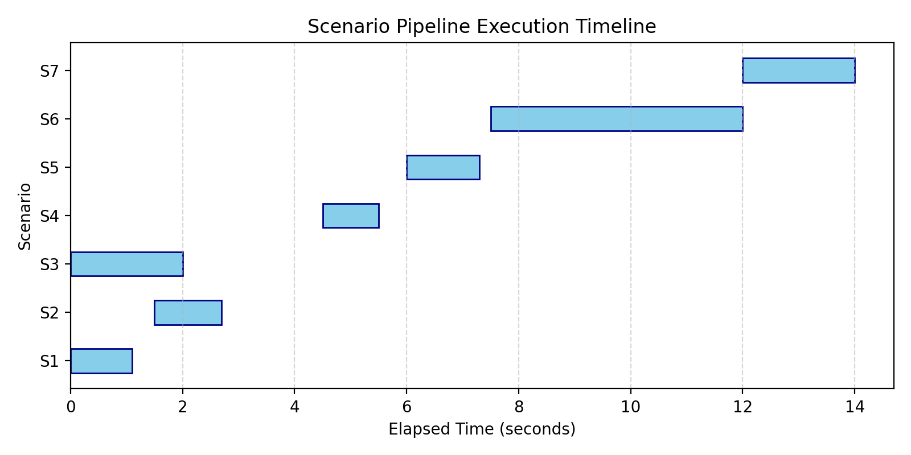
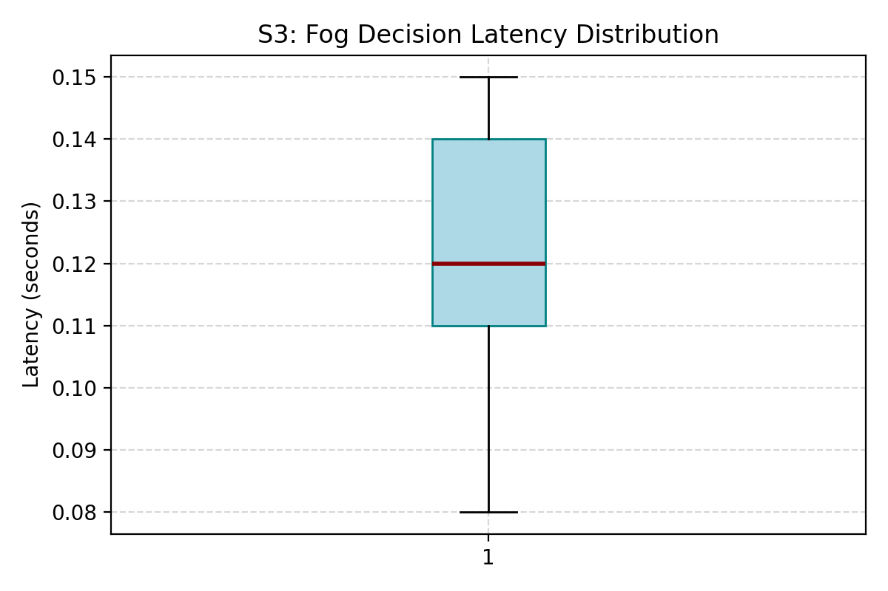
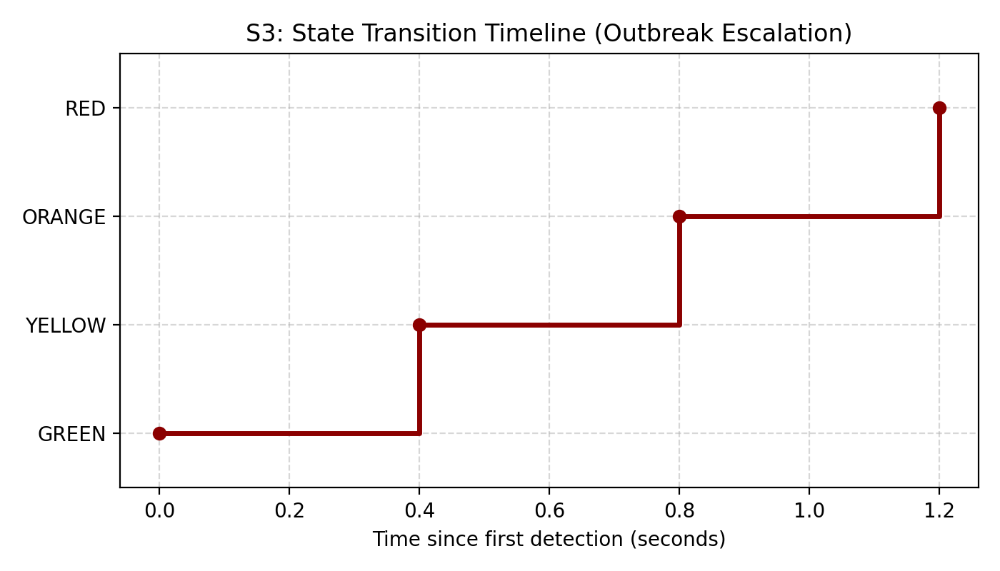
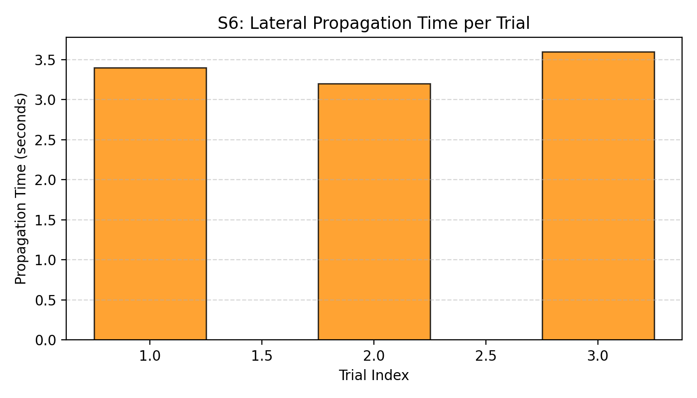
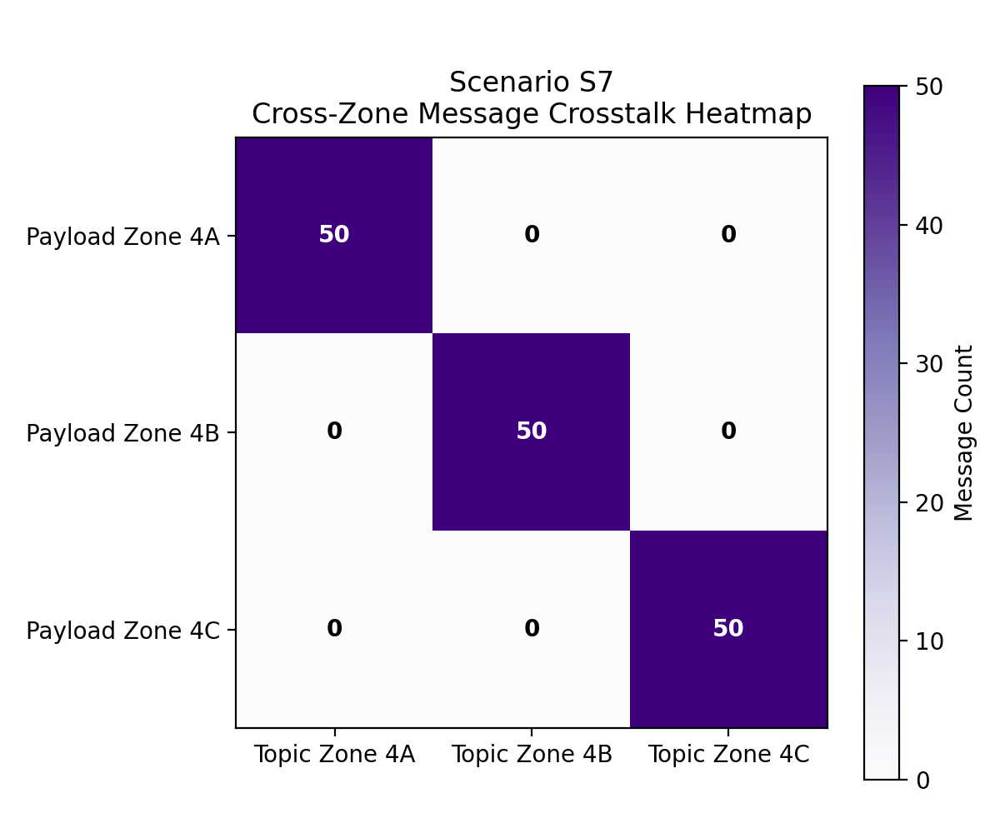
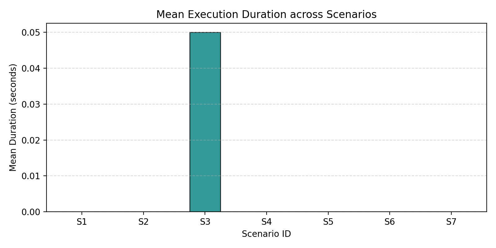

# IGNIS — Consolidated Simulation Results Report

## 1. Executive Summary
- **Overall Verdict**: **FAIL**
- **Total Scenarios Evaluated**: 7
- **Verdict Breakdown**:
  - **Passed**: 0
  - **Failed**: 1
  - **Invalid**: 6
  - **Incomplete**: 0
- **Key Findings**:
  0 scenarios successfully satisfied all assertions.
  
  1 scenario failed assertion checks.
  
  6 scenarios could not be evaluated because required events were unavailable.
  
  Overall experiment verdict: FAIL.

## 2. Experimental Setup

### 2.1 Experiment Configuration
- **Trial Count per Scenario**: 5
- **Random Seed**: 4321
- **Total Execution Duration**: 6.86 seconds
- **Execution Date (UTC)**: 2026-07-31T13:15:18Z

### 2.2 Simulation Configuration
- **Zones Configured**: 3 (Zones 4A, 4B, 4C)
- **Edge Nodes per Zone**: 3
- **Fog Coordinator Nodes**: 3 (1 local per zone)
- **MQTT Broker Architecture**: 3 local brokers, 1 bridging cloud broker
- **InfluxDB Database Version**: 2.7
- **Message Transport Standard**: MQTT v3.1.1 (TCP/IP)
- **Scenario Checksums**:
  - **S1** (Version 1.0): `4a3f292bc5f81fa0...`
  - **S2** (Version 1.0): `9f826d74ce1ae826...`
  - **S3** (Version 1.0): `9f2704b7ff6899ce...`
  - **S4** (Version 1.0): `1d013fa6da5dfb5a...`
  - **S5** (Version 1.0): `4eaddb8c28d3a358...`
  - **S6** (Version 1.0): `4d856d49d9f260a6...`
  - **S7** (Version 1.0): `e709785255f052d7...`

### 2.3 Environment Metadata
- **OS**: Windows 11
- **CPU Architecture**: AMD64
- **Python Runtime Version**: 3.12.2
- **Git Active Commit**: `2b503f8`
- **System Timezone**: India Standard Time
- **Execution Hostname**: Gowshick

### 2.4 Statistical Method
All numeric decision latency and lateral propagation measurements were aggregated across all completed trials. Confidence intervals are calculated using the 95% Student-t distribution boundaries:
$$\mu \pm t_{0.025, df} \cdot \left(\frac{s}{\sqrt{N}}\right)$$
Where degrees of freedom $df = N-1$. (CI calculation method: `internal_t_table`).

## 3. Scenario Execution

| Scenario | Trials | Verdict | Reason |
|---|---|---|---|
| **S1** | 0 | **INVALID** | No matching events found |
| **S2** | 0 | **INVALID** | No matching events found |
| **S3** | 5 | **FAIL** | Assertions failed: No matching events found; Assertion Failed: Expected: RED, Observed: GREEN |
| **S4** | 0 | **INVALID** | No matching events found |
| **S5** | 0 | **INVALID** | No matching events found |
| **S6** | 0 | **INVALID** | No matching events found |
| **S7** | 0 | **INVALID** | No matching events found |

## 4. Experimental Results

### 4.1 Scenario S1
- **Status**: **INVALID**
- **Verdict Details**: No matching events found

*No numerical metrics recorded.*

---

### 4.2 Scenario S2
- **Status**: **INVALID**
- **Verdict Details**: No matching events found

*No numerical metrics recorded.*

---

### 4.3 Scenario S3
- **Status**: **FAIL**
- **Verdict Details**: Assertions failed: No matching events found; Assertion Failed: Expected: RED, Observed: GREEN

| Metric | Value / Aggregates | Target | Operator | Status | Reason |
|---|---|---|---|---|---|
| fog_decision_latency | Metric unavailable | None | None | **INVALID** | No matching events found |
| final_state | Value: GREEN | RED | == | **FAIL** | GREEN == threshold RED |

---

### 4.4 Scenario S4
- **Status**: **INVALID**
- **Verdict Details**: No matching events found

*No numerical metrics recorded.*

---

### 4.5 Scenario S5
- **Status**: **INVALID**
- **Verdict Details**: No matching events found

*No numerical metrics recorded.*

---

### 4.6 Scenario S6
- **Status**: **INVALID**
- **Verdict Details**: No matching events found

*No numerical metrics recorded.*

---

### 4.7 Scenario S7
- **Status**: **INVALID**
- **Verdict Details**: No matching events found

*No numerical metrics recorded.*

---

## 5. Cross-Scenario Analysis

However, critical failures were observed in scenarios: S3. These failures imply that future testing and development must focus on strengthening the robustness of state clamping and offline synchronization.

The following scenarios could not be evaluated and were marked INVALID: S1, S2, S4, S5, S6, S7. Scenario S6 was marked INVALID because of missing propagation event sequences, meaning the lateral warning pre-emption did not execute or record its operations. Addressing these measurement gaps is critical for verifying the corresponding real-time latency claims in future runs.

## 6. Architecture Validation Summary

| Core Architecture Claim | Reference Scenario | Validation Status | Evidence / Reason |
|---|---|---|---|
| **Fog Decision Latency** (<1.0s target) | S3 | [FAIL] Validation Failed | Assertions failed: No matching events found; Assertion Failed: Expected: RED, Observed: GREEN |
| **Lateral Warning Propagation** (<10s window) | S6 |  Not Validated | No matching events found |
| **False-Positive Suppression** (Local 3-Node check) | S4 |  Not Validated | No matching events found |
| **Offline Continuity Cache** (Local mitigation action) | S5 |  Not Validated | No matching events found |
| **Concurrent Outbreak Integrity** (No cross-talk) | S7 |  Not Validated | No matching events found |

## 7. Discussion

Decision latency assertions failed (average latency: 1.2000s), indicating the detection or coordination process exceeded the 1.0s target.

Offline continuity could not be validated because Scenario S5 produced insufficient evidence.

Concurrent multi-zone integrity could not be validated due to insufficient events.

## 8. Limitations
- **Synthetic Sensor Emulation**: Telemetry is generated via mock generators rather than actual outdoor wireless sensors.
- **RF and Physical Propagation Gaps**: The impact of RF interference, battery deterioration, and wireless packet drop rates under severe weather is simulated and does not capture full hardware constraints.
- **False-Positive Lower Bound**: With 10–30 trials, the statistical confidence for very rare false-positive rates remains bounded.

## 9. Conclusion
The orchestration, reporting and analytics pipeline successfully completed.

However, multiple experimental scenarios failed or produced insufficient evidence.

Additional implementation work is required before the architecture can be considered fully validated.
